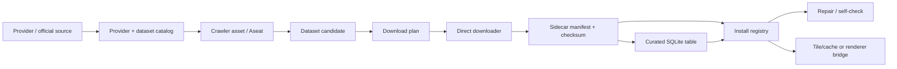
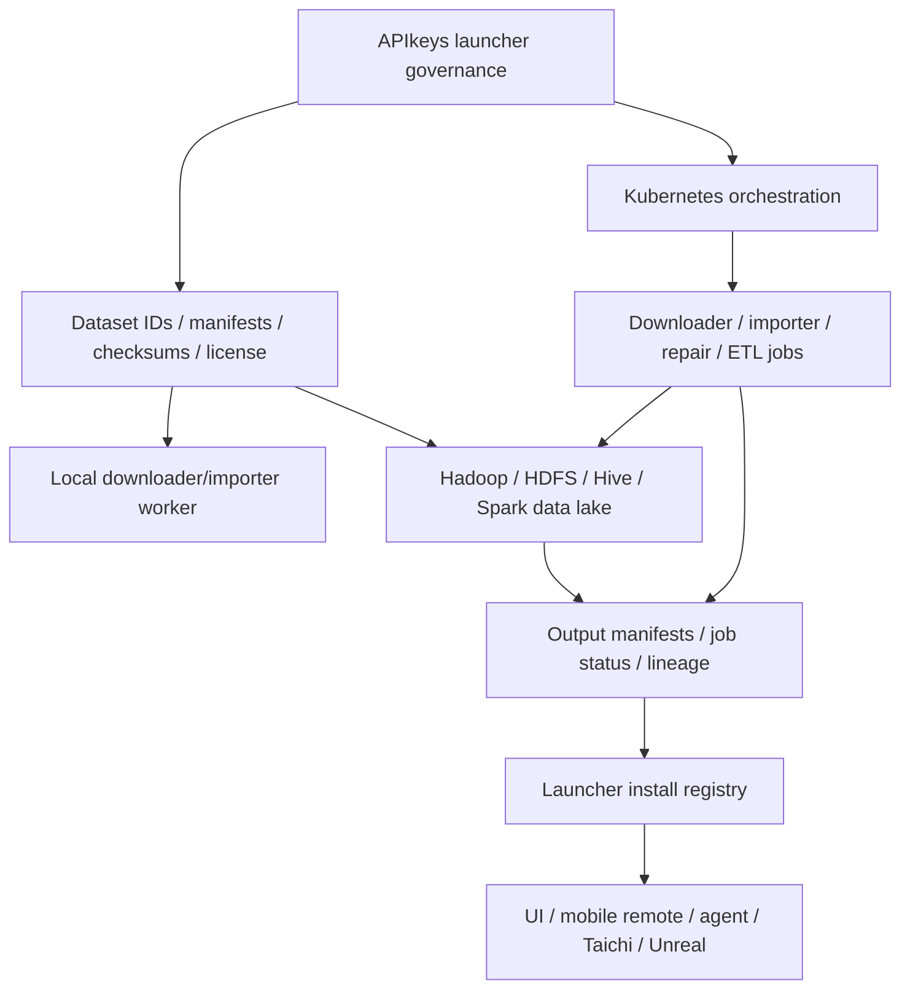
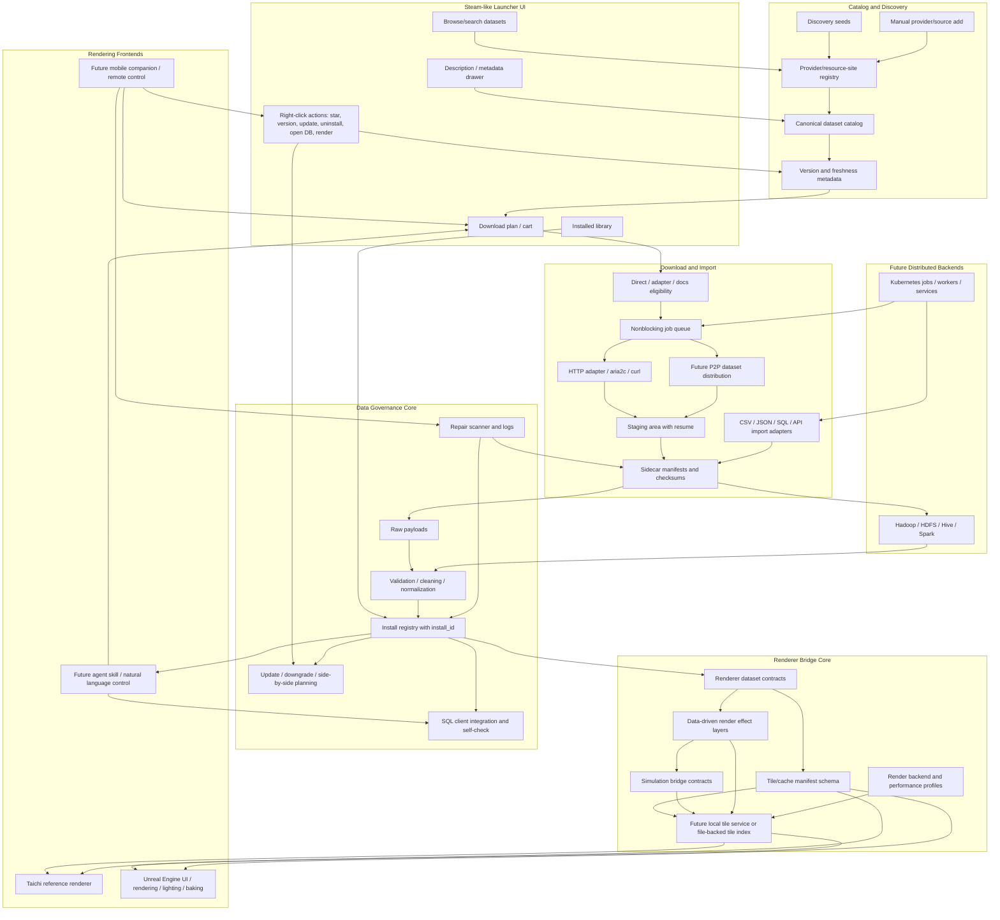

# APIkeys Collection Architecture

Last updated: 2026-05-22

APIkeys Collection is a Steam-like launcher for data sources, crawler assets, and
local databases. It catalogs providers, governs data-acquisition capabilities,
builds download plans, downloads/imports datasets, tracks installed assets, and
prepares data for downstream renderers such as `taichi_global_bathymetry.py`.

## Pipeline

The product has two linked halves:

- Steam-like data launcher: catalog, crawler assets, cart/download plan, install/update/uninstall safety, SQL/file/API integration.
- Renderer data pipeline: curated datasets become tile/cache manifests that Taichi and Unreal can consume with different
  performance budgets.

For handoff discussions, keep two pipeline levels separate: the MVP loop that runs on a local machine today, and the
mid-term distributed loop where Hadoop and Kubernetes may be owned by other teams.

### MVP Loop



### Mid-Term Distributed Loop



Hadoop is the future distributed storage/compute layer. Kubernetes is the future runtime orchestration layer. The
launcher should not own either cluster; it should prepare contracts, submit or describe jobs, and read back status.

Crawler assets are the governed capability layer between catalog sources and dataset candidates. A crawler asset may
package a crawler type, parser, bounded resolver, credentials/rate-limit boundaries, safety guards, health status,
repair workflow, and lineage. It does not replace Provider, Dataset, DiscoverySource, Adapter, or Mission; it makes the
existing crawler/source/resolver path product-readable for a future Aseat-style cockpit.

### Library / Install / Workspace Model

Steam-like data management should keep three ideas separate:

| Layer | Steam analogy | Data launcher meaning |
| --- | --- | --- |
| Library / entitlement | Games owned by an account | Provider/dataset/version rights, subscriptions, favorites, or approved library entries that can sync across machines. |
| Local install | Games installed on this computer | Raw files, SQLite tables, database assets, manifests, checksums, and health state for this machine. |
| Workspace / save | Saves, settings, mods | User annotations, patch overlays, analysis notes, query history, download plans, and preferences. |

Source datasets should be treated as read-only game binaries where possible. User edits should live in workspace overlays
or patch assets, while curated tables, tile caches, and renderer outputs remain derived assets that can be rebuilt from
source payloads plus recipes. MVP work should continue to focus on local install and curated import loops, but the schema
should avoid confusing "owned/approved in library" with "currently installed on this machine."



Important boundary: Unreal is a rendering/UI consumer, not the data owner. Raw data, versions, checksums, cleaning logs,
and install identity remain in the launcher registry. Unreal may import, cache, stream, or bake frontend-specific assets
only when that improves the user experience or performance.

Renderer bridge boundary: renderer bridge assets are managed data assets, not invisible glue. Tile manifests, caches,
meshes, texture atlases, chart indexes, and material presets can have source dataset versions, checksums, compatibility
targets, rebuild recipes, and health status. Treat this bridge like a data-side equivalent of a graphics compatibility/API
layer: it connects stable datasets to rendering frontends, while graphics APIs such as DX12, OpenGL, Metal, and Vulkan
connect those frontends to hardware. MVP work keeps this as a contract/skeleton; later install registry records should
track renderer bridge/cache assets explicitly.

Remote-control boundary: a future mobile app should control the resident desktop/service layer, not become a second data
owner. The mobile side may inspect queue/library/repair status, receive notifications, and request safe actions. Raw
datasets, data-store credentials, provider/API tokens, AI tokens, and heavy imports/render preparation should stay on the
desktop/service side. Any remote API should start read-only by default and require QR/device pairing, revocable device
tokens, scoped permissions, and explicit confirmation for destructive actions.

P2P distribution boundary: a future BitTorrent-like node can only participate for public datasets that are explicitly
redistributable. The launcher must verify license/redistribution metadata, dataset version, source identity, manifest
checksums, and user opt-in before seeding. Token-protected APIs, private datasets, terms-restricted downloads, and
unknown-origin files must stay outside the P2P path.

Hadoop boundary: Hadoop/HDFS/Hive/Spark is a mid-term distributed data lake and batch-compute backend owned by a
separate team. The launcher should pass dataset IDs, versions, manifests, checksums, license/provenance metadata,
partition hints, HDFS/Hive targets, and job metadata. Hadoop should return output manifests, lineage, schema summaries,
and job status that the launcher can store in the registry.

Kubernetes boundary: Kubernetes is an orchestration layer, not a database. It can later run downloader workers,
importer jobs, repair scanners, remote-control API services, scheduled syncs, or Spark/Hadoop bridge jobs. The launcher
should reserve job specs and status contracts, while the Kubernetes team owns cluster deployment, scaling, secrets,
network policy, and operational health.

## Runtime Layers

| Layer | Files | Role |
| --- | --- | --- |
| Entry points | `APIkeys_collection.py`, `APIkeys_collection_ui.py` | Thin compatibility entry points. |
| Frontends | `frontends/tk/launcher_ui.py`, `renderers/`, future Unreal project/tooling, future mobile companion | UI, renderer-facing code, and remote-control clients separated from the backend package. |
| Core orchestration | `api_launcher/core.py` | CLI commands and shared exports used by the UI. |
| Persistence | `api_launcher/db.py`, `api_launcher/repository.py` | SQLite schema, catalog state, crawl results, install registry, local asset state. |
| Catalog model | `api_launcher/models.py`, `api_launcher/registry.py`, catalog JSON/CSV/MD files | Provider and dataset definitions. |
| Discovery / crawler assets | `api_launcher/discovery.py`, `api_launcher/cli_discovery.py`, `api_launcher/crawlers/*`, `catalog/provider_discovery_seeds.json`, `catalog/dataset_discovery_sources.json` | Polite metadata/source discovery, dataset candidate discovery, and the future crawler asset / Aseat governance boundary. |
| Planning | `api_launcher/plans.py` | Builds download-plan JSON and declares nonblocking download policy. |
| Library actions | `api_launcher/library_actions.py` | Shared Steam-like action availability rules for install, update, repair, open, render, and uninstall. |
| Downloading | `api_launcher/downloads/` | Nonblocking job queue, resumable HTTP adapter, staging, manifest repair, and optional external transfer tools. |
| Future P2P distribution | Not implemented yet | Optional BitTorrent-like dataset sharing for redistributable public data only, guarded by license, version, checksum, and opt-in policy. |
| Future distributed data lake | `api_launcher/data_store_connections.py`, future Hadoop adapter | Reserved Hadoop/HDFS/Hive/Spark handoff for large raw/curated datasets and batch compute. |
| Future orchestration | `api_launcher/integrations.py`, future K8S job specs | Reserved Kubernetes/Docker orchestration profiles for workers, jobs, services, and scheduled tasks. |
| Integration settings | `api_launcher/integrations.py`, `api_launcher/data_store_connections.py`, `config/launcher_integrations.example.json` | Database clients, data-store connection profiles, AI summary profiles, download tool profiles, orchestration profiles. |
| Environment checks | `api_launcher/environment.py`, `.editorconfig`, `.gitattributes` | Startup path/tool/encoding checks and cross-platform file rules. |
| Install and uninstall safety | `api_launcher/asset_verifier.py`, `api_launcher/sql_assets.py`, `api_launcher/provenance.py`, `api_launcher/asset_roles.py` | Install IDs, asset verification, provenance, safe uninstall metadata. |
| Data curation | `api_launcher/importers/` | CSV/JSON importers plus early validation/normalization skeleton for API/CSV/JSON/manual imports. |
| Renderer bridge | `api_launcher/renderer_contracts.py`, `api_launcher/tile_manifests.py`, `api_launcher/rendering_profiles.py`, `api_launcher/render_effects.py`, `api_launcher/simulation_bridge.py`, `renderers/taichi_global_bathymetry.py` | Dataset-to-renderer contracts, shared tile manifests, cross-platform render budgets, data-driven render effect layers, simulation bridge contracts, and copied Taichi renderer. |
| Tests | `tests/` | Unit tests for catalog, plans, downloads, discovery, registry, renderer contracts. |

## Current Folder Hygiene

The root folder still contains a mix of source files, tracked catalogs, local
runtime files, and generated caches. This is workable for the MVP but should be
cleaned before the project grows.

Current target structure:

```text
APIkeys_collection/
  api_launcher/          # Python package
    downloads/           # download queue, HTTP, staging, repair, transfer tools
    importers/           # CSV/JSON importers and curation helpers
  frontends/             # Tk UI and future frontend-specific glue
  renderers/             # Optional renderer engines
  tests/                 # Unit tests
  docs/                  # Architecture, GTD, tech stack, handoff notes
    appendices/          # subsystem notes that should not crowd the main docs
  catalog/               # Built-in provider catalog and reference templates
  config/                # Example configs only
  scripts/               # setup/run scripts
  state/                 # ignored local SQLite and discovered candidates
  downloads/             # ignored downloaded raw data
```

Cleanup order:

1. Documentation was moved into `docs/`.
2. Catalog/reference files were moved into `catalog/`.
3. Example config was moved into `config/`.
4. Setup/run scripts were moved into `scripts/`.
5. New runtime outputs should use ignored `state/` and `downloads/`.
6. Legacy root runtime files are still supported during the compatibility window.

The path resolver in `api_launcher/paths.py` prefers the new folders but falls
back to legacy root files when they already exist.
