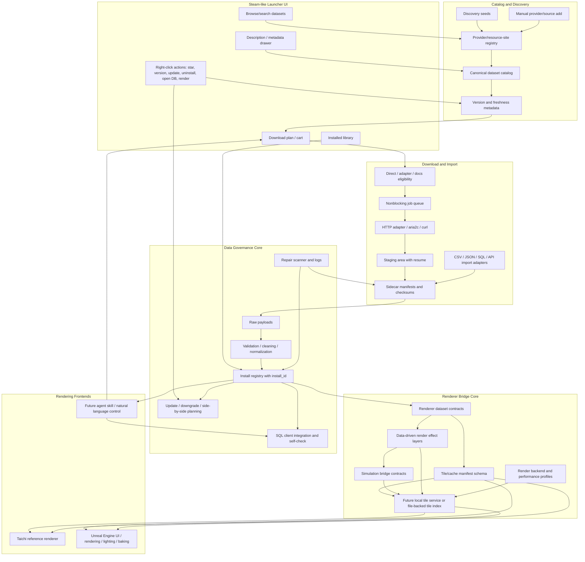

# APIkeys Collection Architecture

Last updated: 2026-05-17

APIkeys Collection is a Steam-like launcher for data sources and local databases.
It catalogs providers, builds download plans, downloads/imports datasets, tracks
installed assets, and prepares data for downstream renderers such as
`taichi_global_bathymetry.py`.

## Pipeline

The product has two linked halves:

- Steam-like data launcher: catalog, cart/download plan, install/update/uninstall safety, SQL/file/API integration.
- Renderer data pipeline: curated datasets become tile/cache manifests that Taichi and Unreal can consume with different
  performance budgets.



Important boundary: Unreal is a rendering/UI consumer, not the data owner. Raw data, versions, checksums, cleaning logs,
and install identity remain in the launcher registry. Unreal may import, cache, stream, or bake frontend-specific assets
only when that improves the user experience or performance.

## Runtime Layers

| Layer | Files | Role |
| --- | --- | --- |
| Entry points | `APIkeys_collection.py`, `APIkeys_collection_ui.py` | Thin compatibility entry points. |
| Frontends | `frontends/tk/launcher_ui.py`, `renderers/`, future Unreal project/tooling | UI and renderer-facing code separated from the backend package. |
| Core orchestration | `api_launcher/core.py` | CLI commands and shared exports used by the UI. |
| Persistence | `api_launcher/db.py`, `api_launcher/repository.py` | SQLite schema, catalog state, crawl results, install registry, local asset state. |
| Catalog model | `api_launcher/models.py`, `api_launcher/registry.py`, catalog JSON/CSV/MD files | Provider and dataset definitions. |
| Discovery | `api_launcher/discovery.py`, `api_launcher/cli_discovery.py`, `catalog/provider_discovery_seeds.json` | Polite metadata/source discovery without collecting secrets. |
| Planning | `api_launcher/plans.py` | Builds download-plan JSON and declares nonblocking download policy. |
| Library actions | `api_launcher/library_actions.py` | Shared Steam-like action availability rules for install, update, repair, open, render, and uninstall. |
| Downloading | `api_launcher/download_jobs.py`, `api_launcher/http_downloader.py`, `api_launcher/transfer_tools.py` | Nonblocking job queue, resumable HTTP adapter, optional external transfer tools. |
| Integration settings | `api_launcher/integrations.py`, `api_launcher/data_store_connections.py`, `config/launcher_integrations.example.json` | Database clients, data-store connection profiles, AI summary profiles, download tool profiles. |
| Environment checks | `api_launcher/environment.py`, `.editorconfig`, `.gitattributes` | Startup path/tool/encoding checks and cross-platform file rules. |
| Install and uninstall safety | `api_launcher/asset_verifier.py`, `api_launcher/sql_assets.py`, `api_launcher/provenance.py`, `api_launcher/asset_roles.py` | Install IDs, asset verification, provenance, safe uninstall metadata. |
| Data curation | `api_launcher/curation.py` | Early validation/normalization skeleton for API/CSV/JSON/manual imports. |
| Renderer bridge | `api_launcher/renderer_contracts.py`, `api_launcher/tile_manifests.py`, `api_launcher/rendering_profiles.py`, `api_launcher/render_effects.py`, `api_launcher/simulation_bridge.py`, `renderers/taichi_global_bathymetry.py` | Dataset-to-renderer contracts, shared tile manifests, cross-platform render budgets, data-driven render effect layers, simulation bridge contracts, and copied Taichi renderer. |
| Tests | `tests/` | Unit tests for catalog, plans, downloads, discovery, registry, renderer contracts. |

## Current Folder Hygiene

The root folder still contains a mix of source files, tracked catalogs, local
runtime files, and generated caches. This is workable for the MVP but should be
cleaned before the project grows.

Current target structure:

```text
APIkeys_collection/
  api_launcher/          # Python package
  frontends/             # Tk UI and future frontend-specific glue
  renderers/             # Optional renderer engines
  tests/                 # Unit tests
  docs/                  # Architecture, GTD, tech stack, handoff notes
  catalog/               # Built-in provider catalog and reference templates
  config/                # Example configs only
  scripts/               # setup/run scripts
  state/                 # ignored local SQLite and discovered candidates
  downloads/             # ignored downloaded raw data
```

Cleanup order:

1. Documentation was moved into `docs/`.
2. Catalog/reference files were moved into `catalog/`.
3. Example config was moved into `config/`.
4. Setup/run scripts were moved into `scripts/`.
5. New runtime outputs should use ignored `state/` and `downloads/`.
6. Legacy root runtime files are still supported during the compatibility window.

The path resolver in `api_launcher/paths.py` prefers the new folders but falls
back to legacy root files when they already exist.
