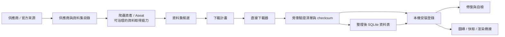
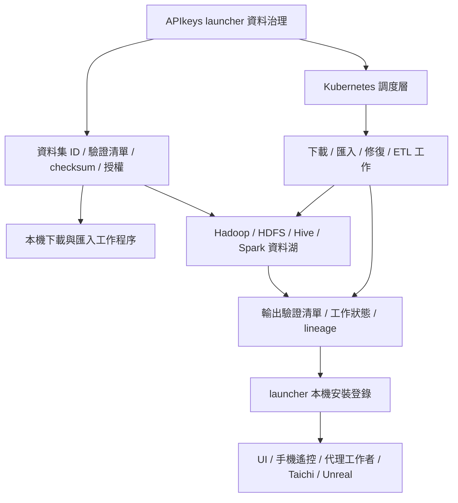
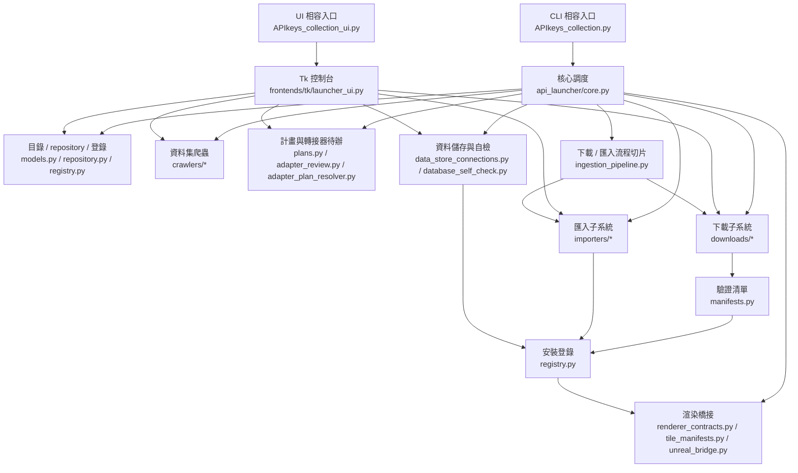

# APIkeys Collection 架構

最後更新：2026-05-22

APIkeys Collection 是一個類 Steam 的科學資料集、爬蟲資產與本機資料庫 launcher。它負責整理 provider/catalog、治理資料取得能力、產生下載計畫、下載與匯入資料、追蹤已安裝資產，並把整理後的資料交給 Taichi、Unreal 或其他下游 renderer / 分析工具。

英文原文仍保留在 `docs/ARCHITECTURE.md`；本文件是繁中架構入口，補足接力與中文討論需要。

## 管線分層

產品有兩個相連但責任不同的半部：

- 資料 launcher：catalog、下載計畫、install/update/uninstall 安全規則、SQL/file/API 串接。
- renderer data pipeline：curated dataset 轉成 tile/cache manifest 或其他 renderer bridge 資產，供 Taichi、Unreal、圖表或未來前端使用。

討論架構時，請分清楚「今天本機 MVP 能跑的閉環」和「中期 Hadoop/K8S 分散式閉環」。

## 本機 MVP 閉環



重點：

- Catalog 不等於已下載資料，只代表 launcher 知道資料源或資料集候選。
- 爬蟲資產不等於資料本體；它是能產生候選、adapter review item 或有界 plan 的可治理能力。
- Download plan 必須分清楚 direct file、adapter_required、requires_unpack_or_adapter。
- Manifest 是下載結果可驗證、可修復、可登錄的核心。
- Curated table 是從 raw payload 派生出來的可重建資產，不應混同原始資料。
- Renderer bridge 是 install registry 的下游消費者，不是資料 ownership 的 owner。

## 中期分散式閉環



邊界：

- Hadoop 是中期資料湖與批次運算層，不是 MVP SQLite/MySQL 的替代品。
- Kubernetes 是 orchestration layer，不是資料庫。
- Launcher 不應擁有 cluster；它準備 dataset ID、manifest、checksum、license/provenance、job spec，並讀回 job status、lineage、output manifest。

## Library / Install / Workspace 三層模型

| 層 | Steam 類比 | 資料 launcher 意義 |
| --- | --- | --- |
| Library / entitlement | 帳號擁有哪些遊戲 | 使用者/profile 擁有、收藏、訂閱、審核通過的 provider/dataset/version。 |
| Local install | 這台電腦裝了哪些遊戲 | raw files、SQLite tables、database assets、manifest、checksum、health state。 |
| Workspace / save | 存檔、設定、mod | 使用者標註、patch overlays、分析筆記、查詢紀錄、下載計畫、偏好。 |

原始資料集應盡量像遊戲本體一樣唯讀。使用者改動放 workspace/overlay；curated table、tile cache、renderer output 是 derived assets，可以從 source payload + recipe 重建。

## 核心模組圖



規則：

- UI 可以觸發 backend，但不應複製 backend 判斷。
- CLI 與 UI 應共用 `plans.py`、download queue、importers、repair/self-check。
- 新增 source crawler 時應進 `api_launcher/crawlers/`，由 `dataset_sources.py` dispatcher 出入口管理。
- 新增下載/匯入格式時，應更新 plan/importer/manifest/registry 的 shared contract。

## Runtime Layers

| 層 | 檔案 | 責任 |
| --- | --- | --- |
| 相容入口 | `APIkeys_collection.py`, `APIkeys_collection_ui.py` | 保留舊命令，轉呼叫 package/frontend。 |
| Frontends | `frontends/tk/launcher_ui.py`, `frontends/unreal/`, future Qt/mobile | UI、renderer-facing code、remote-control client。 |
| Core orchestration | `api_launcher/core.py`, `api_launcher/cli_*.py` | CLI routing 與共用輸出。 |
| Persistence | `api_launcher/db.py`, `api_launcher/repository.py`, `api_launcher/registry.py` | SQLite schema、catalog state、crawl results、install registry、asset state。 |
| Discovery / crawler assets | `api_launcher/discovery.py`, `api_launcher/crawlers/*`, `catalog/provider_discovery_seeds.json`, `catalog/dataset_discovery_sources.json` | provider/source discovery、dataset candidate discovery，以及中期 crawler asset / Aseat 的治理邊界。 |
| Planning | `api_launcher/adapters/*`, `api_launcher/plans.py`, `adapter_review.py`, `adapter_plan_resolver.py` | Download/import plan、provider-specific dataset/query contract、adapter handoff、bounded resolver；非官方 yfinance 預設仍走 fixture 測試，live path 必須明確 opt-in 產生 CSV plan，不接背景 crawler 或 CI live call。 |
| Pipeline slice | `api_launcher/ingestion_pipeline.py` | direct plan 的下載、manifest 登錄、支援格式匯入、blocked next_action 與 CLI/UI 共用 stage。 |
| Downloading | `api_launcher/downloads/*` | job queue、HTTP adapter、staging、manifest repair、transfer tools。 |
| Import / curation | `api_launcher/importers/*` | CSV/JSON/archive raw -> curated SQLite。 |
| Data store | `api_launcher/data_store_connections.py`, `database_self_check.py`, `database_repair.py` | SQLite/MySQL/PostgreSQL profile、self-check、repair guard。 |
| Renderer bridge | `renderer_contracts.py`, `tile_manifests.py`, `rendering_profiles.py`, `render_effects.py`, `simulation_bridge.py`, `unreal_bridge.py` | dataset 到 renderer/cache/tile/simulation 的 contract。 |
| Tests | `tests/` | 保護 catalog、crawler、download、import、registry、renderer、UI 行為。 |

## 重要邊界

### Unreal

Unreal 是 rendering/UI consumer，不是資料 owner。Raw data、version、checksum、cleaning log、install identity 留在 launcher registry。Unreal 可以 import/cache/stream/bake 前端專用資產，但不能成為資料治理中心。

### Renderer bridge

Renderer bridge 資產是可管理資料資產，不是隱形 glue。Tile manifest、cache、mesh、texture atlas、chart index、material preset 都應逐步帶 source dataset version、checksum、compatibility target、rebuild recipe、health status。

### Mobile / remote control

未來 mobile app 應控制 desktop/service layer，而不是成為第二個資料 owner。Raw datasets、data-store credentials、provider/API tokens、AI tokens、重型 import/render preparation 都留在桌面端或服務端。

### P2P

未來 BitTorrent-like 節點只能用於明確可再散布的 public datasets。Token-protected API、private dataset、授權不明或 terms-restricted download 不可進 P2P path。

### Hadoop

Hadoop/HDFS/Hive/Spark 是中期資料湖與 batch compute backend。Launcher 提供 dataset ID、version、manifest、checksum、license/provenance、partition hint、HDFS/Hive target、job metadata；Hadoop 回傳 output manifest、lineage、schema summary、job status。

### Kubernetes

Kubernetes 是 job/service orchestration layer。它可以跑 downloader worker、importer job、repair scanner、remote-control API service、scheduled sync、Spark/Hadoop bridge job；cluster deployment、scaling、secrets、network policy、operational health 由 K8S team 負責。

## 工作區目標結構

```text
APIkeys_collection/
  api_launcher/          # Python package
    crawlers/            # dataset discovery source crawlers
    downloads/           # queue, HTTP, staging, repair, transfer tools
    importers/           # CSV/JSON/archive import and curation helpers
    adapters/            # provider-specific adapter skeletons
  frontends/             # Tk UI and future frontend-specific glue
  renderers/             # optional renderer prototypes
  tests/                 # unit tests
  docs/                  # architecture, GTD, handoff, manuals, appendices
  catalog/               # built-in provider/source catalog and reference templates
  config/                # example configs only
  scripts/               # setup/run/heartbeat scripts
  state/                 # ignored local runtime state
  downloads/             # ignored downloaded payloads
```

清理順序：

1. 文件、catalog、config、scripts 已搬到各自資料夾。
2. 新 runtime output 預設放 `state/` 或 `downloads/`。
3. 舊 root runtime files 暫時保留相容。
4. 重構前先讀 `docs/CODE_RELATIONSHIP_MAP.zh-TW.md` 與 `docs/WORKSPACE_LAYOUT.zh-TW.md`，避免只搬檔不維護調度關係。
