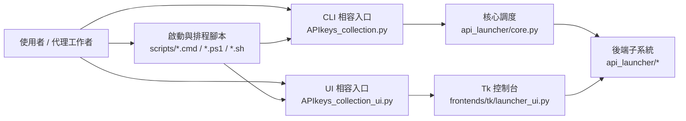
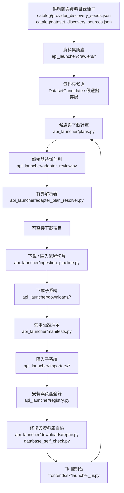
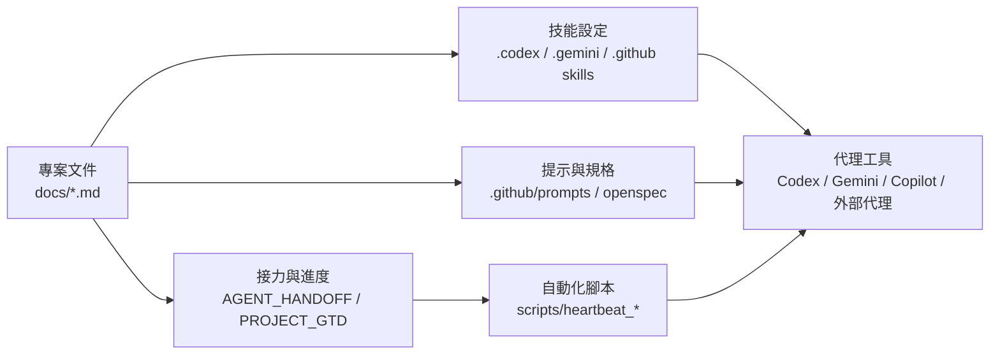

# 程式關聯地圖

最後更新：2026-05-22

這份文件回答「程式彼此怎麼調度」與「資料夾為什麼這樣分」。它不是完整 API 文件，而是讓下一位維護者能快速知道入口、核心模組、UI、測試與文件之間的關係。

調度流程優先使用 Mermaid 表示；文字只補充邊界、風險與例外。未來新增跨模組流程時，請先更新本文件的 Mermaid 圖，再補表格或段落說明。

## 第一層入口



規則：

- 根目錄 `APIkeys_collection.py` 與 `APIkeys_collection_ui.py` 只保留相容入口。
- CLI 調度集中在 `api_launcher/core.py`，新增一群 CLI 功能時優先拆到 `api_launcher/cli_*.py`。
- Tk UI 是目前 MVP 控制台，複雜判斷要逐步外移到 `api_launcher/`。
- `scripts/` 是排程、啟動與維護入口，不放產品規則。

## MVP 主流程



閉環判斷：

- `crawler` 不是「沒報錯就完成」，必須有候選數、evidence URL、warning/error。
- `plan` 必須明確標示 direct、adapter_required、requires_unpack_or_adapter 或 supported_after_download。
- `download` 完成後必須有 manifest 與 registry 記錄。
- `import` 只處理已驗證且支援的 CSV/JSON/GeoJSON 類來源，不支援格式要留在 adapter review。
- `repair` 只能在 ownership 明確時給自動修復建議。

## 子系統責任

| 區域 | 主要檔案 | 責任 | 測試入口 |
| --- | --- | --- | --- |
| CLI 調度 | `api_launcher/core.py`, `api_launcher/cli_*.py` | 解析參數、串接子系統、輸出 CLI 結果 | `tests/test_*cli*`, full unittest |
| catalog / repository | `models.py`, `repository.py`, `registry.py` | provider、dataset、install、asset 狀態 | `tests/test_dataset_catalog.py`, `tests/test_install_registry.py` |
| crawler | `api_launcher/crawlers/*` | source metadata 抓取、pagination、candidate 正規化 | `tests/test_dataset_discovery.py`, `tests/test_dataset_download_plan.py` |
| adapter / plan | `api_launcher/adapters/*`, `plans.py`, `adapter_review.py`, `adapter_plan_resolver.py` | provider-specific dataset/query contract、non-direct plan handoff 與 bounded resolver；yfinance 提供 optional query template、離線 fixture plan，以及必須加 `--yfinance-acknowledge-unofficial` 的 live CSV plan，不自動背景抓取 | `tests/test_adapter_plan_resolver.py`, `tests/test_download_plan.py`, `tests/test_yfinance_adapter.py` |
| ingestion pipeline | `api_launcher/ingestion_pipeline.py` | 將 direct plan 執行、已下載 manifest 匯入、manifest 登錄、支援格式匯入、逐項狀態與 blocked next action 包成可重用 service | `tests/test_ingestion_pipeline.py`, `tests/test_download_plan_runner.py` |
| download | `api_launcher/downloads/*` | queue、HTTP、staging、manifest、repair | `tests/test_http_downloader.py`, `tests/test_download_jobs.py`, `tests/test_repair.py` |
| import | `api_launcher/importers/*` | CSV/JSON/archive raw -> curated SQLite | `tests/test_csv_importer.py`, `tests/test_json_importer.py`, `tests/test_download_plan_runner.py` |
| data store | `data_store_connections.py`, `database_self_check.py`, `database_repair.py` | SQLite/MySQL/PostgreSQL profile、self-check、repair guard | `tests/test_data_store_connections.py`, `tests/test_database_self_check.py` |
| UI | `frontends/tk/launcher_ui.py` | 顯示、選單、觸發 backend flow、狀態文字 | `tests/test_launcher_ui.py`, `tests/test_tk_ui_preferences.py` |
| handoff / automation | `handoff.py`, `heartbeat.py`, `scripts/heartbeat_*` | 接力報告、自動化安全檢查、agent prompt | `tests/test_handoff.py`, `tests/test_heartbeat.py` |

## 文件與 skill 依賴



文件重構不能只看人類閱讀路線。部分 skill 可能直接寫死文件路徑或要求先讀特定 `.md`。但優先順序是：`.md` 先作為 source of truth 整理清楚，skill 再配合更新。合併、改名、刪除文件前，先搜尋這些位置：

```text
.codex/skills/
.gemini/
.github/skills/
.github/prompts/
openspec/
scripts/
docs/AGENT_HANDOFF.zh-TW.md
```

若發現引用，不代表文件不能整理；代表整理後要同步更新 skill/prompt/script，並在過渡期保留 redirect/summary，而不是讓舊 skill 決定文件永遠不能合併。

## 目前高風險耦合

| 風險 | 現況 | 整理方向 |
| --- | --- | --- |
| `frontends/tk/launcher_ui.py` 過大 | UI 同時處理畫面、狀態、部分流程 glue | MVP 後依 panel/dialog 分拆；共用規則回到 `api_launcher/` |
| `api_launcher/core.py` 偏胖 | CLI 仍集中 | 新增 CLI 群組先建 `cli_*.py`，core 只做 routing |
| data store 多 engine 同檔 | MySQL/PostgreSQL/SQLite/Hadoop profile 在同一 contract | 等本地 MySQL flow 穩定後再拆 driver family |
| 文件分散 | 使用者指南、技術總覽、GTD、handoff 都保存重要資訊 | 透過 `DOCS_INDEX` 與本文件建立入口，不直接刪文件 |
| runtime 檔留根目錄 | `APIkeys_collection.sqlite`, `provider_candidates.discovered.json` | 新輸出預設放 `state/`，舊路徑先保留相容 |

## 註解與可維護性規則

使用者已指出可維護性不足。之後新增或整理程式時，採用這個原則：

- 優先寫「為什麼」與「邊界」註解，例如為什麼只抓 25 筆、為什麼不自動 DROP table、為什麼 HTML 頁留在 adapter review。
- 對跨模組調度加短區塊註解，說明 input、output 與 ownership。
- 行末註解只用在少數容易誤解的常數、狀態或 guard，不做每行機械式註解。
- 新功能要在相鄰文件補「使用者怎麼操作」與「怎麼驗證」，不要只補程式碼。
- 若某段程式需要超過 3 個註解才能理解，優先考慮拆函式或搬到更合適的子模組。

## 下一步整理順序

1. 先讓本地 MySQL 連線 flow 跑通：env vars、driver、`--test-data-store mysql_default`、UI data-store dialog。
2. 針對 Demo flow 補缺口：下載按鈕、candidate plan、adapter resolver、import status 要能清楚顯示卡在哪。
3. 擴充 crawler full-crawl 模式的 UI/CLI 說明與保護：可爬到沒有下一頁，但仍要有 page cap、host politeness、warning。
4. 拆 `frontends/tk/launcher_ui.py` 的 dialog/panel helper，但每次只拆一塊並補測試。
5. 拆 `core.py` 的 CLI 群組，保留相容命令。

## 重構相依順序

近期若要整理資料夾，不要先搬檔。建議依相依關係做：

1. `core.py` CLI routing 先拆：它被 root CLI 呼叫，但多數子系統不應反向依賴它。
2. `launcher_ui.py` 只改成呼叫 service/helper：UI 目前依賴 downloads/importers/crawlers/database/self-check；先抽純 helper，再拆 panel。
3. Crawler source type 只從 `dataset_sources.py` dispatcher 進出：新增 source 時只加 handler 與測試，不讓 UI 直接知道 source module。
4. Download/import/repair 的 shared JSON shape 仍由 `plans.py`、manifest、registry contract 管，不要讓 UI 自己組字典。
5. MySQL/local data-store flow 穩定後，再考慮拆 `data_store_connections.py`，否則會在 driver 邊界未定時製造更多小檔。

每個重構 commit 都應回答：

- 哪個上層入口仍相容？
- 哪個測試保護行為沒有漂移？
- 哪個文件入口需要更新？
- 使用者操作是否變少或更清楚？
