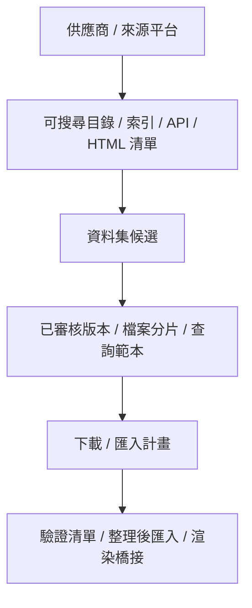
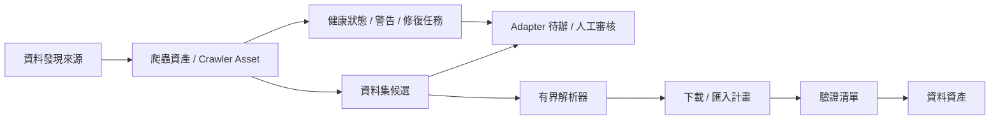

# Dataset Discovery 補充說明

## 2026-05-28 CrawlerSpec registry compatibility layer

- `api_launcher/crawlers/registry.py` 是第一版 crawler 宣告式規格表。它定義 `CrawlerSpec`、`@crawler(...)` decorator、`crawler_specs_by_source_type()` 與 `crawler_matrix()`，用來描述每個 handler 的來源家族、transport、auth profile、result shape 與是否支援 full crawl。
- 這一層目前是相容層，不是重寫。14 個既有 crawler handler 仍保留原本 Python 函式與模組；`dataset_sources.py` 只是把它們註冊成 specs，再由 registry 生成既有 `SOURCE_CRAWLER_HANDLERS`。這能維持舊 API 與測試，同時讓下一步 gateway/profile 化有穩定入口。
- `CrawlerCapabilityProfile` 已開始消費這份 registry metadata。Crawler asset payload 會輸出 `source_family`、`transport`、`result_shape` 與 `supports_full_crawl`，讓前端與 agent 能讀 source capability contract，而不是從 raw `source_type` 猜能力。
- 後續新增 crawler 時，應新增 handler + `CrawlerSpec` metadata，不要只把函式塞進鬆散 dict。等 registry 穩定後，再逐步把 `discover_dataset_candidate_output_for_source()` 的 dispatch 改成讀 spec/gateway，而不是一次性搬動所有 handler。

## 2026-05-28 Recursion / traversal budget guard

- 遠端 seed 枚舉、HTML file index full crawl、STAC / OGC link traversal、CKAN/Socrata pagination 這類 crawler 主路徑，預設要用 queue / stack / `deque` 的 iterative traversal，不用 recursive call stack。每條路徑都要有 `seen` set、`max_pages`、`max_depth`、timeout 與 rate-limit。
- 互動式遠端探索以 Raspberry Pi-class 裝置為安全基準：預設 `max_depth=2`；沒有明確 source profile、測試與使用者確認時，不得超過 `max_depth=4`。深度以「索引頁追索引頁」或「catalog link 追 catalog link」計算；資料檔、跨網域頁與登入後頁面不應被自動深追。
- 本機 preview / artifact scan 也不能無界。UI preview 應限制節點數與深度，例如 `max_depth<=6`、`max_nodes<=1000`；背景 job 若要放寬，必須有進度、取消、memory guard 與 structured event。
- 若碰到 traversal budget，handler 不應回報 `exhausted`。應回報 `remote_pagination.status=has_more`、`completion_confidence=local_limit_only` 或 warning code，例如 `traversal_limit_reached` / `pagination_limit_reached`，讓 Web/Tk/Qt 顯示「顯示更多 seed」或「縮小界域」。
- 這條規則與宣告式 profile 並行：profile 宣告 traversal budget，pipeline 執行 bounded fetch / pagination / dedupe / audit warning。不要把 depth / page cap 寫死在 UI 或單一 handler 裡。
- 迴圈停止條件要先看遠端回應、profile budget、使用者 bounds 與 runtime policy；硬寫哨兵值只作最後安全網。若需要 sentinel，請把它命名成可測欄位或常數，並在 payload 回報 `limit_reached` / `sentinel_stop`，不要讓 UI 誤以為已列完整來源。
- 建 seed 清單與分頁時，優先使用 range / slice window：例如 page 0 顯示 `[0:50]`，展開後顯示 `[0:100]` 或下一個 page window。payload 應帶 `shown_start`、`shown_end`、`page_size`、`has_more`、`remaining`，而不是把 `50` / `100` 這類數字硬編在前端。
- `itertools.islice()` 適合處理 iterator 型候選流，避免為了 preview 一次載入過大遠端或本機資料。slice 只代表目前視窗，不代表遠端 exhausted；是否 exhausted 仍以 `remote_pagination` / `completion_confidence` 為準。
- 裝飾器可用來把 crawler handler 註冊到 `CrawlerSpec` / matrix，但 handler 原本的回傳值仍應原樣進入 `dataset_crawler_output()` 或 gateway。不要讓 decorator 吞掉 candidates、warnings、pagination metadata 或 next_action；它應提供 metadata 與組裝入口，不應隱藏核心資料流。
- 這裡的宣告式方向是混合式準宣告式：registry/profile/matrix/pipeline/decorator 集中重複規則，少量條件分支與迴圈保留在 gateway / adapter / policy 邊界。不要為了消滅所有 `if` 而做上帝 YAML；也不要為了快速接線讓 `source_type` 分支散回 UI。
- Crawler 主路徑可以視為「主管道中的分流膠囊」：主管道把 source / bounds / policy 正規化，膠囊內用 registry array、decorator metadata 與少量 policy branch 選 handler，handler 回傳後再 normalize 回 `DatasetCrawlerOutput`。膠囊外的 plan / download / import / UI 只讀標準 contract，不知道內部分支。
- 條件分支只做真正的 route selection：選 handler、policy、middleware、fallback。不要讓每個 branch 自己做 payload 包裝、warning 正規化、UI 文案或 in-box-return；這些應在 gateway/normalizer 出口集中處理。
- 分支數量本身是設計判斷：2 到 3 條路可以保留簡單 `if/else`；4 條路已經接近 `2 x 2` matrix，應考慮 table / registry / decorator dispatch。crawler source type、auth、pagination、content format、bounds facet 這類維度一旦疊加，不應繼續用中心 `if/elif` 延長。
- YAML / JSON / TOML profile 適合放有人類語意、需要維護者填寫的 source/provider/credential/rate-limit 設定；純邏輯條件分支則優先用 typed Python table / dataclass / tuple index / dict registry。不要把機器分派矩陣硬包成使用者要讀的 YAML。

## 2026-05-27 Seed enumeration / Web Preview paging

- Source profile 現在可宣告第一組 politeness defaults：`crawl_timeout_seconds`、`crawl_max_pages`、`crawl_page_size` 與 `crawl_rate_limit_seconds`。它們存在於 `DatasetDiscoverySource` / `dataset_discovery_sources*.json` 層，屬於「這個來源本身應如何被有禮貌地探測」的設定，不是 UI 專屬選項。
- `crawl_max_pages` 會作為來源層安全上限；若 CLI/UI 執行期給更低的 `max_pages`，後端會採更低值，避免一次展示或完整枚舉把特定入口的來源邊界放大。`crawl_page_size` 會限制單次請求的 page size；若 UI/CLI 給很大的 `max_results_override`，source profile 仍可把 per-request page size 壓低。
- `crawl_rate_limit_seconds` 由 paginated crawler handler 透過共用 `polite_crawl_delay()` 套用於下一頁 request 前；這是 request-policy guard，不是 parser 邏輯。後續若要更完整，可把它提升成正式 request policy 物件，但不要讓 Tk/Web/Qt 自行 sleep 或猜測限流。
- `credential_mode` 與 `terms_risk` 現在也可由 source profile 明示。crawler asset capability 先讀 source profile，再退回文字 heuristic；因此登入/API key 與條款風險是 crawler/source 的治理設定，不是 dataset seed 或 UI 憑空推論。
- `credential_mode` / `terms_risk` 會經過白名單 normalization。未知字串不會寫回 source JSON，也不會進入 UI capability contract；這避免本機 source profile 誤填的 raw secret、自由文字或臨時標籤被前端當成正式治理狀態。
- `api_launcher.crawlers.request_policy.SourceRequestPolicy` 現在是 source profile request/access policy 的 typed staging point。`dataset_sources.py` 先算出 effective timeout、max pages、page size、rate-limit、credential mode 與 terms risk，再呼叫既有 handler；後續 middleware/decorator 化應接這裡，而不是讓 handler/UI 各自重算。
- `api_launcher.crawler_capability_profiles.CrawlerCapabilityProfile` 是下一個 typed staging point。它會把 source type、auth mode、terms risk、pagination mode、content format hints、bounds facets、middleware ids、failure policy 與 request policy 變成一份可序列化 profile，並掛到 crawler asset 的 `capability_profile`。這讓 Web/Tk/Qt 可以讀同一份 capability contract，而不是各自從 `source_type` 猜 pagination、內容格式或缺憑證時的下一步。
- 這只是 source profile request/access policy 的第一段。未來可再把 timeout、page cap、page size、rate-limit、credential mode、terms risk 合併成正式 request policy object，但不要在個別 parser 或 UI 裡硬寫站點規則。
- 使用者提出的「數據驅動裝飾器爬蟲架構」可視為第二階段 PoC：把 credential gating、pagination driver、timeout/retry/rate-limit 等橫切能力收成 middleware pipeline。但正式 contract 應使用 typed source profile / request policy schema，不使用欄位順序脆弱的 raw list row。
- 中期命名採 `Matrix Cell -> Validated Profile -> Capability Gateway -> Middleware Pipeline`。Crawler source 的 matrix cell 代表來源範式、權限模式、分頁模式、內容格式與界域能力的組合；它要先驗證成 `CrawlerCapabilityProfile`，再由 gateway 組裝 middleware pipeline。這不是第一階段重寫命令，現有 handler 仍保留。
- `DatasetCrawlerOutput` 是 crawler handler 回報遠端分頁狀態的第一個後端 contract。舊 handler 可維持回傳 candidate list；支援分頁的 handler 應逐步改成回傳 candidates 加 `remote_pagination_status` / `remote_exhausted` / `remote_next_page_token`，讓 UI 呈現 seed 枚舉完整度而不用自行猜測。
- Socrata full crawl 已接上這個 contract：當 Socrata catalog 因本機 `max_pages` 上限停止而遠端仍可能有更多 seed 時，listing payload 會回報 `remote_pagination.status=has_more` 與 `completion_confidence=remote_has_more`；raw pagination token 只留在後端，不進 UI payload。
- CKAN full crawl 也已接上這個 contract：`result.count` / `start` 能讓 handler 判斷遠端是否 exhausted；若本機 `max_pages` 先截斷，UI 會看到 `has_more` / token-present，而不是誤以為本機已列完整個入口。
- OpenAlex、DataCite、Zenodo、CMR full crawl 也已接上同一份 contract：OpenAlex 讀 `meta.next_cursor`，DataCite / Zenodo 讀 `links.next`，CMR 在頁面滿版且本機 page cap 先停止時回報下一頁 page number。這些 token 只用於後端續抓判斷；UI/agent 只應讀 `remote_pagination.status`、`remote_exhausted` 與 token-present 摘要，不應顯示或依賴 raw token。
- NCEI、GBIF、Dataverse、OGC API Records、STAC full crawl 也已接上同一份 contract。NCEI / GBIF / Dataverse 會用 offset/start 類分頁推算下一個 token；OGC / STAC 會用 response links 的 `rel=next` 判斷遠端仍有下一頁。這仍是 handler-level metadata，不是 live endpoint 全量成功證明；前端應呈現「仍可展開更多 seed」而不是宣稱已列完整個官方入口。
- Seed enumeration payload 現在有 `remote_pagination` 與 `completion_confidence`。`remote_pagination.status=not_reported` 代表 handler 尚未回報遠端是否還有下一頁；`has_more` 代表 handler 有下一頁 token；`exhausted` 代表遠端已明確回報列完。UI 只能呈現這份 payload，不應自行把本機 `max_results` 當成遠端完整證據。
- `completion_confidence=local_limit_only` 是目前最重要的防誤導狀態：它表示本機安全上限被碰到，遠端可能還有更多 seed。後續 handler 若支援 pagination，應把 raw token 留在後端，只讓 UI 看到 `next_page_token_present=true`。

- Crawler asset listing 現在要被視為「入口 seed 枚舉」的後端動作，而不是只為 UI 產生一份小樣本。Web Preview 選取入口時會以 `complete_seed=true`、`full_crawl=true`、`max_results=1000` 觸發 listing，並將候選寫回本機 catalog。
- 既有 crawler handler 仍保留安全邊界；`search_terms_override=("",)` 是目前用來避免 sample search term 縮小入口清單的 sentinel。這代表「完整枚舉嘗試」，不代表所有外部平台都已能證明走到遠端末頁。
- UI 展示 seed 清單時，不應重新打 crawler。Web Preview 新增 `/api/crawler-assets/{asset_id}/seeds?page=&page_size=50`，從 catalog 讀取 `metadata.discovery_source_id == asset_id` 的候選，先顯示 50 筆，使用者按「顯示更多 seed」才展開下一批。
- CLI 現在也能讀同一份 seed page contract：`--crawler-asset-seeds ASSET_ID --crawler-asset-seeds-json` 從 catalog 輸出 `page_summary`、`has_more`、`favorite_seed_count` 與 seed rows。這是給 agent / CI / 未來 Tk-Qt 接線用的薄入口，不會重新打遠端 crawler。
- Tk 爬蟲資產分頁也已讀同一份 seed page contract：右側 Crawler Passport 的「Seed 清單」區塊會呼叫 `crawler_seed_page()`，用本機 catalog 顯示第一批 50 筆與「顯示更多 Seed」下一頁；收藏星號來自 crawler asset profile 的 `favorite_seed_uids`。Tk 仍不重新 live crawl，也不自行計算 page summary。
- Tk 也會從最近的 `crawler_asset_listing_recorded` structured event 讀取 `seed_enumeration` / `remote_pagination`，把「遠端仍有下一頁線索 / 遠端已列完 / handler 尚未回報完整度」轉成 Crawler Passport 可讀提示。Web Preview 的 recent listing compact payload 也保留這份摘要，避免頁面重載後退回純本機 counts。
- Tk seed row 操作已補成表格 dialog：`frontends/tk/crawler_asset_seed_dialog.py` 只投影已載入的 seed page rows，回傳 `favorite` 或 `download` action；`frontends/tk/crawler_asset_workflows.py` 再交給 `save_crawler_seed_favorite()` 或 `run_crawler_seed_download_import()`。這保持 UI 與後端 service 分層，未來 Qt 不需要重寫 seed favorite/download 規則。
- Web Preview 的 seed row 已能進入正式下載 / 匯入路徑：`POST /api/crawler-assets/{asset_id}/seed-download-import` 會驗證 `dataset_uid` 屬於該 asset，從 catalog seed 建立 formal resolved plan，並交給 download/import pipeline；這不是重新枚舉遠端入口，也不是舊 demo CSV。
- 收藏功能應落在 seed 層。Web 會透過 `/api/crawler-assets/{asset_id}/seed-favorites` 寫入 crawler asset profile 的 `favorite_seed_uids`；Tk seed 表格也走 `save_crawler_seed_favorite()`，不直接知道 profile 欄位名稱。後續要把收藏提升到正式 seed registry，並保留 dataset uid、title、source URL、版本與來源 pattern 等可追溯欄位。
- Listing result 已補 `seed_enumeration` 結構化狀態，先處理 blocked / error / empty / warning / within-current-limits / local-limit-reached / bounded-sample 這幾種 UI 分流。它能避免 UI 只從候選數猜測枚舉完整度。
- 後續 hardening：handler 層仍應補「是否抵達遠端末頁 / 下一頁 token / 遠端總數」等更精確欄位。現在的 `local_limit_reached` 只表示碰到本機 `max_results` 安全上限，不能證明遠端已到末頁。

## 2026-05-27 Source pattern detector coverage

- `source_patterns.py` 現在把已接 crawler handler 的 source type 全部納入 `SOURCE_TYPE_HINTS`，包含 STAC、CKAN、Socrata、OGC API Records、OGC WMS、CMR、ERDDAP、HTML file index，以及 NCEI、GBIF、Dataverse、Zenodo、DataCite、OpenAlex 這類 vendor/science API。
- 新增的 NCEI / GBIF / Dataverse / Zenodo / DataCite / OpenAlex detector 只依 URL host/path 形狀辨識「這個入口應交給哪個已存在 crawler handler」，不下載資料、不做 catalog promotion，也不代表已通過 crawler audit。
- `tests.test_source_patterns` 會確認 `SOURCE_TYPE_HINTS.values()` 等於 `SUPPORTED_DATASET_SOURCE_TYPES`；以後新增 handler 時，必須同步補 source pattern hint 或明確調整契約，避免 UI/CLI 貼 URL 時仍被 `unknown` 擋下。
- `tests.test_source_pattern_drafts` 會確認 vendor/science API URL 在 fake fetcher / no live network 下可建立 supported local source draft，並由 `discovery_drafts.py` 正規化為各 crawler 的 canonical endpoint。這是 `URL -> source draft -> crawler audit` 的第一段閉環，不是直接下載。
- `SOURCE_BOUND_FACETS` 與 `SOURCE_SURFACE_LABELS` 現在也被測試鎖成覆蓋所有 supported crawler source type。新增來源類型時，除了 handler 外，也要同步補 UI 中立界域 facet 與來源表面標籤，否則 crawler asset 分頁會退化成弱表單或 raw label。
- `--dataset-discovery-handler-smoke-json` 是離線 crawler audit contract smoke。它會用 fixture source 覆蓋每一個 `SUPPORTED_DATASET_SOURCE_TYPES`，分別驗證「零候選時產生 `zero_candidates` / `repair_crawler_query_or_parser`」與「正常候選時 audit pass」。這不取代各 crawler 的 payload fixture 測試，也不代表 live endpoint 可用；它用來防止新增 handler 後 audit summary、warning code、next_action 或 CLI JSON 交接斷線。
- `--handoff-report` / `--handoff-report-json` 現在會包含 `crawler_handler_smoke_summary` 的 compact 摘要：可重跑命令、supported source type 數、零候選 warning count 與正常候選 pass count。若摘要異常，再跑完整 `--dataset-discovery-handler-smoke-json` 讀 per-source report；不要讓 handoff 夾帶完整 smoke payload。
- `--heartbeat-plan-json`、heartbeat report 與 heartbeat agent prompt 也會包含同一份 compact summary。這是給自動接力 / 長工時工作檢查用的開發者 contract 狀態，不是一般使用者的資料下載入口。
- Web Preview 的 `GET /api/diagnostics/crawler-handler-smoke` 與 Tk 工具選單「開發者：Crawler handler diagnostics」都讀同一份 compact summary，作為 developer diagnostics。它只適合 agent / 開發者確認 handler audit contract，不能用來判斷 NASA/NOAA/CKAN 等 live endpoint 是否真的可連線，也不應放進正式使用者下載心流。
- Tk / Web / 未來 Qt 的 diagnostics surface payload 應透過 `api_launcher/developer_diagnostics.py::crawler_handler_smoke_diagnostics_payload(surface)` 產生；前端只傳自己的 surface，不要各自複製 `diagnostic_id`、scope、next action 或 compact summary 結構。

## 2026-05-26 Crawler run record / registry handoff

- `crawler_run_summary.summary_scope` 會描述摘要掃描範圍、latest listing / plan build event timestamp、`status`、`missing_event_names` 與 `next_action`；它只用來讓 agent 判斷這份 handoff 來自哪個事件視窗，不代表來源 freshness 或遠端資料是否已變更。

- `--handoff-report` / `--handoff-report-json` 現在會輸出 `crawler_run_summary`：最新 listing 與 download-plan build 的 counts、compact `run_record`、`next_action`、`resolved_plan_available` 都會以白名單摘要呈現，不帶完整 resolved plan 或候選清單。接手 agent 應先讀 handoff，再視需要查 Web `/api/events/recent` 或完整 JSONL。
- `--crawler-run-summary-json` 是 crawler run 狀態的輕量 CLI：預設掃描最近 5000 筆 structured event，不重跑 crawler，不讀完整 resolved plan，輸出與 handoff / Web Preview 共用的 latest listing / plan build summary。需要更窄或更廣時可用 `--crawler-run-summary-limit` 明確覆寫。
- Tk 清單擷取完成後現在會額外寫入 `crawler_asset_listing_recorded` structured event，只保存 bounded counts、`next_action` 與 `run_record.stage=crawler_listing`；這補上 `source profile -> crawler run -> candidate -> plan` 前半段的可追蹤性，但仍不是永久 SQLite run registry。

- Tk / Web 建立爬蟲資產下載計畫時，`crawler_asset_plan_outcome_recorded` event context 現在會保存同一份 compact `run_record`。Web `/api/events/recent` 會暴露 bounded `run_record` summary 與核心 counts，讓 agent 可以從事件紀錄讀狀態，但不會把完整 plan 或候選清單塞進 event log。
- `crawler_asset_listing_recorded` 的 Web summary 也會保留候選、upsert、skipped provider、duplicate、warning/error counts；這是 `source profile -> crawler run -> candidate` 的輕量接力面，不代表正式 SQLite run registry 已完成。
- `crawler_run_record_from_result()` 是前端中立 helper：Tk/Web/未來 Qt 不應知道每個 result 如何計算 run status，只從 `result.to_dict()["run_record"]` 取 compact payload；沒有這個 contract 的 result 會回傳空 payload。
- `CrawlerAssetListingResult.to_dict()` 與 `CrawlerAssetDownloadPlanResult.to_dict()` 現在都會輸出 `run_record`，作為 crawler run registry 正式落地前的 structured handoff payload。
- `run_record` 目前固定帶 `stage`、`status`、`outcome_bucket`、候選/下載/review/error/warning/duplicate counts、`source_signature`、`bounds_signature`、`candidate_snapshot_signature`、`next_action` 與 16 字元 `record_key`。
- 這個 payload 的用途是讓 UI、Web Preview、Qt 前導與 agent 能讀同一份 crawler run 狀態；不要在前端或 handoff 腳本中重新用分散欄位推理 listing / plan build 結果。
- 目前 storage lane 仍是 `structured_event_log`；`future_sqlite_table=crawler_run_registry` 只是下一步資料表設計提示。等 run registry 表定案後，再把這組欄位映射進 SQLite registry，不要在本切片直接新增 migration。

更新日期：2026-05-23

## 文件角色

這份文件是 discovery / crawler / adapter review 的主要維護入口。舊路徑 `docs/appendices/discovery.zh-TW.md` 只保留 redirect 與短摘要，避免既有 handoff、skill 或外部 prompt 失效；新增 crawler type、候選審核規則、bounded resolver、download/import plan 規則時，請優先更新本文件。

## 定位

目前專案不應再被理解成單純的 API key 清單，而是科學資料集啟動器。

供應商或資源站點比較像 Steam 上的發行商或資源站，資料集才是實際要下載、安裝、清洗、接到 SQL 或渲染器的內容。

因此不要把每一個資料集都寫成一段 Python 硬編碼。比較健康的模型是：



白話說：Alpha Vantage、NOAA、Google Earth Engine、MarineCadastre、ERDDAP 這些首先是供應商或資料平台；背後可能有很多資料集。第 1 階段應該優先把「發現資料集」的 crawler 做好，再挑代表資料集進入下載閉環。

套件型 client 也要套同一條規則。像 Python 的 `yfinance`、`fredapi`、`wbgapi`、`arxiv`、`pyalex`、`astroquery`、`Bio.Entrez`、`pubchempy`、`earthaccess`、`cdsapi`、`pystac-client`、`osmnx`、`pygbif`、`openml`、`kaggle`，以及 R 的 `WDI`、`wbstats`、`fredr`、`eurostat`、`tidycensus`、`ipumsr`、`biomaRt`、`GEOquery`、`TCGAbiolinks`、`rgbif`、`webchem`、`rcrossref`，背後通常是一個遠端資料庫或 Web API；它們可以被 catalog 追蹤，但不代表要在背景自動 live call。這個概念可再推廣成 `data source access surface matrix`：同一個資料庫/API 可能同時有 REST、Python wrapper、R wrapper、MATLAB toolbox、CLI、database driver、cloud catalog 或 file index。再往外推，PyPI、CRAN、Bioconductor、MATLAB Add-On、Julia registry、npm、Maven、NuGet、Go modules、crates.io 這些套件生態也可以被解析成 discovery 線索，但主要產出應是 canonical source 的 metadata evidence，而不是直接新增 source、安裝套件或執行套件。metadata 表示應採三元關係：`來源 / 語言或 runtime / 套件或工具名稱`，並補官方程度、文件 URL、credential 需求、terms/license 風險、可查詢資料型態、查詢邊界與 fixture/mock 測試策略。公開套件不等於公開 API key；只有 keyless public access、使用者明確配置自己的 credential，或 fixture/mock/dry-run path，才能進入直接抓取。多個 wrapper 若指向同一資料庫/API，應取聯集合併到同一 canonical source；只有 backend、授權或語意真的不同時才拆開。只有當某個 client 需要專屬 auth、query builder、format conversion、rate-limit guard、商業工具箱授權或跨語言執行邊界時，才新增 adapter。

這種 adapter 不是單純「代替使用者呼叫套件」。它的真正用途是簡化轉檔：把套件或 API 回傳的 JSON、CSV、DataFrame、SDMX/OData、分頁結果或壓縮檔，轉成有 manifest、checksum、schema、provenance、匯入策略與 repair 線索的本機資料資產，再灌入 SQLite/MySQL/未來湖倉。

`yfinance` 是目前第一個樣板：預設只有 query template 與 fixture-backed plan；live path 必須明確加 `--yfinance-acknowledge-unofficial`，並只寫本機 CSV + file-backed download/import plan，不接 crawler 或 CI live call。

## 爬蟲資產的定位

「爬蟲資產」是目前 crawler-first 路線的概念擴充。它不是把每個資料集硬寫成一支爬蟲，而是把「能穩定取得某類資料候選或有界樣本的能力」當成可治理資產。

在目前架構中，它對應到這些組件的組合：

```text
catalog/dataset_discovery_sources.json
api_launcher/crawlers/*
api_launcher/crawlers/orchestrator.py
api_launcher/adapter_plan_resolver.py
api_launcher/plans.py
state/logs/launcher_events.jsonl
```

一個健康的爬蟲資產至少應該回答：

```text
它服務哪個 provider/source scope？
它使用哪個 crawler type 或 parser？
它需要哪些 credential、rate limit、查詢參數與安全上限？
它產出 candidate、adapter review item，還是 bounded download/import plan？
它上次執行是否成功，候選數是否合理，是否有 suspicious zero/low output？
它的輸出是否能追到後續 manifest、curated table、repair event 與 lineage？
```

這也是 Crawler Asset 概念可以落地的位置：Crawler Asset 不是取代 Provider、Dataset 或 Adapter，而是包住一個可維護的資料取得能力，讓 UI 以「資產護照、任務隊列、健康狀態、修復流程」呈現它。短期仍以現有 crawler/source/resolver 檔案推進；中期才把它提升成獨立 registry 或操作艙。

2026-05-24 的硬化切片已把三個能力槽正式寫成 `api_launcher/crawler_asset_capabilities.py`：`fetch_metadata` 負責入口 metadata 與 audit summary，`list_datasets` 負責候選清單與 audit summary，`build_download_plan` 負責把候選資料集加上界域後產生下載計畫或 adapter review item。舊 UI 名稱 `download_selected` 只保留為相容別名。每個能力槽同時帶有 credential mode、terms risk、error buckets、rate-limit policy 與 bounds facets，讓 Tk/Qt/CLI 能共用同一份爬蟲能力護照，而不是各自猜測「資料庫可不可抓」。

同日第二個切片把 bounds facets 正式提升為 `api_launcher/crawler_asset_bounds.py` 的前端中立 schema。每個 facet 會說明 group（TimeBounds、SpatialBounds、ColumnBounds、VersionBounds、LimitBounds、AuthBounds 等）、control、value type、maps_to 與是否需要 schema probe。這份 schema 是 Tk/Qt/CLI 產生界域表單的共同來源；現有 `api_launcher.bound_form` 與 `SourceDownloadBounds` 仍是實際下載界域的執行契約，不再另外造一套平行格式。

2026-05-25 的後續硬化已把 crawler asset 的 source_type -> bounds facets 分派收斂到 `SOURCE_BOUND_FACETS` registry。`bounds_facets_for_source()` 只做 file-index override 與 registry lookup，避免 UI/CLI 或 capability 層各自寫 `if source_type == ...`；新增 crawler source type 時，應同時檢查是否需要 facet registry entry 與 regression test。這次也補上 `ogc_wms_capabilities`，讓老式 WMS capabilities 入口能產生 collection / bbox / time / format / limit 界域表單，而不是退回只有 `limit` 的弱表單。

同一輪也修正 seed coverage 對 WMS 的理解：`ogc_wms_capabilities` 已接 crawler，且 capabilities XML 本身就是可列 layer 的入口清單，因此應歸入 entry-listing seed capability。這避免展示或 crawler asset 卡片把 WMS 誤標成 `add_or_repair_supported_crawler_handler`。

Crawler asset 的入口表面標籤也應該由後端 registry 提供，而不是 UI 自己猜。`SOURCE_SURFACE_LABELS` 目前負責 file index、WMS map service 與少數 API catalog 標籤；未知 endpoint 仍由 endpoint shape fallback 成 `api` 或 `catalog`。未來卡片牆、Logo、狀態 chip 與篩選器應優先讀 `asset.source_surface`。

同一輪也把 download plan 的 CMR 與研究 metadata 擋板命名化：`api_launcher/plans.py` 目前用 `CMR_COLLECTION_*` 與 `RESEARCH_METADATA_*` registry/set 判斷 CMR collection、DataCite DOI 與 OpenAlex work 是否必須進 adapter review。這不是新增下載能力，而是把原本散在 `if source_type == ...` 的安全規則集中成可測契約，避免 NASA、DOI 或 OpenAlex 特例重新散回 resolver/UI。

HTML file index 的來源類型判斷已集中到 `api_launcher/crawlers/source_type_registry.py`。`source_uses_file_index()` 會同時檢查 `source_type` 與 `file_url_regex`，供 bounds facet、capability 狀態與 source draft 使用；後續若新增 FTP-like / directory-listing 變體，不要再在 UI 或 capability 層硬寫 `source_type == "html_file_index"`。

Source pattern detector 的 unknown fallback 與最低信心門檻已集中到 `api_launcher/crawlers/source_patterns.py` 的 `UNKNOWN_PATTERN_ID` 與 `DEFAULT_PATTERN_MINIMUM_CONFIDENCE`。Draft writer、測試與後續 adapter 不應各自硬寫 `"unknown"` 或 `0.35`，避免 detector、draft、UI 對「保留人工 review」的門檻漂移。

Detector 入口必須把注入式 fetcher 例外收斂成 `None` probe result。這讓自訂 fetcher、未來 plugin detector 或測試替身在 timeout、HTTP、JSON 或實作錯誤時安全降級成 `unknown` / review，而不是讓整段 discovery 崩潰；錯誤細節應在 crawler audit 或來源設定層用 warning/next_action 呈現，不在 detector 階段假猜來源類型。

Source draft writer 也會在寫入 local source draft 前重新檢查 detector confidence；即使注入的 detector 回傳非 unknown 且帶 `source_type_hint`，低於最低信心門檻仍必須停在 review。這是防止測試替身、外部 detector 或未來 plugin adapter 繞過 unknown fallback 的安全邊界。

Source draft writer 的 review 擋板現在會輸出結構化失敗 payload：`source_pattern_unknown`、`source_pattern_below_minimum_confidence`、`source_pattern_missing_source_type`、`source_pattern_unsupported_source_type` 都會保留 `source_pattern_detection`、`minimum_confidence`、`skipped` 與 `next_action=review_source_profile_or_add_detector`。CLI 指定 `--write-source-draft-json` 時，即使 URL 被擋在 review，也會先寫出 blocked summary JSON，供 Tk、Web、Qt 或下一位 agent 判斷是要人工補 source profile，還是新增 detector/adapter；不得把這類失敗只當成普通 traceback。

Tk 爬蟲資產分頁現在已消費這份 structured review payload：被擋下的 URL 會顯示「保留審核」警告，列出 `review_reason`、pattern、confidence、evidence 與 `next_action`，並寫入 `source_pattern_source_draft_blocked` warning event。這條 UI 路徑不得把 unknown / low-confidence 當成 generic error，也不得在前端繞過後端擋板寫 local source draft。

Tk 的 source draft dialog 與 crawler asset workflow 也改為讀取同一個最低信心門檻常數，而不是在 UI 層硬寫 `0.35`。UI 仍只負責收集輸入與呼叫 service；detector contract 的預設值由後端維護。

CLI `--source-draft-detector-min-confidence` 的預設值同樣引用 `DEFAULT_PATTERN_MINIMUM_CONFIDENCE`。這代表命令列、Tk 表單與後端 detector 共用同一個 review 門檻；若未來調整信心門檻，應先更新 `source_patterns.py` 的契約與 regression tests，不要在不同入口各自改數字。

同日第三個切片把 profile 與 health 從 UI 推回後端：`api_launcher/crawler_asset_profiles.py` 保存 crawler 的本機偏好與憑證參照，例如啟用/封存、credential profile、API key 環境變數名稱、帳號提示、排程、限流、重試、seed scope、官方 logo/favicon、本機自訂圖片與授權備註；`api_launcher/crawler_asset_health.py` 則把 profile、能力契約與風險層級收斂成 `status_code`、emoji、reason、warning codes 與 `next_action`。這讓未來 Tk 卡片牆、Qt 卡片牆、CLI 稽核報告都能看到同一個爬蟲健康狀態，而不是在不同前端各自判斷。

Crawler asset health 現在也帶 `status_gate`，把 CODE_KM 式 gate 概念映射到資料入口：`restricted` 表示封存不可用、`staged` 表示停用或未知狀態、`adapter_review` 表示缺 handler、`review` 表示需要界域/adapter/seed review、`completed` 表示目前工作流可用。前端與 agent 應用這個 gate 做分流，不要各自從 source type 或 provider 名稱猜狀態。

Crawler 查詢 URL 一律應透過共用 helper 或範式專屬 normalizer 組裝，不要用手寫字串相加。`api_launcher/crawlers/fetch.py::search_endpoint_url()` 會保留既有 query，並把新增 query 寫在 `#fragment` 前面；這保護 CKAN、CMR、Dataverse、GBIF、OGC、OpenAlex、Zenodo、WMS 等共用 query builder 的 crawler，不會在使用者貼含文件錨點的 URL 時產生錯誤 endpoint。

`tem/ui-aseat-ui/HANDOFF.md` 可作為 UI 精神參考：一個入口爬蟲是一張可治理的資產卡片，預設畫面應清爽掃描，細節放在右側 passport 或設定視窗；齒輪、封存、健康狀態、信任分數、成熟度、風險與任務隊列是 crawler asset 的產品語言。`tem/` 本身不是正式來源，不應直接加入 commit；要抽取的是互動規則與資訊架構。



## Discovery seeds

內建 provider/source discovery seeds 已從 8 個擴充到 43 個。範圍包含：

- 氣候與天氣
- 海洋與水文
- 生物多樣性
- 地理空間與地形
- 統計與經濟
- 研究 metadata
- 台灣區域開放資料
- Data.gov / CKAN 類開放資料目錄
- STAC 類地球觀測目錄
- Smithsonian / Wikidata / Dataverse 類文化資產與研究資料目錄
- Marine Regions / VLIZ 類海域法域 GIS 來源
- Google Earth Engine
- NOAA AIS / MarineCadastre
- NOAA GOES-R cloud/moisture imagery

這些 seed 只是搜尋與匯入候選來源的起點，不是最終 catalog。未來使用者可以透過 local seed 檔或 UI 手動新增區域平台、研究機構、政府資料站或團隊內部資料站。Tk `資料庫 > 審核 provider 候選` 也可以把候選寫成 ignored local provider seed；若候選已帶有明確或可保守推導的 supported crawler type 與 endpoint，還可以寫成 ignored local dataset discovery source 草稿。CLI/agent 可用 `--write-provider-candidate-source-drafts --provider-candidate-source-drafts-input ...` 從同一類 review JSON 批次重建本機 source 草稿，方便 Mac 接力或無 UI 工作流；summary 會帶 `next_action`、`audit_command` 與 `audit_source_ids`，CLI 也會寫入 `provider_candidate_source_drafts_written` structured event，讓 `--handoff-report` / `--handoff-report-json` 能直接顯示下一步 dry-run audit 指令。這些 local 草稿都必須再經 `審核本機 discovery 草稿` / crawler audit，不能直接視為正式來源。

## Dataset discovery sources

`catalog/dataset_discovery_sources.json` 是下一層：它不是新增供應商，而是描述「去哪個供應商的哪個目錄找資料集」。

目前 `catalog/dataset_discovery_sources.json` 內建 23 個可爬資料目錄。支援的通用 crawler 類型：

- `ncei_search`：查 NOAA/NCEI Common Access Search Service，適合從關鍵字找到 NOAA 資料集候選。
- `erddap_all_datasets`：讀 ERDDAP `allDatasets` JSON table，適合從 ERDDAP 站點列出可用 dataset。
- `html_file_index`：讀簡單 HTML 檔案索引，用 regex 找出版本/檔案 shard，例如 MarineCadastre AIS daily CSV.ZST。
- `cmr_collections`：查 NASA Earthdata CMR collection search，適合從 NASA/Earthdata 目錄找到可再審核的衛星、海洋、氣候資料集。
- `stac_collections`：讀 STAC `/collections`，適合 Microsoft Planetary Computer、Earth Search 這類雲端地球觀測 catalog。
- `ogc_api_records`：讀 OGC API `/collections` 清單或 OGC API Records `items` / FeatureCollection，適合從地理空間 metadata catalog 產生可審核資料集候選；`/collections` 會先產生 collection candidate 並把主要 `api_url` 指向該 collection 的 `/items`，FeatureCollection 則保留 record metadata，不直接下載背後的大型資料。若 record 連到 `mqtts://` 這類 broker/notification stream，crawler 會把它留在 metadata links，但不把它當成主要 `api_url` 或 direct download。
- `ogc_wms_capabilities`：讀老式 WMS `GetCapabilities` XML layer 清單，適合先把 map service layer 變成可審核候選；它不等於已下載 raster，GetMap 的 bbox/time/style 參數化仍在後續 resolver。
- `gbif_dataset_search`：查 GBIF registry dataset search，適合先發現生物多樣性資料集與 record count，再決定是否進入 GBIF download workflow。
- `dataverse_search`：查 Dataverse search API，適合 Harvard Dataverse 這類研究資料平台，先取得可審核的 dataset metadata。
- `zenodo_records_search`：查 Zenodo records API，適合先發現研究資料記錄與檔案摘要，再決定是否能進入 direct download 或 adapter review。
- `datacite_dois`：查 DataCite `/dois` public API，並以 `resource-type-id=dataset` 先找研究資料 DOI metadata；它只產生候選，不直接下載 DOI landing page 背後的檔案。若 metadata 裡有明確 `contentUrl`，會先整理成 resource 線索，交給後續 resolver 安全判斷。
- `openalex_works_search`：查 OpenAlex Works API，使用 `type:dataset` 篩選研究資料型 work；它只保留 OpenAlex/DOI/landing-page metadata，不直接下載 repository 檔案。
- `ckan_package_search`：讀 CKAN `package_search`，適合 Data.gov 這類政府開放資料目錄；resource URL 可能是檔案、API、入口頁或外部系統，必須 review。
- `socrata_catalog_search`：讀 Socrata Discovery/Catalog API，例如 NYC Open Data、DataSF、Chicago Data Portal；crawler 只把每個 resource 變成可審核候選，並保留 domain/resource id 給後續 `$limit=25` 小樣本 resolver。

這些 crawler 的共通目標是「先產生候選 metadata」。例如 STAC 只先列 collection，不直接抓每一張影像；CMR 只先列 collection，不直接全量抓 granules；CKAN 只先保留 resource 摘要，不把未知 URL 直接交給 downloader。

AIS 與衛星雲圖請當作 crawler 的代表測試案例，不要當成特例硬寫：

- AIS：應從 MarineCadastre/NOAA index 發現 daily shards，metadata 標成 `spatiotemporal_trajectory`。
- 衛星雲圖：應從 NOAA/NCEI/GOES-R 或 Earth Engine 類 catalog 發現，metadata 標成 `raster_or_grid`，後續才進入 renderer/tile/time-animation 設計。

CLI smoke：

```bash
python3 APIkeys_collection.py --init-db --seed --discover-dataset-candidates --dataset-discovery-source marinecadastre_ais_daily_index_2025 --dataset-discovery-limit 2 --write-dataset-candidates dataset_candidates.smoke.json --upsert-dataset-candidates --summary
```

這只會產生候選 metadata，不會下載 AIS 大檔。

## 來源介面類型與內容格式分層

本專案不應把 `NASA`、`NOAA`、`World Bank` 這種機構名稱當成 crawler 類別。比較穩的抽象是先辨識「來源介面類型」（也可稱資料入口範式 / Source interface pattern），再交給對應 crawler adapter。入口辨識只回答「這個 URL 像哪種資料服務」，不負責下載或解析內容。

第一版 detector registry 位於 `api_launcher/crawlers/source_patterns.py`，目標是把任意入口 URL 先歸類為：

- `stac` -> `stac_collections`
- `ckan` -> `ckan_package_search`
- `erddap` -> `erddap_all_datasets`
- `socrata` -> `socrata_catalog_search`
- `ogc` -> `ogc_api_records`
- `cmr` -> `cmr_collections`
- `html_file_index` -> `html_file_index`
- `unknown` -> detector 證據不足，保留人工補設定或新增 detector

Detector 必須回傳信心分數與 evidence，例如 `json_contains_stac_version`、`erddap_info_index_table`、`html_contains_links`。這些 evidence 供 UI/agent 顯示與除錯，避免只用 URL 字串或品牌名稱猜測來源。

分層原則如下：

```text
source URL
  -> source detector: 判斷來源介面類型
  -> source adapter: 依 STAC/CKAN/ERDDAP/CMR/... 列出 dataset/resource/asset URL
  -> fetcher: 下載或分頁抓取
  -> content detector: 判斷 CSV/JSON/NetCDF/HDF5/GeoTIFF/Shapefile/FlatGeobuf/PMTiles/MBTiles/Zarr/Parquet/ZIP/XML/PDF/unknown
  -> content parser: 能解析就抽 schema/metadata，不能解析就保留 raw artifact
  -> normalizer/importer: 轉成 manifest、registry asset、SQLite/lakehouse/renderer 可用格式
```

入口範式標準化的是「資料在哪裡、怎麼查、怎麼列資源」；內容格式標準化的是「下載下來的東西怎麼讀」。STAC adapter 不應內建 GeoTIFF/NetCDF 解析；CKAN adapter 不應內建 CSV/ZIP/PDF parser。兩者中間的穩定交接物應是「資料資源清單」：URL、format/media type hint、role、license/provenance、bounds/版本 metadata。

目前內容格式的第一層骨架在 `api_launcher/content_registry.py`。它只處理下載物格式與 parser capability，不處理 STAC/CKAN/ERDDAP 等來源入口。`dataset_import_plan_entry()` 已使用這層 registry：CSV/CSV.GZ 走 `csv_to_sqlite`，JSON/JSONL/NDJSON/GeoJSON 走 `json_to_sqlite`；ZIP/TAR/ZST 等壓縮或封包檔停在 `requires_unpack_or_adapter`；NetCDF/HDF/Zarr、GeoTIFF/COG/Shapefile ZIP/GeoPackage/FlatGeobuf/PMTiles/MBTiles、Parquet/Arrow、PDF/XML/HTML/TXT 與 unknown 目前都停在 `manual_review_required`，等待專用 content parser 或 renderer/cache adapter。這個狀態是刻意保守，不代表不能下載，只代表不能假裝已能 curated import。

Adapter resolver 產生 direct download entry 時，也會寫入 `content_detection` 與 `content_parser` 摘要。後續 UI/agent 應優先讀這些 machine-readable 欄位來判斷下一步，而不是只看 `source_format` 字串或人類文字 reason。

目前要先把 source detector 做成保守、可測、可擴充的服務。CMR detector 只能在 host/path 像 NASA CMR 時 probe CMR 固定端點，避免所有 URL 都被 NASA CMR 的成功回應污染。遇到 unknown 時，不自動下載，改回報 `source_pattern_unknown` 或引導人工補 source profile。

CLI/agent 若只是拿到一個入口 URL，可以先用 detector 產生 ignored local source draft，不直接改官方 catalog：

```powershell
py -3 -B APIkeys_collection.py --write-source-draft-from-url https://example.org/stac `
  --source-draft-provider-id example_source `
  --source-draft-name "Example Source" `
  --source-draft-category satellite `
  --write-source-draft-json state/source_pattern_draft.summary.json
```

這條路徑會寫入 `dataset_discovery_sources.local.json`，summary 會保留 `source_pattern_detection`、`audit_source_ids`、`next_action` 與 crawler audit 指令。它的定位是「URL -> detector evidence -> source draft -> local discovery audit」，不是下載、匯入或正式 catalog promotion。

Source draft 入口只接受絕對 HTTP(S) URL，並會在 detector 前拒絕帶 username/password 的 URL。這是為了防止本機檔案路徑或 credential-bearing URL 被保存到 ignored local draft 後又被誤提升到 catalog。

若 detector 判成 `html_file_index`，source draft 會自動帶保守資料檔副檔名 regex（CSV/CSV.GZ/CSV.ZST、GeoJSON/GeoJSON.GZ、ZIP/TAR.GZ、NetCDF/CDF、HDF/HDF5/H5、GeoTIFF、GeoPackage、Shapefile ZIP、FlatGeobuf、PMTiles/MBTiles、SQLite DB、Zarr、GRIB/GRIB2、JSON/JSONL/NDJSON、XML、Parquet）。Detector 本身也會用同一類資料檔線索提高 HTML file index 信心分數。這是通用蟲的第一層接線：先讓 HTML 目錄 URL 能被後續 crawler audit 抽出候選檔案；真正是否下載仍要經過 candidate review / plan / content parser。

K 槽爬蟲教材可用來萃取技巧，但不要直接搬站點腳本進專案。可吸收的部分包含 HTTP header/timeout、HTML `href` 擷取、相對 URL 合併、Scrapy 分層思想、CSV/SQLite 清洗、rate limit/politeness、錯誤處理與 fixture 測試。落地時一律轉成 RRKAL 的 source pattern detector、crawler adapter、content parser、manifest/import pipeline 與 audit warning，不讓 crawler 直接寫 DB 或假裝未知格式已可解析。

Sciverse / OpenDataLab 這類科學文獻 API 暫時不應打亂 geospatial asset downloader 主線。對地理資料下載來說，它不是 STAC / OGC / CMR / ERDDAP 等資料本體入口；比較合理的定位是低優先級 `literature_discovery_api` 或 `vendor_science_api`，用來搜尋地理資料相關論文、DOI、方法、資料集名稱與引用片段，產生 provenance 線索後再交給真正的資料入口 detector 判斷。第一階段仍優先穩住 STAC、OGC、CMR、ERDDAP、CKAN、Socrata、HTML file index 與 unknown fallback。

Detector 測試目前已覆蓋 STAC、CKAN、Socrata、OGC API JSON、OGC/WMS `GetCapabilities` XML、ERDDAP、CMR guard、HTML file index、複合壓縮/地理資料檔線索、fetcher exception、malformed JSON，以及 ambiguous collections payload fallback。新增範式前應先補 fake fetcher fixture，確認正例、低信心 unknown、probe failure fallback，以及不污染其他範式三件事。

OGC family 目前分兩條 source type：`ogc_api_records` 負責 OGC API `/collections` 與 Records / Features JSON 目錄，`ogc_wms_capabilities` 負責老式 WMS `GetCapabilities` XML layer 清單。source draft 會把 detector 找到的 OGC API base URL 正規化為 `/collections`，避免後續 audit 仍停在 root endpoint。WMS 只產生 layer candidate 與 map service metadata，並優先把 `Request/GetMap` 的 `OnlineResource` 當成候選 `api_url`；真正的 GetMap 影像下載、bbox/time/style 參數化仍需後續 adapter resolver / content parser 切片。

OGC API detector 不只讀使用者貼上的 URL 本身，也會 bounded probe `conformance`、`collections` 以及 origin fallback 的同名端點；這讓 root endpoint 沒有直接回傳完整 JSON，但標準 `/conformance` 和 `/collections` 存在的 OGC API Features / Records 入口仍能被辨識。若只有單獨 `collections` 欄位、沒有 OGC/OpenGIS conformance evidence，仍保持低信心並退回 `unknown`，避免把一般 catalog 或 STAC-like payload 硬判成 OGC。

CKAN / Socrata detector 不應假設使用者一定貼站台首頁。若收到深層 dataset/resource URL，detector 會先嘗試 path-local probe，再 fallback 到同 origin 的 canonical API probe；這可提升「貼入口頁、資料集頁、API resource 頁」三種常見操作的容錯率。

CKAN / Socrata source draft 也必須把使用者貼入的首頁或深層頁面正規化成 crawler 可 audit 的 endpoint。CKAN source draft 會回到同 host 的 `/api/3/action/package_search`，即使使用者貼的是 `/dataset/...` 或 `/api/3/action/package_show?...`。Socrata source draft 會轉成 `https://api.us.socrata.com/api/catalog/v1?domains=<portal-host>`，讓後續 crawler 拿到 Discovery/Catalog API 的 `results` payload，而不是把 `/resource/...json` 或首頁直接當 catalog search endpoint。

搜尋型 source draft endpoint 必須先移除 detector probe 留下的 query 與 fragment。STAC、CKAN、GBIF、Dataverse、Zenodo、DataCite、OpenAlex、NCEI、ERDDAP 這類目錄搜尋型來源，source draft 只保存乾淨的 catalog/search endpoint；`rows`、`limit`、`q`、`search`、`page_size`、bbox、datetime 等 bounded query 應由各 crawler 或 resolver 在執行時加入。這條邊界可避免探測 URL 被誤當成正式 audit endpoint，也避免 query 參數重複、fragment 汙染或被錯接進 path。

Source draft endpoint normalization 已集中在 `api_launcher/discovery_drafts.py` 的 `SOURCE_ENDPOINT_NORMALIZERS` registry。`normalize_endpoint_for_source_type()` 只做 registry dispatch；每個 source type 的 path/query 清理必須放在具名 normalizer，並用測試確認 normalizer registry 只登記 `SUPPORTED_DATASET_SOURCE_TYPES` 內已接 crawler 的來源類型。這條規則是為了避免 `if source_type == ...` 分支重新散回 UI、CLI 或 provider candidate 轉換流程。

Provider candidate 轉成 source draft 時的 URL 推斷也已集中在 `SOURCE_TYPE_INFERENCE_RULES` registry。`infer_source_type()` 只按順序套用保守 predicate，且每個推斷結果都必須屬於 `SUPPORTED_DATASET_SOURCE_TYPES`；無法辨識的 URL 仍留在 review，不應用機構名稱或模糊字串硬猜成 crawler source type。新增來源入口時，應同時補 inference rule、endpoint normalizer（若需要）與失敗/unknown regression test。

Socrata catalog endpoint 是例外中的小例外：canonical endpoint 需要保留 `domains=<portal-host>`，因為這是把中央 Discovery API 限制到原入口站台的必要條件；但 `limit`、`offset`、搜尋字串、fragment 等 probe 或 pagination 參數仍不應寫進 source draft。Socrata crawler/resolver 會在執行時自行加入 bounded limit 與 resource-level 查詢。

STAC detector 也不應假設使用者一定貼 root catalog；`/collections` endpoint 若回傳 collections payload，會以 `stac_collections_endpoint` evidence 判成 STAC，並交給既有 `stac_collections` crawler。

ERDDAP detector 若從深層 dataset URL 辨識成功，source draft normalization 必須回到站台層 `allDatasets` endpoint，而不是把 `tabledap/allDatasets.json` 接在 dataset path 後面。這讓「貼 ERDDAP griddap/tabledap 單一資料集頁」仍可先回到目錄 crawler，再由後續界域/adapter 選指定資料集。

ERDDAP detector 的 probe endpoint 也必須以站台根 `/erddap/info/index.json` 為準；即使使用者貼 `/ERDDAP/griddap/...` 這類大小寫不同或深層資料集 URL，也不應把 probe 接在 dataset path 後面。

K 槽其他教材與 CODE_KM 也應作為「概念樣本庫」使用，而不是程式碼來源。金融/風控教材補 time-series asset、交易日曆、補資料策略與 storage review；GIS、星圖與 3D 範例補 raster/tile/cache、bbox、projection 與 renderer-ready manifest；數學與機械工程教材補 bounds/geometry/transform；Pandas 與資料清理教材補 header normalize、type inference、schema fingerprint 與 bad-row warning；Fluent Python / PyMOTW 補 protocol、iterator、context manager、subcommand 與 concurrency 設計。CODE_KM 的價值在治理模型：來源 provenance、checksum、pipeline run state、rights/review gate、local metadata index 與人類可讀知識庫分離。RRKAL 應把這些概念收斂到 source profile、crawler run registry、manifest/import pipeline、install registry、adapter review、rights/provenance gate 與 agent skill 分工，而不是讓教材範例碼進入正式產品路徑。

## Dataset adapters

### 能力成熟度邊界

本節容易被誤讀，必須先分層。`SUPPORTED_DATASET_SOURCE_TYPES`、`SOURCE_CRAWLER_HANDLERS`、`dataset_adapters.py`、`adapter_plan_resolver.py`、`content_registry.py` 與 renderer/simulation bridge 說的是不同成熟度，不可互相替代。

目前建議用以下方式描述實作狀態：

- **Source crawler handler**：位於 `api_launcher/crawlers/` 與 `SOURCE_CRAWLER_HANDLERS`。它負責 source-level discovery、candidate enumeration、pagination metadata、audit warning 與 offline handler smoke。它不保證該來源已能下載資料本體，也不保證內容格式可匯入。
- **Provider-specific dataset adapter**：位於 `api_launcher/dataset_adapters.py` 與 `api_launcher/adapters/`。目前實體註冊的是 GEBCO、HYG、yfinance 三條 provider/dataset adapter。這是 legacy / provider-specific adapter 層，不是每個 supported source type 都必須有一支同名 adapter。
- **Adapter plan resolver**：位於 `api_launcher/adapter_plan_resolver.py` 與 `api_launcher/adapter_plan_resolvers/`。它把候選 metadata 轉成 bounded direct plan 或 adapter review item；多數 resolver 只產生小樣本 metadata / CSV / JSON plan，不等於完成全量下載器。
- **Content parser / importer capability**：位於 `api_launcher/content_registry.py` 與 importer pipeline。CSV/JSON/GeoJSON 可走 SQLite MVP import；NetCDF、HDF、GeoTIFF、COG、Zarr、Parquet、ZIP、unknown 等目前多數仍是 review / future parser lane。
- **Renderer / simulation bridge**：`simulation_bridge.py` 目前是 `contract_only`，不能被寫成已實作物理模擬；`unreal_bridge.py` 目前只產生 `planned` bridge target，不在該層做 real file copy 或 Unreal Content import。

因此，「14 個 supported source type」只能表示 source crawler handler / offline audit contract 已覆蓋到這些入口類型；不能寫成「14 個來源都已有深度 dataset adapter、內容 parser、SQLite curated import、renderer bridge」。反過來，`dataset_adapters.py` 只有三條 provider-specific adapter，也不能寫成 crawler 系統只支援三種來源，因為 source discovery 與 provider-specific adapter 是兩個不同層。

Source-site discovery 和 dataset discovery 已經分開：

- `api_launcher/discovery.py`：負責從官方來源站抓取可審核的 provider/source candidate。
- `api_launcher/crawlers/types.py`：放 dataset crawler 共用資料結構，例如 `DatasetDiscoverySource`、`DatasetCandidate` 與候選 metadata 轉換 helper。
- `api_launcher/crawlers/metadata.py`：放共用 metadata helper，例如安全 dataset id、分類合併、資料家族推論、storage/sql/analysis/viewer hint。
- `api_launcher/crawlers/fetch.py`：放 crawler 共用的 HTTP fetch helper、JSON 讀取檢查與搜尋 endpoint URL 組裝。
- `api_launcher/crawlers/pagination.py`：放 crawler 共用的 full-crawl page cap 與候選去重 append helper。
- `api_launcher/crawlers/ncei.py`：放 NOAA/NCEI Search query URL builder、payload parser、source-level fetch/parse flow 與 NCEI pagination flow，保留 result/file id、format、observation type、keyword、link 與 temporal coverage metadata。
- `api_launcher/crawlers/stac.py`：放 STAC collection payload parser、source-level fetch/parse flow 與 STAC `next` link pagination flow。
- `api_launcher/crawlers/ckan.py`：放 CKAN `package_search` query URL builder、payload parser、source-level fetch/parse flow、resource 摘要 helper 與 CKAN pagination flow。
- `api_launcher/crawlers/erddap.py`：放 ERDDAP `allDatasets` source-level fetch/parse flow，保留 griddap/tabledap/wms protocol metadata 給後續 bounded adapter resolver 使用。
- `api_launcher/crawlers/cmr.py`：放 NASA CMR collection query URL builder、payload parser、source-level fetch/parse flow、CMR link/platform helper 與 CMR pagination flow。
- `api_launcher/crawlers/gbif.py`：放 GBIF dataset search query URL builder、payload parser、source-level fetch/parse flow 與 GBIF pagination flow，保留 GBIF key、record count 與 organization metadata。
- `api_launcher/crawlers/dataverse.py`：放 Dataverse search query URL builder、payload parser、source-level fetch/parse flow 與 Dataverse pagination flow，保留 global id、版本、dataverse alias 與 file count metadata。
- `api_launcher/crawlers/zenodo.py`：放 Zenodo records query URL builder、payload parser、source-level fetch/parse flow、Zenodo pagination flow、檔案摘要 helper 與簡單 markup 清理 helper。
- `api_launcher/crawlers/datacite.py`：放 DataCite `/dois` query URL builder、payload parser、source-level fetch/parse flow 與 DataCite pagination flow；保留 DOI、publisher、client id、subjects、formats、rights、usage count 與 `contentUrl` resource metadata。
- `api_launcher/crawlers/ogc_records.py`：放 OGC API query URL builder、`/collections` payload parser、FeatureCollection payload parser、source-level fetch/parse flow 與 `next` link pagination flow；保留 collection id / record id、keywords/themes、formats、extent、geometry type、links 與 temporal coverage metadata。collection payload 會把 `items` rel 或 fallback `/collections/{id}/items` 當成可審核 API 入口；FeatureCollection primary `api_url` 只會選 HTTP(S) data/download/items/self links；非 HTTP broker links 只留 metadata，等待未來 WIS2/stream adapter。
- `api_launcher/crawlers/socrata.py`：放 Socrata catalog query URL builder、payload parser、source-level fetch/parse flow 與 offset pagination flow；保留 Socrata domain、resource id、`api/views` metadata URL、bounded resolver 可用的 `/resource/{id}.json`、欄位摘要與 attribution/license metadata。
- `api_launcher/crawlers/openalex.py`：放 OpenAlex Works search URL builder、payload parser、source-level fetch/parse flow 與 cursor pagination flow；保留 OpenAlex work id、DOI、primary location、open access metadata、作者/機構/concepts/keywords。
- `api_launcher/crawlers/html_index.py`：放 HTML file index source-level fetch/parse flow，負責把簡單目錄頁裡符合 regex 的檔案連結整理成可審核版本 shards。
- `api_launcher/crawlers/orchestrator.py`：統一調度所有 dataset crawler，負責並行、去重、錯誤收斂與回傳統一結果。
- `api_launcher/crawlers/dataset_sources.py`：目前主要保留 source type dispatcher、limit/search_terms 正規化與舊匯入相容；各來源 API 參數組裝、一般抓取解析與 full-crawl 分頁都已優先放回 source module。dispatcher 已集中成 `SOURCE_CRAWLER_HANDLERS` mapping，並匯出 `SUPPORTED_DATASET_SOURCE_TYPES` 給 portal intake 使用。
- `api_launcher/dataset_discovery.py`：相容入口；新 crawler 程式碼應放在 `api_launcher/crawlers/`。

新增供應商時，原則是先看它能否使用既有 crawler type；若不能，新增一個小 crawler，再交給 orchestrator 調度。特殊網頁結構的硬規則可以存在，但要集中在該 crawler 裡，不要散到 UI、core 或下載器。

白話說，新增 crawler type 只應該有一份「正式支援清單」。目前這份清單在 `SOURCE_CRAWLER_HANDLERS`；`portal_intake.py` 會讀同一份清單，所以入口表格不需要另外手抄一份 crawler type。測試會檢查 catalog 內的 source type、dispatcher mapping、portal intake 支援清單三者一致。

Crawler 不能只用「沒報錯」當成功標準。現在 orchestrator 會對每個 source 做基礎審核：

- endpoint 回傳的資料結構若不像預期，例如 NCEI 沒有 `results`、STAC 沒有 `collections`、OGC API 沒有 `collections` 或 Records `features`、Socrata 沒有 `results`、CKAN 沒有 `result.results`，解析器會直接報錯。
- source 成功跑完但回傳 0 筆，會標成 warning，因為這可能是搜尋詞、分頁、網頁結構或反爬規則失效。
- 每個 source 可設定 `min_expected_candidates`；若候選數低於最低預期，也會標成 warning。
- source 有回傳候選，但全部都是其他來源已經抓過的重複項，也會標成 warning，避免「看似有資料、其實沒有新增資訊」。
- source 有回傳部分新候選、但重複候選數量大於或等於新候選數，也會標成 `duplicate_heavy_output` warning；這通常代表分頁停止條件、dataset id mapping、搜尋詞或來源重疊設定需要檢查。
- 候選缺少 dataset id、title、source url、evidence 或 provider 對不上，也會標成 warning。

每個 source audit 現在會同時輸出 `warning_codes` 與 `next_action`。例如 `zero_candidates` 對應 `repair_crawler_query_or_parser`，`below_min_candidates` 對應 `adjust_query_or_min_expected_candidates`，`duplicate_heavy_output` / `all_candidates_duplicate` 對應 `review_source_overlap_or_dedupe`，`candidate_metadata_issue` 對應 `repair_candidate_metadata_mapping`。`--discover-dataset-candidates` 寫出的 JSON、`--promote-local-discovery-catalog --write-local-discovery-audit-json ...`、以及 Tk `資料庫 > 發現資料集候選` 的完成提示都會帶出這些欄位或其繁中操作提示，讓 UI/agent 不必解析整段 warning 文字。頂層 JSON 也會輸出 `audit_summary`，包含 `status`、`by_status`、`by_warning_code`、`by_next_action` 與 `problem_sources`；這是 heartbeat/agent 優先讀取的快速摘要，完整細節仍以 `source_results` 為準。

白話說，crawler 的審核要回答「我真的看到了資料嗎？」而不是只回答「我有沒有崩潰？」。CLI 可用 `--dataset-discovery-strict-audit` 把 warning/error 變成失敗，適合未來 CI 或定期健康檢查。
- `api_launcher/dataset_adapters.py`：集中註冊 provider-specific dataset adapter。
- `api_launcher/adapters/gebco.py`：把 GEBCO 對應成 GEBCO 2025 全球高程網格 dataset。
- `api_launcher/adapters/hyg.py`：第一個具體 adapter，會把 HYG Database 對應成 HYG v3.8 星表 dataset。
- `api_launcher/renderer_contracts.py`：保存渲染器共用 dataset ID，避免 launcher 與 `taichi_global_bathymetry.py` 各自硬編碼名稱。

Adapter 仍然重要，但它應該處理「crawler 找到候選後，如何產生安全的 bounded query、驗證、匯入、轉換」，不是拿來取代 catalog crawler。HYG/GEBCO adapter 測試指令：

目前 `api_launcher/adapter_plan_resolver.py` 已有幾條從候選 metadata 走向 MVP 閉環的安全橋：

- CKAN/Data.gov：只查單一 `package_show`，挑 100MB 以下、格式可辨識的 direct resource。
- Dataverse：用 persistent id 查單一 dataset 最新版本 metadata，只挑未受限、格式可支援、100MB 以下的檔案，轉成 `/api/access/datafile/{id}` plan entry。
- ERDDAP：讀 `info/{dataset}/index.json`，產生最多 25 列或最小維度切片的 CSV sample。
- STAC：把 collection 轉成 `items?limit=1` 的 GeoJSON metadata sample，不抓 raster asset。
- NASA CMR：把 collection concept id 轉成 `granules.json?page_size=1` 的 JSON metadata sample；若 plan 已經是單筆 granule metadata，才從 CMR `links` 裡挑明確 `data` / `download` / `enclosure` 檔案連結。
- Socrata/SODA：把 resource/API view 轉成 `$limit=25` 的 JSON/CSV/GeoJSON sample。
- NOAA/NCEI Search / Access Data：Search data query 若已有 dataset 加站點/空間條件，可先查 1 筆 metadata 並挑小於 100MB 的 `/data/...` direct file；Access Data 仍只在 query 已有 dataset、時間、空間邊界時產生小樣本；否則留在 adapter review。

這些 resolver 的共同原則是：先用小、可驗證、可匯入的樣本打通下載與 SQLite MVP，不假裝已經完成完整大量下載。

```powershell
py APIkeys_collection.py --init-db --seed --discover-datasets --provider hyg_database --db state\hyg_adapter_smoke.sqlite --summary
py APIkeys_collection.py --init-db --seed --discover-datasets --provider gebco --db state\gebco_adapter_smoke.sqlite --summary
```

注意：GEBCO 官方目前已釋出 2026 grid，但 `taichi_global_bathymetry.py` 的 bridge contract 仍固定在 GEBCO 2025。現階段先用 GEBCO 2025 作為穩定橋接版本，避免快取檔名與渲染器資料格式突然變動。後續應該獨立做一次 GEBCO 2026 migration 測試。

## 版本新鮮度

Seed 只能代表「官方入口」或「可探索來源」，不能保證它指向的是最新版資料。Dataset adapter 也可能為了 schema、快取檔名、渲染器相容性而刻意固定舊版。

因此後續 dataset metadata 應該包含：

- `version_status`
- `latest_known_version`
- `latest_known_release_date`
- `freshness_review_required`

例如 GEBCO 2025 對目前渲染器是 compatibility-pinned；它不是最新版宣稱，而是為了保持 `taichi_global_bathymetry.py` 目前的快取與資料格式穩定。

這套版本機制不是地圖資料專用。任何資料集都可能有舊版、最新版、穩定版、相容版或已棄用版本。Adapter 應該透過 `metadata.available_versions` 提供版本候選，UI 再透過通用的 `api_launcher/dataset_versions.py` 動態產生右鍵選單。

右鍵選單的設計目標：

- 預設新增 latest/default 版本。
- 可以手動選擇舊版或相容版。
- 下載計畫需要記錄使用者選擇的 dataset version。
- 未來同一資料集應可在同一計畫中同時排入多個版本，用於比較、重現研究或 migration 測試。

Dataset-version 下載計畫也是通用機制。`api_launcher/plans.py` 可把 adapter 發現的 `DatasetVersionOption` 或 crawler 審核後的候選資料集轉成 plan entry，包含 `dataset_version`、direct/review eligibility、staging 設定、保守的 `import_plan`，以及穩定的 `downloads/{provider}/{dataset}/{version}/...` 目標路徑。CLI 用法：

```bash
python3 APIkeys_collection.py --init-db --seed --provider hyg_database --export-dataset-plan state/hyg_dataset_plan.json
```

Crawler candidate 版本可用：

```bash
python3 APIkeys_collection.py --export-candidate-plan state/candidate_plan.json --candidate-plan-status approved
```

若版本 URL 看起來是入口頁、API endpoint 或下載 selector，而不是具體檔案，計畫會標記 `adapter_required`，並把網址放在 `adapter_review_url`；不要直接交給 HTTP downloader。

若候選來自 DataCite 或 OpenAlex，DOI/OpenAlex URL 也會先留在 adapter review。白話說：DOI 像資料的門牌或索引卡，OpenAlex work 像研究記錄，不是檔案本身。DataCite metadata 若明確提供 `contentUrl`，crawler 會把它整理進 `resources`，讓 generic resolver 只挑已支援、可界定的檔案連結。若 plan 只有 DataCite DOI metadata，或 OpenAlex work 只有 DOI，resolver 現在也可以只查一次 DataCite DOI API，再從 `contentUrl` 裡挑支援格式、未宣告超過 100MB 的 direct file；但 DOI landing page 或 repository HTML 頁仍然不能直接當成下載檔，也不會被背景爬取。

若 `adapter_required` 來自 CKAN/Data.gov 類平台，且 plan 只拿到 `package_show` URL，或只有 `package_search` URL 加 dataset id，`--resolve-adapter-plan` 現在可以只查一次單一 package metadata，再從 resources 裡挑安全的 direct file。這仍然是 bounded adapter：它不掃整個 CKAN catalog，也不下載 HTML 頁或大型未知資源。泛用 resource resolver 目前會辨識 `resources`、`distribution` / `distributions`、`dcat:distribution`、`links`、JSON-LD `@graph` 這些常見包裝，也會辨識 `download_url`、`downloadURL`、`contentUrl`、`fileUrl`、`url`、`href`、`dcat:downloadURL`、`schema:contentUrl` 這類明確下載欄位，欄位值可以是字串、list，或 `{"@id": "..."}` 這類 JSON-LD 物件；物件裡若只有 `label` 而沒有 URL，不會被當成下載連結。格式提示可用 `format`、`mediaType`、`contentType`、`encodingFormat`、`dct:format`、`dcat:mediaType` 等欄位；沒有格式提示時，URL suffix 也會經過同一套正規化，例如 `.nc` / `.cdf` 會變成 `netcdf`、`.hdf5` 會變成 `hdf5`、`.gpkg` 會變成 `geopackage`、`.shp.zip` 會變成 `shapefile`、`.fgb` 會變成 `flatgeobuf`、`.pmtiles` / `.mbtiles` 會變成 tile package review。大小可讀 `byteSize` / `contentSize`、`dcat:byteSize` 與 `{"@value": "..."}` 等提示。白話說，資料目錄欄位名稱或寫法不同時，也能先找出「看起來真的像檔案」的小樣本；`accessURL` 這類可能只是入口頁的欄位仍然不會被泛用 resolver 自動當成檔案。

若候選來自 Socrata/SODA，`socrata_catalog_search` crawler 會刻意把候選的主要 API URL 設為 `/api/views/abcd-1234` 這種 metadata URL，而不是直接把 `/resource/abcd-1234.json` 交給下載器。resolver 目前只處理已能辨認的 v2-style resource 入口，例如 `/resource/abcd-1234.json`、`/resource/abcd-1234.csv`，或 metadata URL `/api/views/abcd-1234`。它會保留既有 `$select` 等查詢條件，再加上 `$limit=25`，產生一個小樣本 direct plan entry；泛用 direct-file resolver 會跳過這類 resource URL，避免把 `.json` API 當成完整檔案直接下載。SODA v3 token/query POST 形狀目前仍留在 adapter review，等 credential 與 query contract 明確後再做。

若候選來自 NOAA/NCEI Common Access Search，resolver 現在可以把 crawler 留下的 `/search/v1/datasets` 或 `/search/v1/data` URL 變成 `limit=25&offset=0` 的 JSON metadata sample。白話說，這是在下載「搜尋結果清單」的小樣本，不是在下載 NOAA 真正的資料檔；後者仍需要依 dataset、時間、空間、格式、授權與檔案大小再做下一層 adapter。若 plan 已經是 `/search/v1/data`，且 query 有 dataset 加站點/框選/位置條件，resolver 會先做一次 `limit=1&offset=0` metadata lookup；只有第一筆結果提供 `/data/...` direct file path、格式可辨識、且 `fileSize` 未超過 100MB 時，才會把那個 CSV/JSON 等檔案排進 direct download。沒有站點/空間條件，或檔案太大時，仍只保留 bounded JSON metadata sample。

若 plan 已經進到 NOAA/NCEI Access Data Service 的 `/access/services/data/v1`，resolver 現在只會在查詢同時具備 dataset、startDate、endDate、站點/框選/位置等空間條件，且日期跨度不超過 7 天時，才把它提升成 CSV/JSON 小樣本 direct entry。沒有時間或空間邊界的 Access Data 查詢會留在 adapter review，避免把看似 API URL 的大範圍資料誤當成安全下載。

若候選來自 NASA CMR collection search，`api_launcher/adapter_plan_resolver.py` 現在可以把 `cmr_concept_id` / `collection_concept_id` 轉成 `/search/granules.json?collection_concept_id=...&page_size=1` 的 JSON metadata sample。這只下載一筆 granule metadata，用來打通 `candidate -> plan -> resolver -> JSON manifest/import` 的 MVP 小閉環；它不直接下載整批 HDF/NetCDF/COG 等衛星科學資料資產。若 plan 已經是單筆 CMR granule metadata，resolver 也可以只查一次 CMR concept/granules JSON，從 `links` 裡挑明確 `data` / `download` / `enclosure` rel、格式可辨識、未宣告超過 100MB 的檔案連結。CMR 的 `granules.json` 雖然網址以 `.json` 結尾，也仍被視為 API endpoint，必須先經 bounded resolver，不可直接當成任意檔案下載。若 CMR granule metadata 裡有 `metadata`、`documentation`、`browse`、`service`、`opendap`、`self` 等 rel，resolver 會保守留在 adapter review。白話說，metadata 是「資料的說明書」，data link 才是「可能要下載的檔案」。JSON importer 也已能把 CMR 回應裡的 `feed.entry` 攤成 SQLite 資料列。

若候選來自 OGC API Records，例如 WMO WIS2 catalog，resolver 會保守處理 record links：`self`、`alternate`、`canonical`、`describedby`、`items`、`related` 等 rel 代表 metadata/navigation/broker 入口，不會因為 URL 或 media type 看起來像 GeoJSON 就被提升成 direct download；只有 `data` / `download` 這類明確資料連結才可進入 generic direct-resource resolver。

`import_plan` 不是自動匯入，而是下一步提示：CSV/CSV.GZ 與 JSON/JSONL/GeoJSON 可在下載驗證後進入現有 SQLite MVP importer；CSV.ZST、ZIP、TAR 等壓縮包可下載但需要解壓或 adapter；API/入口頁仍需 adapter review。

若計畫裡已有 direct entry，可用 CLI 執行：

```bash
python3 APIkeys_collection.py --init-db --seed --run-download-plan state/hyg_dataset_plan.json --verify-downloads --manifest-health
```

`--run-download-plan` 只會送出有直接 `download_url` 且未標記 `adapter_required` 的 entry。下載完成後會驗 sidecar manifest，並把健康 payload 登錄成 managed filesystem `file` asset。需要 smoke test 時可加 `--download-plan-limit N`。

若 plan entry 的 `import_plan.status` 是 `supported_after_download`，可讓 runner 在驗證後自動匯入支援的 CSV/JSON 類 payload：

```bash
python3 APIkeys_collection.py --run-download-plan state/candidate_plan.json --import-supported-plan-results --import-sqlite-db state/curated_imports.sqlite
```

這仍然是保守流程：下載失敗與匯入失敗分開回報，不支援的格式只會跳過，不會被硬轉成 SQL。

若下載結果是 CSV/CSV.GZ，且 sidecar manifest 健康，可進一步匯入 curated SQLite table：

```bash
python3 APIkeys_collection.py --init-db --seed --import-csv-manifest downloads/sample.csv.manifest.json --import-sqlite-db state/curated_imports.sqlite --import-table sample_curated
```

目前這是 MVP 級匯入：所有欄位先以 `TEXT` 存放，欄位名稱會轉成安全 SQL identifier，table 會帶 schema fingerprint 登錄回 install registry。重跑 plan 時若目標 table 已存在，預設會略過而不覆蓋；想保留舊表並匯入新表，可用 `--plan-import-existing-table-policy rename` 產生 `table_2` 這類安全新名稱。要覆蓋既有 table 時必須明確加 `--import-replace-table` 或 `--plan-import-existing-table-policy replace`。

若 registry 裡已經有多個健康 CSV/CSV.GZ manifest，可批次匯入：

```bash
python3 APIkeys_collection.py --import-verified-csv-manifests --import-sqlite-db state/curated_imports.sqlite
```

批次匯入預設會跳過非 CSV、不健康 manifest，以及已存在的 table；可搭配 `--provider ID` 限定資料商。

## 版本轉換與增量更新

版本切換不一定永遠是「更新到最新版」。使用者可能從很早期資料移到中間版本，也可能為了重現研究而降版本。

因此版本規劃要支援：

- install：本機沒有資料，第一次安裝。
- same：本機版本與目標版本相同，應可跳過。
- upgrade：往下一個新版。
- partial_forward：從舊版跳到較新的中間版本或更後版本。
- downgrade：往上一個舊版。
- partial_backward：從新版跳回更早的舊版。
- side-by-side：舊版與新版同時保留，避免破壞渲染器相容性或研究重現性。

實際更新時不應暴力刪除舊資料再重抓全包。比較理想的流程是先比對 manifest、checksum、schema fingerprint、資料列主鍵或 tile key，再只下載與合併變動部分。若 provider 不支援增量更新，才退回全量下載或並存安裝。

## AI / LLM metadata

未來本地 LLM 或 agent 可以利用這個 launcher 管理資料庫，但不是所有下載資料都適合直接拿去訓練語言模型。

表格、網格、時間序列、星表、地形資料，常常更適合放進 SQL、RAG、向量索引、特徵工程或領域模型，而不是直接餵給語言模型。

後續 catalog schema 建議新增：

- `license`
- `attribution_required`
- `redistribution`
- `commercial_use`
- `training_allowed`
- `rag_suitability`
- `data_quality_notes`

這能避免 agent 或開發者誤把只能研究使用、只能本地分析、或需要標註來源的資料拿去訓練或重分發。
## 展示用 seed 覆蓋稽核

`dataset seed coverage` 是展示與交接用的純 metadata 稽核：它不執行網路爬取、不下載大量資料，只檢查目前 catalog 中每個 dataset discovery source 是否已經具備「完整 seed 嘗試路徑」。這讓中午展示或後續進度說明可以用一致的數字說明目前覆蓋度。

建議展示命令：

```powershell
py -3 -B APIkeys_collection.py --write-dataset-seed-coverage state/showcase/dataset_seed_coverage.json --write-dataset-seed-coverage-md state/showcase/dataset_seed_coverage.md --dataset-discovery-max-pages 3
```

若 source 平常為了安全只配置抽樣 `search_terms`，展示或審核時可使用：

```powershell
py -3 -B APIkeys_collection.py --discover-dataset-candidates --dataset-discovery-complete-seed --dataset-discovery-max-pages 3
```

`--dataset-discovery-complete-seed` 會忽略 catalog 裡的抽樣 `search_terms`，並啟用有頁數上限的完整爬取嘗試；`--dataset-discovery-max-pages` 仍是安全上限，不代表無限制下載。這個模式的目標是「找到入口內可 seed 的資料庫 / 資料集候選」，後續仍需候選審核、adapter plan、download plan、manifest verification 與 import 才算進入資料資產生命週期。
## 2026-05-25 爬蟲資產到下載計畫的執行邊界

本輪把爬蟲資產的「界域表單」正式接到下載計畫，而不是只停在 UI payload。新的邊界如下：

```text
CrawlerAsset + CrawlerAssetBoundPayload
  -> source_download_options_from_crawler_asset_payload()
  -> SourceDownloadBounds / SourceDownloadOptions
  -> build_source_download_plan()
  -> original plan + resolved plan
  -> Tk/Qt/CLI consume resolved plan
```

重要原則：

- `CrawlerAssetBoundPayload` 是前端中立輸入；Tk/Qt 只負責收集欄位。
- `SourceDownloadBounds` 是下載服務真正理解的界域契約；例如 limit、bbox、time range、columns、search terms。
- 版本選擇的邊界：crawler asset 表單是在 source-level 收集條件，可能尚未知道具體 dataset id。因此 `version` facet 會先轉成 wildcard `selected_versions["*"]`，由 `selected_version_options()` 套用到實際候選 dataset。`version_limit` 則是獨立 facet，只控制未指定版本時最多取幾個版本；不要用同一個欄位同時表示版本字串與版本數量。若未來 UI 已經能針對單一 dataset 顯示版本清單，應改用 dataset_uid/dataset_id keyed selector。
- direct download / adapter review 的判斷仍由 `source_download` 與 resolver 管線負責，UI 不應自行猜測。
- Tk 目前會把結果寫到 `state/crawler_asset_plans/*.original.json` 與 `*.resolved.json`，並只把 resolved plan 中可直接下載的項目加入下載器。
- 若 source 被 disabled / archived，或 resolver 判斷仍需 adapter review，流程應清楚回報 `next_action`，不能裝作已可下載。

下一步是把 `review_required_count`、blocked reason、content parser review 等結果做成更清楚的 UI 待辦狀態，而不是再增加新的 UI 判斷分支。
## 2026-05-27 Seed registry service checkpoint

- `api_launcher/crawler_seed_registry.py` 現在是 seed 分頁的後端 service 邊界：負責從 repository 讀 `list_dataset_candidates(status="all", provider_id=...)`、以 `metadata.discovery_source_id` 過濾 asset seed、限制每頁最多 50 筆、輸出 shared row payload 與 favorite flag。Web endpoint 只是 adapter；Tk/Qt/CLI 之後不要複製這段 catalog paging 邏輯。
- Seed 收藏寫入也已進入同一個 service 邊界：`save_crawler_seed_favorite(asset_id, dataset_uid, favorite, profile_path)` 負責檢查必要欄位、呼叫 profile lane 寫入 `favorite_seed_uids`，並回傳 `favorite`、`favorite_seed_count` 與 `next_action=seed_favorite_saved`。Web/Tk/Qt 只應呈現這份結果，不要各自操作 profile 欄位。
- Seed 分頁狀態也由後端輸出：`page_summary.shown_start/shown_end/remaining/page_count/next_page/next_action` 是 UI/agent 判斷目前顯示視窗與「顯示更多」的 canonical payload。前端不應用自己的 page math 取代這份摘要。
- Tk seed row 下載已接正式 service：選取 seed 後，Tk 會把 `asset_id` / `dataset_uid` / 最近一次界域 payload 交給 `run_crawler_seed_download_import()`，輸出到本機 Downloads 產品資料夾下的 `crawler_assets/<asset>/<seed>`，並寫出 resolved seed plan 與 `curated_sources.db`。這條路徑仍會依 resolved plan 決定 direct / review / blocked，不是「選到 row 就保證成功下載」。
