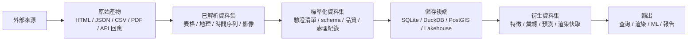
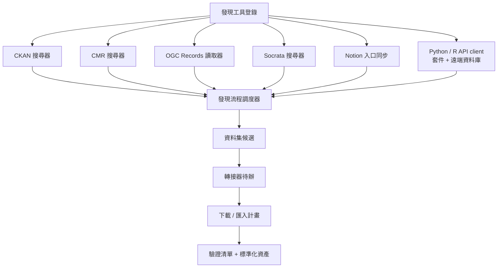
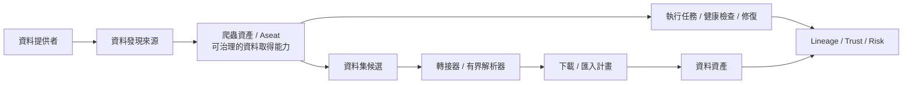
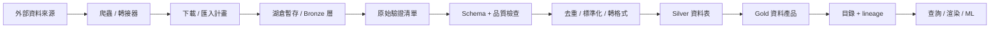
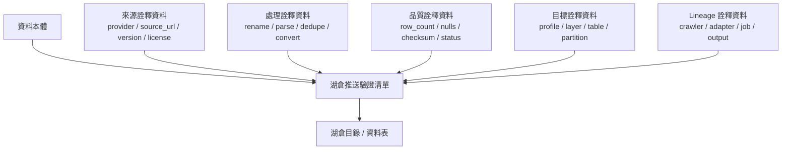
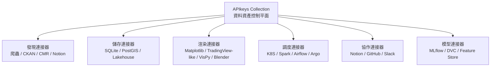
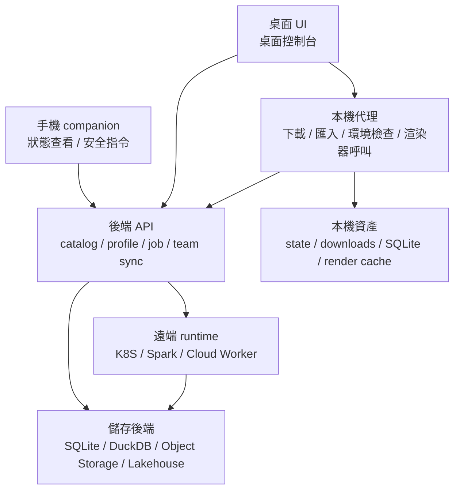

# 資料資產平台概念總綱

最後更新：2026-05-22

這份文件整理 2026-05-20 的產品概念討論。它不是當前 MVP 的實作清單，而是中期到長期的架構方向，幫下一位開發者理解：本專案不只是資料庫下載器，而是在形成一個 local-first 的資料資產平台。

目前 MVP 仍然只應優先守住：

```text
找得到 -> 排得進 -> 下得來 -> 匯得進 -> 看得到
```

本文件中的湖倉、K8S、ML、Render Studio、Notion、TradingView、Blender、Unreal 等方向，除非已經直接服務 MVP 閉環，否則先以文件、contract 或 stub 保留，不要搶主線。

## 核心定位

本專案的長期定位可以寫成：

> 資料工程版 Steam，並逐步演進成資料資產的桌面控制台。

更精準地說，它不是只管理「資料庫」，而是管理資料資產的完整生命週期：

```text
資料如何被發現
資料如何被審核
資料如何被下載或接入
資料如何被標準化
資料如何被推送到儲存後端
資料如何被渲染、查詢、訓練模型或分享
資料如何被追蹤、驗證、修復與重跑
```

Steam-like 的類比仍然成立：

```text
資料集本體 = 遊戲本體
本機安裝狀態 = 這台機器是否已安裝
workspace/save = 使用者設定、標註、查詢、渲染配方、模型訓練設定
renderer/backend = runtime 或 game engine 類角色
manifest/checksum/repair = 檔案驗證與修復
```

原始資料應盡量保持唯讀；使用者的改動、標準化規則、渲染設定、模型設定與分析結果應以 workspace、overlay、recipe、derived artifact 的方式保存。

## 管理對象

平台管理的對象不應限縮成 database。更合理的上位詞是：

```text
Data Asset / Dataset Artifact
```

資料庫只是資料資產的一種。平台未來可以管理：

```text
正式資料庫表
CSV / JSON / Parquet / GeoJSON / NetCDF / GeoTIFF
pandas DataFrame 或 DuckDB query result
爬蟲 raw result，例如 HTML、API response、PDF、圖片、壓縮檔
爬蟲資產，例如可版本化、可審核、可排程、可修復的 crawler / parser / resolver 能力包
語言 API client-backed source，例如 Python 的 yfinance、fredapi、astroquery，或 R 的 WDI、fredr、tidycensus 這類背後連到遠端資料庫 / Web API 的套件
標準化後的 curated dataset
湖倉 table
GIS layer
時間序列 shard
多媒體與 3D asset bundle
模型 artifact
模型推論結果
渲染輸出，例如 PNG、SVG、HTML、MP4、Python script、render recipe
```

資料生命週期可以抽象成：

```text
Source
-> Raw Artifact
-> Parsed Dataset
-> Standardized Dataset
-> Storage Backend
-> Derived Dataset
-> Render / ML / Query Output
```



這個抽象可以接住「資料只是 pandas DataFrame」或「資料只是爬蟲剛抓下來的結果」這類場景。DataFrame 可視為暫態表格 artifact；爬蟲結果可視為 raw artifact；兩者都可以後續被保存成 CSV、Parquet、SQLite、DuckDB、湖倉表或其他 storage target。

## 資料發現工具也是資產

本專案目前已走 crawler-first，但概念上可以再提升成：

```text
discovery-tool-first
```

也就是平台不只管理資料，也管理「資料是怎麼被找到的」。

Discovery Tool 是一級管理資產。它包含但不限於：

```text
crawler
API catalog searcher
portal parser
metadata harvester
sitemap scanner
OGC API Records reader
CKAN package searcher
Socrata catalog searcher
NASA CMR collection searcher
OpenAlex searcher
Dataverse searcher
Notion 清單同步器
人工入口 intake parser
```

它們的共同責任是：

```text
外部世界 -> candidate datasets
```

每個 Discovery Tool 應描述：

```text
tool_id
name
type
provider_scope
input parameters
output type
rate_limit
requires_credentials
version
last_run_status
last_success_at
health
```

平台可以管理：

```text
啟用 / 停用
查詢範圍
rate limit
排程
健康狀態
最近產出的 candidates
失敗原因
parser 版本
是否需要 credential
是否尊重 robots / terms / license
```

這能避免每新增一個入口網站，就多出一支孤立腳本。新增資料入口時，應優先新增或配置 Discovery Tool，讓它接進既有 orchestrator、candidate review、adapter handoff、download plan 流程。

## 語言 API client-backed source

使用者從 `yfinance` 延伸出的觀察很重要：許多 Python / R 套件本質上不是普通工具函式，而是遠端資料庫或 Web API 的 client。這類套件也應被視為可追蹤的資料取得入口，只是它們的入口不是 URL catalog，而是「語言套件 + provider API」的組合。

代表類型包含：

```text
Python 金融 / 經濟：yfinance、fredapi、wbgapi、pandas-datareader
Python 研究文獻：arxiv、pyalex、habanero、semanticscholar、pybliometrics
Python 天文：astroquery
Python 生物資訊：Bio.Entrez、mygene、bioservices、ensemblrest
Python 化學 / 藥物 / 材料：pubchempy、chembl_webresource_client、mp-api
Python 地球科學 / 氣候：earthaccess、cdsapi、meteostat、pystac-client
Python 地理 / 地震 / 生態：osmnx、obspy.clients.fdsn、pygbif、pyinaturalist
Python 機器學習資料集：openml、kaggle、ucimlrepo
R 官方統計 / 經濟：WDI、wbstats、fredr、eurostat、tidycensus、ipumsr
R 生物資訊 / 臨床：biomaRt、GEOquery、TCGAbiolinks
R 生物多樣性 / 化學 / 文獻：rgbif、webchem、rcdk、rcrossref、rorcid
```

這些 source 的治理重點和一般 crawler 類似，但還要多記：

```text
runtime 語言與執行方式，例如 Python package、R package、Rscript 或未來 renv profile
package 名稱與版本
背後 API / database 名稱
是否需要 API key 或帳號
terms / license / redistribution 風險
可查詢的 dataset/record 類型
查詢參數邊界，例如 symbol、country、DOI、gene id、bbox、date range
是否允許 CI/排程 live call
是否只能 fixture 測試或必須使用 mock
```

短期做法不是一次新增所有 adapter，也不是立刻引入 R runtime，而是把這類套件納入 source taxonomy。`yfinance` 是第一個具體樣板：預設只提供 query template 與 fixture plan；live fetch 必須由使用者明確 opt-in，並寫成本機 CSV + file-backed plan，再走既有下載 / manifest / SQLite 匯入閉環。未來每新增一個 Python / R client-backed source，都應先判斷能否用現有 crawler/API resolver；只有在需要套件專屬 auth、query builder、format conversion、rate-limit guard 或跨語言執行邊界時，才新增 adapter。



## 爬蟲資產 / Crawler Asset

使用者提出的「爬蟲資產」可以視為 Discovery Tool 的產品化擴充：平台不只管理資料本體，也管理「取得資料的能力」。這個能力不應被理解成單一 Python function，而是一個可被安裝、審核、版本化、執行、監控、修復，並能產生資料資產的能力包。

爬蟲資產可以用 Aseat 作為中期產品語彙：一個 Aseat 代表一個可治理的資料取得膠囊。它應包含：

```text
身份：asset_id、名稱、版本、維護者、適用 provider / source scope
來源：入口 URL、API endpoint、portal 類型、授權與 terms/robots 風險
能力：crawler type、parser、bounded resolver、可支援輸出格式
執行設定：查詢參數、rate limit、pagination、timeout、credential profile
安全邊界：大小上限、時間/空間邊界、不可自動下載的 URL 類型
產出：candidate datasets、adapter review items、download/import plan、manifest
治理：last run、health、warnings、trust score、cost、risk、repair workflow
lineage：哪個 crawler asset 在什麼版本下產生哪批資料資產
```

這個概念不取代既有模型，而是把既有模型包成更容易理解的產品層：

```text
Provider = 誰提供資料或入口
DatasetDiscoverySource = 去哪裡找資料
Crawler Asset / Aseat = 用什麼可治理能力取得資料候選或小樣本
DatasetCandidate = 這次找到的資料候選
Adapter / Resolver = 如何把候選轉成安全有界的下載 / 匯入計畫
Mission = 某次執行、修復、診斷、下載或匯入任務
Data Asset = 最後被下載、匯入、標準化、渲染或登錄的資料資產
```



短期不需要立刻新增一張龐大的 crawler asset table；目前可先讓 `catalog/dataset_discovery_sources.json`、`api_launcher/crawlers/*`、`adapter_plan_resolver.py`、event log 與 handoff 文件共同承擔這個概念。等 UI 進入 Aseat Arsenal / crawler asset cockpit 階段，再把它提升成明確 registry、健康面板與 repair mission。

## 標準化策略

本平台的核心價值不是把資料下載下來，而是讓資料取得「可治理的身分證」。

標準化資料資產至少應包含：

```text
dataset identity
manifest
schema version
processing log
quality report
storage target
job manifest
lineage event
license / usage policy
```

### Dataset Identity

每份資料要有穩定身分：

```text
dataset_id
provider_id
source_id
source_url
version
retrieved_at
license
attribution
```

同一份資料不應因為同時存在 SQLite、PostGIS、湖倉、render cache，就變成互不相干的多份資料。

### Manifest

每次資料落地都應產生 manifest：

```text
files
checksum
size_bytes
format
schema
row_count
time_range
geo_range
quality_status
source_url
retrieved_at
```

manifest 是平台與湖倉、K8S、渲染器、ML 工具交接的核心契約。

### Schema

schema 不是只有欄位名稱，還應逐步記錄：

```text
column name
data type
nullable
unit
semantic role
coordinate reference system
timezone
schema fingerprint
schema version
breaking change flag
```

### Processing Log

任何標準化動作都要可追蹤：

```text
rename column
parse datetime
convert unit
deduplicate
drop null
normalize CRS
resample
filter
sample
convert format
```

湖倉或 ML 使用者需要知道資料被平台做過哪些處理。

### Quality Report

資料有放進平台，不代表資料可信。品質報告至少應逐步支援：

```text
row_count
null_count
duplicate_count
failed_rows
checksum result
schema drift
time range
geo range
warning_count
validation status
```

### Lineage

lineage 是平台長期價值之一：

```text
provider source
-> discovery tool
-> candidate dataset
-> adapter review
-> download artifact
-> standardized dataset
-> lakehouse table
-> feature dataset
-> model
-> prediction dataset
-> render recipe
-> output image/video
```

有了 lineage，使用者才能回答：「這張圖、這個模型、這張湖倉表到底從哪份資料來？」

## 湖倉與 K8S

湖倉可以先粗略理解為「有資料庫腦袋的大型儲存系統」。它不只是雲端碟，而是把大量檔案組織成可查詢、可版本管理、可治理的大型資料表。

平台與湖倉 / K8S 的合理分工是：

```text
本平台 = control plane
湖倉 = storage / table plane
K8S / Spark = execution plane
```

平台不應取代湖倉與 K8S，而是把它們包裝成使用者不用直接面對的 managed backend。

### 安全推送流程

未來資料可以不先下載到本機，而是直接送到湖倉。但不應直接寫入正式表。安全流程應該是：

```text
外部資料來源
-> crawler / adapter
-> download / import plan
-> lakehouse staging / bronze
-> raw manifest
-> schema + quality check
-> 去重 / 標準化 / 轉格式
-> silver / gold table
-> catalog / lineage
```



湖倉分層可以採用：

```text
Bronze：原始保存，接近來源資料，用於追溯與重跑。
Silver：清洗標準化後，可穩定查詢。
Gold：面向應用、報表、渲染、ML 的資料產品。
```

### Push Manifest

推送到湖倉時，不只推資料，也要推 metadata。可以稱為：

```text
Lakehouse Push Manifest
```

它應包含：

```text
source metadata
processing metadata
quality metadata
target metadata
lineage metadata
```



白話說，資料本體是貨物，metadata 是報關文件與履歷表。湖倉需要這份文件才知道平台做過哪些標準化動作。

### Storage Profile

一站式資料平台需要知道有哪些 storage backend 可用：

```text
local files
SQLite
DuckDB
MySQL
PostGIS
TimescaleDB
Object Storage
Lakehouse
Feature Store
Model Registry
```

每個 Storage Profile 應描述：

```text
profile_id
backend_type
connection hints
capabilities
read/write permission
default namespace/schema/prefix
supported formats
health status
```

平台 catalog 是總控索引；湖倉或資料庫保存真正的大型資料表與檔案。

### Health Monitor

如果平台能指揮資料進湖倉，就需要監控後端健康狀態：

```text
連線狀態
認證與權限
latency
upload / download throughput
容量
catalog 狀態
最近 job 成功率
資料一致性
```

UI 可以呈現每個 storage profile 的健康卡，例如：

```text
Lakehouse Default
狀態：良好
延遲：42 ms
上傳：85 MB/s
下載：120 MB/s
容量：68% used
Catalog：正常
最近 24h jobs：31 成功 / 2 失敗
```

### Lakehouse Command Center

平台未來也可以成為湖倉 GUI 控制台，幫使用者發送安全指令：

```text
匯入資料集
建立資料表
轉成 Parquet / GeoParquet
建立 partition
執行品質檢查
壓縮小檔案
修復 catalog 與檔案不一致
重跑失敗 job
更新 schema
查看 lineage
```

危險動作必須採用：

```text
dry-run
plan preview
user confirmation
job status tracking
audit log
```

不要讓 GUI 直接按下去就破壞湖倉。

## 渲染接口與 Render Studio

渲染不應被視為單一功能，而是資料消費的一種大類接口。

Render Wizard 的流程可以是：

```text
加入待渲染資料
-> 解析資料型態與軸
-> 判斷使用者視覺意圖
-> 推薦渲染策略
-> 選擇構圖
-> 選擇 renderer backend
-> 預覽
-> 匯出圖片 / HTML / 影片 / Python code / render recipe
```

Matplotlib 只是第一個 renderer backend，不是渲染精靈本身。

未來 renderer backend 可包括：

```text
Matplotlib：靜態 2D 圖、報告圖、PNG/PDF/SVG。
Seaborn：統計圖。
Plotly：互動圖表、HTML。
TradingView-like：金融與高頻時間序列，可能透過 Lightweight Charts 或 Datafeed API 類接口。
VisPy：GPU 加速科學視覺化、大量點、影像、3D/volume。
Cartopy / GeoPandas：地圖與投影。
Taichi：高效能 GPU 模擬與自訂渲染。
Blender：高品質 3D 離線渲染、動畫、材質與燈光。
Unreal packaged renderer：即時 3D 場景、數位孿生、一般使用者不必安裝 Unreal Editor。
Cesium / Deck.gl：地球尺度與 Web GIS。
```

### Composition Model

複數資料集的構圖應有明確模型：

```text
Figure：整張圖。
Panel / Subplot：子圖。
Layer：圖層。
Axis：座標軸。
Scale：尺度。
Legend：圖例。
Camera / View：2D/3D 視角。
Style：樣式。
Annotation：註記。
Export：輸出。
```

每個 renderer 都有排版或構圖問題，不只是 Matplotlib：

```text
Matplotlib 有 legend、子圖、邊距、色條。
Plotly 有 dashboard layout、hover、responsive size。
GIS 有 CRS、底圖、比例尺、extent、圖層順序。
VisPy 有 viewport、camera、GPU scene graph。
Blender 有相機、燈光、材質、物件層級。
Unreal 有 level、actor、camera、material、runtime interaction。
Cesium 有 globe camera、tileset、terrain、time slider。
```

因此長期應該抽象為：

```text
Render Composition Editor
```

Matplotlib Layout Editor 只是最容易落地的第一個子集。

### Data Render Studio

中期可以把 Render Wizard 發展成資料渲染版的 Composition Studio。它可以吸收 Photoshop-like 概念，但要改造成資料語境：

```text
Layer：資料圖層、註記圖層、背景圖層、地圖圖層、模型輸出圖層。
Brush：資料選取、註記、mask 生成工具。
Mask：SQL 條件、時間範圍、GeoJSON polygon、boolean array、raster mask。
Filter：影像濾鏡、資料濾鏡、科學濾鏡、視覺濾鏡。
Color management：colormap、vmin/vmax、linear/log scale、色盲友善 palette、colorbar。
```

這不是 Photoshop clone，不需要修臉、像素級繪畫或相片合成全套。它的重點是非破壞式資料渲染：

```text
原始資料 + processing/filter/mask/style/renderer recipe = output artifact
```

## ML 使用者與模型資產

資料科學使用者必然會碰到 ML。平台不需要一開始變成完整 MLOps，但可以成為資料集與模型之間的治理橋樑。

可管理的 ML 資產包括：

```text
training dataset version
feature dataset
train/validation/test split
sampling rule
filter rule
model artifact
model metrics
inference output
embedding
forecast
segmentation mask
```

模型也可以是平台管理的資產：

```text
model_id
model_version
framework
model_file
training_dataset
feature_dataset
metrics
created_at
owner
license
```

最重要的是 ML lineage：

```text
哪些資料訓練了這個模型？
這個模型產生了哪些預測資料？
哪些渲染圖或報表使用了這個模型輸出？
```

未來可對接 MLflow、DVC、Feast、Weights & Biases、Ray、K8S training job，但近期只需把模型視為可管理資產，並保留資料授權欄位如 `training_allowed`。

## 外部工具與 Connector 分型

平台不要把所有工具重寫一遍。更健康的策略是定義接口，讓外部工具成為 connector。

Connector 可分型：

```text
Discovery Connector：找資料，例如 crawler、Notion 清單、CKAN、CMR、OGC Records。
Storage Connector：存資料，例如 SQLite、PostGIS、湖倉、Object Storage。
Renderer Connector：把資料變畫面，例如 Matplotlib、TradingView-like、VisPy、Blender。
Control Connector：送任務，例如 K8S、Spark、Airflow、Argo。
Collaboration Connector：協作與審核，例如 Notion、GitHub Issues、Slack。
Model Connector：模型 registry、experiment tracking、feature store。
```



### TradingView 類工具

TradingView 類工具可以視為 renderer connector，特別是金融和高頻時間序列。

較安全的方向是：

```text
使用 TradingView Lightweight Charts 或 TradingView-like 自建 renderer。
或在授權條件允許時，實作符合 Charting Library Datafeed API 的資料接口。
```

不建議把核心架構建立在自動操控 tradingview.com 網站帳號或 UI 上，因為穩定性與授權風險都高。

### Notion

Notion 比較適合作為 collaboration / discovery I/O，不適合當大型資料庫。

可用情境：

```text
組員維護資料入口網站清單
人工審核 candidate dataset
同步 GTD / handoff / portal intake
寫回 crawler audit 結果
寫回品質報告摘要
```

Notion 應視為雲端 staging，不是正式 catalog 權威。同步進來的資料仍應轉成 review JSON、local seeds、crawler audit，通過後才進正式 catalog。

## 產品形態

完整產品的第一形態適合是桌面軟體，但不應只是桌面軟體。

更準確地說：

```text
Local-first desktop control panel
+ local agent
+ optional remote/lakehouse/K8S backend
```

類比：

```text
Steam：桌面 App 管遊戲、runtime、更新、修復。
Docker Desktop：桌面 App 管本機與遠端 container。
VS Code：桌面 IDE，但可接 remote。
Postman：桌面/API 工作流工具。
TablePlus：桌面資料庫 GUI。
```

平台層次可分為：

```text
Desktop UI：使用者操作入口。
Local Agent：下載、匯入、環境檢查、呼叫 renderer、管理本機資料。
Backend API：管理 job、profile、catalog、team sync。
Remote Runtime：K8S、Spark、lakehouse、cloud worker。
Mobile Companion：未來查看狀態與發送安全指令，不處理重資料。
```



商業化上可分為：

```text
個人版：桌面 App + 本機資料 + SQLite/DuckDB + 基本 crawler/render。
團隊版：桌面 App + team catalog + lakehouse/K8S connector + 權限 + sync + job history。
```

## 工程哲學與防暴走規則

使用者偏好的工程哲學：

```text
能軟編碼就不要硬編碼。
能 GPU 就不要 CPU。
能多線程就不要單線程。
能非阻塞式 IO 就不要阻塞式。
能跨平台就跨平台。
```

但 MVP 階段要加一條防暴走規則：

```text
先做最小可驗證閉環，架構上預留升級路徑，不提早實作完整重型系統。
```

每個新增功能都要先回答：

```text
它服務 MVP 哪一段？
它目前被哪個 CLI / UI / test / documented flow 使用？
如果移除它，MVP 會不會受影響？
```

如果答不出來，先放入 roadmap 或本文件，不要直接寫成實作。

## 分階段路線

### 當前 MVP

只聚焦：

```text
資料來源 seed / discovery
crawler candidate
adapter review
download plan
非阻塞下載
manifest / checksum / repair
CSV/JSON 匯入 SQLite
UI 看得到狀態
```

### 近期標準化

定義並逐步落地：

```text
dataset_manifest.json
processing_log.json
quality_report.json
storage_profile.json
job_manifest.json
lineage_event.json
```

### 中期平台化

逐步加入：

```text
Discovery Tool registry
Storage Profile health monitor
lakehouse push manifest
K8S job contract
Render Wizard with Matplotlib backend
Notion-backed portal intake
ML artifact catalog stub
```

### 中後期產品化

再評估：

```text
Lakehouse Command Center
Render Composition Editor
VisPy / Plotly / GIS / Blender / Unreal packaged renderer connectors
feature dataset / model lineage
team catalog sync
resident desktop agent
mobile companion
```

## 總結

這個平台的長期價值不是「我能下載很多資料」，而是：

> 把資料發現工具、資料資產、標準化策略、儲存後端、渲染器、模型、任務與 lineage 都納入同一套可追蹤、可審核、可重跑的工作流。

如果成功，它會把資料工作者每天重複的碎工平台化：

```text
找資料
看文件
寫一次性爬蟲
猜 schema
手動匯入
追版本
記錄處理流程
查授權
確認品質
推送湖倉
渲染輸出
追模型資料來源
```

近期仍要克制。先讓 MVP 真正閉環，讓平台證明它能把資料從外部來源安全帶到本機可用狀態。長期概念再依照標準化 contract 一層一層長上去。
