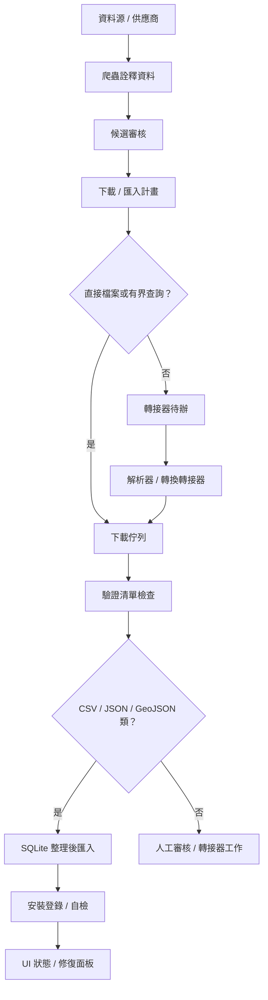

# MVP 閉環稽核

最後更新：2026-05-22

這份文件用來回答 Demo 時最重要的問題：哪些流程真的可以從 UI/CLI 走完，哪些只是有按鈕或骨架，卡住時該看哪裡。

## 總覽圖



## 閉環狀態表

| 流程 | 目前狀態 | 可驗證入口 | Demo 風險 |
| --- | --- | --- | --- |
| 啟動 UI | 已閉環 | `py APIkeys_collection_ui.py` | GUI 環境或 Tk 問題仍可能阻擋視窗 |
| Provider catalog | 已閉環 | `py APIkeys_collection.py --summary` | catalog 是 provider/source，不代表每個 provider 都有可下載資料 |
| Crawler discovery | 部分閉環 | `--discover-dataset-candidates`, UI `資料庫 > 發現資料集候選` | Demo 可能只看到少量候選；要確認是否有 full-crawl、搜尋詞、page cap、warning |
| Candidate review | MVP | UI `資料庫 > 審核資料集候選`, `--export-candidate-plan` | metadata-only，加入 plan 不代表已可下載 |
| Canonical MVP Demo Flow | MVP | `--write-mvp-demo-flow state/mvp_demo/flow.json` | 會產生固定 review plan、離線 direct plan 與操作指令；離線 fixture 可驗證下載/manifest/SQLite 匯入，線上 Socrata 小樣本仍受網路影響 |
| Adapter review | MVP | `--adapter-review-plan`, UI `Adapter 待辦` | HTML/API selector 仍要 adapter，不應假裝下載完成 |
| Adapter resolver | MVP | `--resolve-adapter-plan` | 只做 bounded lookup，不掃整站；過大或未知格式會留在 review |
| Download queue | MVP | `--run-download-plan`, UI 下載計畫 `開始` | 只有 direct entries 會下載；若 plan 全是 adapter/API/metadata 項目，CLI 會輸出 `skip_summary` 與 `next_action`，UI 會跳出引導，要求先開 Adapter 待辦或解析 Adapter 計畫 |
| Manifest verification | MVP | `--verify-downloads`, Repair panel | 需要 sidecar manifest；沒有 manifest 的舊檔不能自動修復 |
| CSV/JSON/GeoJSON import | MVP | `--import-supported-plan-results`, UI `匯入` | NetCDF/HDF/GeoTIFF/大型壓縮包仍需 adapter |
| Database self-check | MVP | `--self-check-databases-json`, Repair panel | 自動修復只限 ownership 明確的安全案例 |
| MySQL connection | Skeleton/MVP probe | `--test-data-store mysql_default` | 本機目前 MySQL 服務存在，但缺 `APIKEYS_MYSQL_*` env vars；Python driver 也需要確認 |

## 目前本機 MySQL 檢查結果

2026-05-21 Windows/K 檢查：

- Windows service 看到 `MySQL84`，狀態是 `Running`。
- `py -B APIkeys_collection.py --test-data-store mysql_default` 回報缺少 `APIKEYS_MYSQL_HOST`、`APIKEYS_MYSQL_DATABASE`、`APIKEYS_MYSQL_USER`、`APIKEYS_MYSQL_PASSWORD`。
- 獨立 Python probe 顯示 `mysql.connector` namespace 尚不可用，代表可能還沒在目前 Python 環境安裝 `mysql-connector-python`。
- 下一步不應把密碼寫進 Git；應用環境變數或 future credential vault。

安全連線順序：

```powershell
$env:APIKEYS_MYSQL_HOST = "127.0.0.1"
$env:APIKEYS_MYSQL_PORT = "3306"
$env:APIKEYS_MYSQL_DATABASE = "你的測試資料庫"
$env:APIKEYS_MYSQL_USER = "你的使用者"
$env:APIKEYS_MYSQL_PASSWORD = "你的密碼"
py -B APIkeys_collection.py --test-data-store mysql_default
```

只有 read-only probe 通過後，才考慮 registry-backed smoke。任何會建立/ALTER/DROP 測試表的流程都必須用 disposable database，並明確設定 opt-in guard。

## Demo 檢查清單

Demo 前至少確認：

1. UI 能啟動並印出 `APIkeys_collection UI ready ...`。
2. `--summary` 能列出 provider count。
3. 若要先做穩定 smoke test，執行 `--write-mvp-demo-flow state/mvp_demo/flow.json`，照 flow JSON 內的離線 plan 指令跑到 manifest/SQLite 匯入成功。
4. Crawler discovery 對至少一個 source 產生候選，且沒有 suspiciously low/zero warning。
5. Candidate 可以加入 download/import plan。
6. Plan 至少有一個 direct entry 或 resolver 能產生 direct entry。
7. Download 後有 sidecar manifest。
8. 匯入後能在 SQLite 看到 curated table asset。
9. Repair panel 能看到下載檔案或 database self-check 狀態。
10. MySQL 若要 Demo，先確定 env vars、driver、service/database 都準備好。

## 對「爬到沒有東西可爬」的界線

可以支援 full-crawl，但不能無邊界背景亂爬。

可接受：

- 依 API pagination 的 `next`、cursor、offset/limit 一頁頁抓到沒有下一頁。
- 有全域 page cap、per-source cap、host politeness、timeout。
- 0 筆、低於預期、全部重複、payload shape 不符時報 warning/error。

不可接受：

- 掃整站 HTML 連結直到沒有連結。
- 未經授權或未知格式直接下載。
- 把 API selector、登入頁、landing page 當成資料檔。
- 下載大型資料前沒有版本、大小、checksum 或 manifest 策略。
