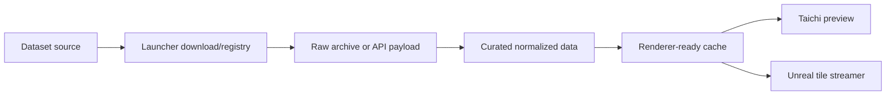

# 渲染前端策略：Taichi 與 Unreal

最後更新：2026-05-17

## 核心想法

Launcher 管理資料，渲染前端消費資料。資料集本身應該保持同一套 ID、版本、manifest、checksum 與清洗紀錄；不同前端只改變取樣方式、cache 格式與呈現策略。

Unreal 只是最終 UI 與渲染器，不是資料庫本身。它負責互動、材質、光照、烘焙、後處理與畫面呈現；資料仍然可以由 launcher、SQLite/MySQL、檔案 manifest、tile service 或外部資料管線提供。也就是說，能不預生成巨大資產就不要預生成，能串流就串流，能外部索引就外部索引。

目前可以把前端分成兩層：

| 前端 | 定位 | 適合場景 |
| --- | --- | --- |
| Taichi renderer | 跨平台參考渲染器、GPU/CPU smoke test、演算法原型 | 沒有 Unreal 的機器、快速測試地形/星圖/視角邏輯、CI 或 agent 接力 |
| Unreal Engine | 最終互動式虛擬孿生前端 | 第一人稱/第二人稱/第三人稱互動、場景串流、材質、光照、世界組成 |

`taichi_Taipei_bathymetry.py` 的精神是很好的參考：它會根據平台選擇 Taichi backend，使用 cache 避免重算，並用區域 preset、grid resolution、環境變數來控制渲染成本。這些概念未來應該抽成 renderer profile。

## 資料流



## Camera-driven LOD

在 Unreal 中，資料集可以相同，但採樣策略會因視角改變：

| Camera mode | 取樣需求 | 可能策略 |
| --- | --- | --- |
| First person | 近場最高，遠場可省略 | 小 tile、高 LOD、依移動方向預取 |
| Second person | 目標附近最高，相機路徑次高 | 目標位置與相機位置雙中心 streaming |
| Third person / orbit | 全球概覽，焦點區域細化 | 大 tile、低 LOD 全球底圖、焦點 patch refine |

這代表 launcher 的 Unreal bridge 不應只輸出一個巨大 mesh，而應逐步演進成：

1. 建立 renderer-ready tile cache。
2. 為每個 tile 記錄 dataset id、版本、經緯度範圍、解析度、checksum。
3. 產生 tile manifest。
4. Unreal 依 camera mode/frustum/distance/performance budget 請求 tile。
5. Taichi 使用同一份 tile/cache 做參考渲染或 debug。

## Taichi Profile 建議

目前已加入 `api_launcher/rendering_profiles.py`，用來描述不同平台與算力等級的渲染策略。未來可以把它接進 UI 與 Unreal importer。

Taichi 可以建立類似 profile：

```json
{
  "id": "taichi_gpu_preview",
  "frontend": "taichi",
  "backend_order": ["cuda", "vulkan", "metal", "opengl", "cpu"],
  "cache_policy": "reuse_or_build",
  "target_fps": 60,
  "default_lod": "preview"
}
```

Unreal 則可以有：

```json
{
  "id": "unreal_virtual_twin",
  "frontend": "unreal",
  "streaming_policy": "camera_driven_tiles",
  "content_root": "Content/APIkeysCollection",
  "default_camera_mode": "third_person_orbit"
}
```

## 跨平台後端

| 平台/設備 | Taichi backend 傾向 | Unreal graphics API 傾向 | 預設資料策略 |
| --- | --- | --- | --- |
| Windows + NVIDIA | CUDA -> Vulkan -> OpenGL -> CPU | DirectX 12 -> Vulkan -> DirectX 11 | 較高並行 tile，允許較大 stream radius |
| Windows 無明確 CUDA | Vulkan -> OpenGL -> CPU | DirectX 12 -> Vulkan -> DirectX 11 | 中等 tile 預算，保守預取 |
| macOS / Apple Silicon | Metal -> Vulkan -> OpenGL -> CPU | Metal | 中等 tile 預算，重視 memory pressure |
| Linux workstation | CUDA 或 Vulkan -> OpenGL -> CPU | Vulkan -> OpenGL | 可配置為 high/workstation |
| Mobile / low-power | Vulkan/OpenGL/CPU，視設備而定 | Mobile RHI/Metal/Vulkan，視平台而定 | 小 tile、短 stream radius、低 FPS 或動態解析度 |

環境變數可以先作為簡單控制面：

- `APIKEYS_RENDER_PERFORMANCE_TIER=mobile|low|medium|high|workstation`
- `APIKEYS_RENDER_DEVICE_CLASS=mobile|tablet|low_power`
- `TAICHI_ARCH=cuda|vulkan|metal|opengl|cpu`

這些設定未來會變成 UI 中的「渲染預算」與「裝置 profile」。

## 下一步

- 將 Taichi/Unreal 共同需要的 dataset ID、cache path、tile schema 放進 launcher 的 renderer contract。
- 為 GEBCO/HYG 先做一套簡單 tile manifest。
- `scripts/export_unreal_preview.py` 目前已會輸出 preview 用的 `TileManifest.json`，先作為 Unreal/Taichi 串流契約骨架。
- 讓 Taichi 可以讀 tile manifest，而不是只讀固定 cache 檔名。
- 讓 Unreal 先匯入 preview OBJ，再逐步改為 tile streaming。
