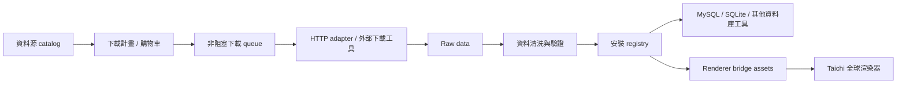

# APIkeys Collection 中文技術概要

最後更新：2026-05-17

APIkeys Collection 是一個類 Steam 的資料庫與資料源啟動器。它的目標不是只保存 API key，而是協助大數據專案管理「資料源、下載計畫、本機資料庫、安裝狀態、清洗流程、渲染器橋接」。

## 目前定位

這個專案目前是 MVP 階段，已經具備資料源清單、下載計畫、非阻塞下載器、資料庫工具設定、基本安裝 registry、Taichi renderer bridge 的骨架。

它尚未完成的部分包括：完整 provider-specific adapters、SQL 自檢、資料清洗流程、手動 CSV/JSON 匯入、完整 UI 右鍵選單、資料庫安全刪除流程。

## 主要流程



## 重要資料夾

| 路徑 | 用途 |
| --- | --- |
| `api_launcher/` | Python 核心套件。大多數產品邏輯都在這裡。 |
| `catalog/` | 內建資料源清單、credential reference、範例 registry。 |
| `config/` | 可提交的範例設定，例如資料庫工具、AI、下載工具 profile。 |
| `docs/` | 技術文件、GTD、交接文件。 |
| `scripts/` | Windows/macOS/Linux 啟動與環境設定腳本。 |
| `state/` | 本機 runtime 狀態，預期忽略於 Git。 |
| `downloads/` | 實際下載資料，預期忽略於 Git。 |
| `renderers/` | 可選的渲染引擎，目前有 `taichi_global_bathymetry.py`。 |
| `tests/` | 單元測試。 |

## 路徑管理規則

跨平台開發時不要在各檔案自行硬寫路徑。請使用：

```python
from api_launcher.paths import catalog_file, config_file, local_config_file, state_file
```

常見用途：

```python
catalog_file("APIkeys_collection_catalog.json")
config_file("launcher_integrations.example.json")
local_config_file("launcher_integrations.local.json")
state_file("APIkeys_collection.sqlite")
```

`api_launcher/paths.py` 會優先使用新資料夾，也會在相容期回頭尋找舊 root 檔案，降低 Windows/Mac 接力時的路徑錯誤。

## 下載器設計

下載器分成兩層：

| 層 | 檔案 | 用途 |
| --- | --- | --- |
| Job queue | `api_launcher/download_jobs.py` | 管理 queued/running/paused/completed/failed/cancelled 狀態。 |
| HTTP adapter | `api_launcher/http_downloader.py` | 真正下載 direct HTTP(S) 檔案，支援 `.part` 與 Range 續傳。 |
| 外部工具 profile | `api_launcher/transfer_tools.py` | 建立 aria2c/curl 等外部工具命令，但不用 shell 字串拼接。 |
| 可下載性判斷 | `api_launcher/download_eligibility.py` | 判斷資料源是 Direct、Adapter、Docs 或 Unavailable。 |
| 禮貌下載政策 | `api_launcher/download_policy.py` | 控制每 host 延遲、重試退避、429/503 冷卻、User-Agent。 |

目前 UI 只會直接下載 Direct 類型資料源。API endpoint 或 docs page 會被標為需要 adapter，避免把文件頁誤當資料集下載。

大量下載時必須注意來源站的限制。預設下載器會限制同一 host 的請求節奏，遇到 429 或 503 會冷卻後重試。未來 provider-specific adapter 應該讀取官方 rate limit，並且讓使用者能在 UI 中調整並行數與延遲。

## 可下載性狀態

| 狀態 | 意義 |
| --- | --- |
| `direct_download` | URL 看起來是直接檔案，例如 `.zip`、`.nc`、`.csv`、`.json`。 |
| `adapter_required` | 有 API endpoint，但需要 provider-specific adapter 轉成資料檔。 |
| `metadata_only` | 目前只有 docs/signup 頁面，不能直接下載。 |
| `unavailable` | 沒有可用 URL。 |

## 資料庫工具接口

資料庫工具設定在：

- 範例：`config/launcher_integrations.example.json`
- 本機：`launcher_integrations.local.json`

本機檔案不要提交 Git。使用者可以設定 MySQL Workbench、DBeaver 或其他資料庫工具。UI 中有「資料庫工具設定」視窗可切換預設工具。

## 安裝 registry 與解除安裝

資料下載或手動納管後，launcher 會以 `install_id` 追蹤本機資產。這是為了避免使用者手動刪除、重複匯入、或資料庫漂移時造成誤判。

目前解除安裝仍是安全骨架：會標記 registry 狀態，不會直接執行破壞性 SQL。未來若要刪除 SQL database，必須確認 install_id 與 fingerprint 都符合。

## Taichi renderer bridge

`renderers/taichi_global_bathymetry.py` 被視為渲染引擎，不應該負責資料 discovery、下載、清洗或卸載。

Launcher 透過 `api_launcher/renderer_contracts.py` 管理 renderer 需要的資料集 ID 與快取路徑，例如：

- GEBCO 地形資料
- HYG 星表資料

未來的目標是：資料被 launcher 下載與註冊後，可以被 renderer bridge 穩定讀取。

## 驗證指令

Windows PowerShell：

```powershell
py -m unittest discover -s tests
$env:PYTHONDONTWRITEBYTECODE='1'; py -m py_compile APIkeys_collection.py APIkeys_collection_ui.py api_launcher\core.py
docker compose run --rm --build launcher
```

macOS/Linux：

```bash
python3 -m unittest discover -s tests
PYTHONDONTWRITEBYTECODE=1 python3 -m py_compile APIkeys_collection.py APIkeys_collection_ui.py api_launcher/core.py
docker compose run --rm --build launcher
```

## 開發原則

- 不要收集、爬取、提交真實 API key 或 token。
- 不要把本機絕對路徑寫進程式碼。
- 不要把下載資料、SQLite runtime state、private config 提交 Git。
- 任何會刪除資料庫或檔案的功能，都必須依賴 install_id 與明確確認流程。
- 新功能完成後要更新 `docs/PROJECT_GTD.md`。
