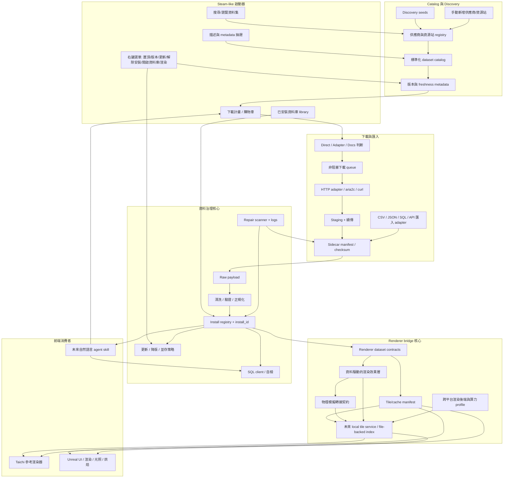

# APIkeys Collection 中文技術概要

最後更新：2026-05-18

APIkeys Collection 是一個類 Steam 的資料庫與資料源啟動器。它的目標不是只保存 API key，而是協助大數據專案管理「資料源、下載計畫、本機資料庫、安裝狀態、清洗流程、渲染器橋接」。

## 目前定位

這個專案目前是 MVP 階段，已經具備資料源清單、下載計畫、非阻塞下載器、資料庫工具設定、基本安裝 registry、Taichi renderer bridge 的骨架。

它尚未完成的部分包括：完整 provider-specific adapters、SQL 自檢、資料清洗流程、手動 CSV/JSON 匯入、完整 UI 右鍵選單、資料庫安全刪除流程。

若要先建立資料類型概念，請讀 `docs/DATASET_TYPE_MAP.zh-TW.md`。那份文件整理表格、GIS、時間序列、科學陣列、粒子事件、多媒體/3D、文件、圖網路與串流資料各自適合的儲存、分析與渲染方向。

## 中期桌面常駐形態

Steam-like 的產品形態不應只是一個手動開啟的視窗。中期目標是讓 launcher 成為常駐桌面程式：Windows 收在右下角系統匣，macOS 收在功能列 / menu bar。使用者可以從常駐入口快速開啟 library、暫停或恢復下載、查看修復提醒、進入設定、打開近期日誌。

技術上，這代表要把「背景工作者」和「視窗 UI」分清楚。下載、匯入、修復掃描、更新提醒應該能透過共用 backend service/worker 和 CLI action 執行；Tk 視窗、未來系統匣 shell、macOS menu bar shell 都只是操作同一套能力的不同入口。這不是後端 MVP 的第一優先，但現在文件先記錄，避免後續把架構寫成一次性腳本。

在更後面的階段，可以新增移動端 companion app。它應該透過安全配對連到常駐桌面端，而不是直接連資料庫。基本模型是：手機端發出「查看狀態、暫停/恢復下載、重試失敗任務、收到修復提醒」這類控制命令；桌面端負責驗證裝置、檢查權限、執行 action、保管 token 與資料。這需要一層 guarded remote-control API，至少包含 QR/device pairing、可撤銷 device token、預設唯讀權限、破壞性操作二次確認，以及 LAN/VPN/tunnel 的安全部署邊界。

## 主要流程

這份專案要同時保留兩件事：

- Steam-like 資料庫安裝器：搜尋資料集、加入下載計畫、下載、安裝、更新、解除安裝、開啟資料庫工具。
- 虛擬孿生資料管線：把已安裝資料轉成 Taichi/Unreal 可讀的 cache、tile manifest 或串流索引。



重要邊界：Unreal 是前端與渲染器，不是資料主權所在。原始資料、版本、checksum、清洗紀錄、install_id 仍由 launcher 管理；Unreal 只在需要時匯入、快取、串流或烘焙前端專用資產。

## 重要資料夾

| 路徑 | 用途 |
| --- | --- |
| `api_launcher/` | Python 核心套件。大多數產品邏輯都在這裡。 |
| `frontends/` | 前端程式碼。目前 Tk launcher 實作已放在 `frontends/tk/`，根目錄 UI 檔只保留相容入口。 |
| `catalog/` | 內建資料源清單、credential reference、範例 registry。 |
| `config/` | 可提交的範例設定，例如資料庫工具、AI、下載工具 profile。 |
| `docs/` | 技術文件、GTD、交接文件。 |
| `scripts/` | Windows/macOS/Linux 啟動與環境設定腳本。 |
| `state/` | 本機 runtime 狀態，預期忽略於 Git。 |
| `downloads/` | 實際下載資料，預期忽略於 Git。 |
| `renderers/` | 可選的渲染引擎，目前有 `taichi_global_bathymetry.py`。 |
| `tests/` | 單元測試。 |

## 路徑管理規則

跨平台開發時不要在各檔案自行硬寫路徑。請使用：

```python
from api_launcher.paths import catalog_file, config_file, local_config_file, state_file
```

常見用途：

```python
catalog_file("APIkeys_collection_catalog.json")
config_file("launcher_integrations.example.json")
local_config_file("launcher_integrations.local.json")
state_file("APIkeys_collection.sqlite")
```

`api_launcher/paths.py` 會優先使用新資料夾，也會在相容期回頭尋找舊 root 檔案，降低 Windows/Mac 接力時的路徑錯誤。

## 前後端資料夾邊界

後端核心放在 `api_launcher/`。Tk UI 實作放在 `frontends/tk/`。根目錄的 `APIkeys_collection.py` 和 `APIkeys_collection_ui.py` 是相容入口，讓舊指令仍可使用。

未來 Unreal 相關工具會優先放在 `frontends/unreal/` 或 `scripts/` 中，不應直接混進後端資料管理邏輯。目前 `frontends/unreal/README.zh-TW.md` 先定義 Unreal 前端邊界與後續腳本位置。

## 下載器設計

下載器分成兩層：

| 層 | 檔案 | 用途 |
| --- | --- | --- |
| Job queue | `api_launcher/download_jobs.py` | 管理 queued/running/paused/completed/failed/cancelled 狀態。 |
| HTTP adapter | `api_launcher/http_downloader.py` | 真正下載 direct HTTP(S) 檔案，支援 `.part` 與 Range 續傳。 |
| 外部工具 profile | `api_launcher/transfer_tools.py` | 建立 aria2c/curl 等外部工具命令，但不用 shell 字串拼接。 |
| 可下載性判斷 | `api_launcher/download_eligibility.py` | 判斷資料源是 Direct、Adapter、Docs 或 Unavailable。 |
| 禮貌下載政策 | `api_launcher/download_policy.py` | 控制每 host 延遲、重試退避、429/503 冷卻、User-Agent。 |

目前 UI 只會直接下載 Direct 類型資料源。API endpoint 或 docs page 會被標為需要 adapter，避免把文件頁誤當資料集下載。

大量下載時必須注意來源站的限制。預設下載器會限制同一 host 的請求節奏，遇到 429 或 503 會冷卻後重試。未來 provider-specific adapter 應該讀取官方 rate limit，並且讓使用者能在 UI 中調整並行數與延遲。

Direct HTTP(S) 下載完成後會產生 sidecar manifest。健康 manifest 會被寫入 SQLite `dataset_asset_manifests`，並且可登錄成 install registry 裡的 managed `file` asset。這是目前 MVP 閉環的核心：下載檔案不只是落在 `downloads/`，還會有 manifest、checksum、provider/dataset/version/source metadata，以及本機 ownership 記錄。

下載政策可以在 `launcher_integrations.local.json` 覆寫，範例來源在 `config/launcher_integrations.example.json`：

```json
{
  "download_policy": {
    "max_parallel_jobs": 3,
    "max_parallel_per_host": 1,
    "min_delay_per_host_seconds": 1.0,
    "max_retries": 5,
    "retry_base_delay_seconds": 2.0,
    "retry_max_delay_seconds": 120.0,
    "cooldown_status_codes": [429, 503]
  }
}
```

如果來源站有限制，請優先降低 `max_parallel_jobs`，提高 `min_delay_per_host_seconds`，而不是硬開多執行緒。

## Steam-like library actions

目前新增 `api_launcher/library_actions.py` 作為 UI/agent 共用的動作判斷骨架。它會根據 local status、update status、manifest health、install_id、是否可下載、是否有 renderer asset，判斷以下動作是否可用：

| Action | 用途 |
| --- | --- |
| `add_to_plan` | 加入下載計畫。 |
| `install` | 下載/匯入並納管。 |
| `update` | 有新版或 stale 狀態時更新。 |
| `repair` | manifest 顯示缺檔、checksum 錯誤或 size 錯誤時修復。 |
| `open_database` | 透過設定的資料庫工具開啟。 |
| `render_preview` | 有 renderer bridge asset 時交給 Taichi/Unreal 預覽。 |
| `uninstall` | 解除納管或未來 guarded destructive uninstall。 |

這層先不直接綁死 Tk UI，避免 UI 越來越複雜。之後右鍵選單、agent skill、Unreal frontend 都可以共用同一套 action rules。

可用 CLI 模擬目前某個資料源可做的動作：

```powershell
py APIkeys_collection.py --show-library-actions gebco --library-local-status managed --library-install-id inst_demo --library-render-assets
```

## 可下載性狀態

| 狀態 | 意義 |
| --- | --- |
| `direct_download` | URL 看起來是直接檔案，例如 `.zip`、`.nc`、`.csv`、`.json`。 |
| `adapter_required` | 有 API endpoint，但需要 provider-specific adapter 轉成資料檔。 |
| `metadata_only` | 目前只有 docs/signup 頁面，不能直接下載。 |
| `unavailable` | 沒有可用 URL。 |

## 資料庫工具接口

資料庫工具設定在：

- 範例：`config/launcher_integrations.example.json`
- 本機：`launcher_integrations.local.json`

本機檔案不要提交 Git。使用者可以設定 MySQL Workbench、DBeaver 或其他資料庫工具。UI 中有「資料庫工具設定」視窗可切換預設工具。

選單列也有 `Integrations > Data store connections`。這和「資料庫工具」不同：

- Database tool settings：設定要開啟 MySQL Workbench、DBeaver 或其他 GUI client。
- Data store connections：保留 MySQL/PostgreSQL/SQLite、MongoDB、S3-compatible object storage、vector DB 等連線 profile 與環境變數名稱，供未來自檢、登入、測試連線、install/uninstall adapter 使用。

SQL 不再有獨立的連線 profile 模組；MySQL、PostgreSQL、SQLite 會被視為 data store connection 的一種。這樣可以避免未來同時維護 SQL-only 與 NoSQL/object/vector profile 兩套相似結構。

目前密碼與 token 不會寫進 config；建議放在環境變數或未來的 credential vault。Profile 可用 `env_var_map` 說明 host、database、user、password、port、SQLite path 各自要讀哪個環境變數，讓使用者可以為不同資料庫保留不同命名，而不是全部硬塞進同一組 `APIKEYS_MYSQL_*` 或 `APIKEYS_POSTGRES_*`。這是為了支援使用者混合使用關聯式與非關聯式資料庫的情況。

Data store connection testing 已有第一版骨架：

```bash
python APIkeys_collection.py --test-data-store sqlite_local
python APIkeys_collection.py --test-data-store all
```

SQLite 會用 read-only 方式開啟既有檔案並做基本 introspection，不會為了測試而建立缺失的資料庫檔。MySQL/PostgreSQL 會先檢查必要環境變數與 optional Python driver；未安裝 driver 時只回報 `dependency_missing`，不會嘗試連線或要求把套件裝進 base/system 環境。

如果資料庫資產已經被 install registry 納管，可以跑：

```bash
python APIkeys_collection.py --self-check-databases
```

目前這會用 registry asset verifier 檢查 managed database/table assets。SQLite database asset 會依 `source_uri` 或 path-like `asset_name` 做 read-only 檢查，計算 database-level table/column schema fingerprint；SQLite table asset 會依 `source_uri` + `asset_name` 檢查單表是否存在，並可用 table-level `schema_fingerprint` 偵測 drift。MySQL/PostgreSQL 會使用 local integration config 裡的 data-store profiles，先檢查 env vars 與 optional driver；driver/env vars 可用時，連線 smoke 會透過 `information_schema` 回報 table_count，database/table asset 若有 `schema_fingerprint` 也可做 schema drift detection。跨引擎 table asset 的 database ownership 來自 install record 的 `location`/`install_location`；asset 可另外記錄 `data_store_profile_id` 與明確 `schema_name`，PostgreSQL 也仍可用 `schema.table` 指定 schema；missing table 會標記為 `missing`。結果會把 `present` / `missing` / `error` 回寫到 `provider_installation_assets` 與 provider local status，CLI 也會列出 missing/error 明細。

## 海域邊界、EEZ 與公海資料

海域法域資料不能被當成單純的經緯度戳。領海、鄰接區、專屬經濟海域（EEZ）、爭議區與公海應該被建模成 GIS polygon 圖層，每個 polygon 帶有 `zone_type`、`sovereign`、`source`、`disputed` 等法律/行政屬性。船舶、測站、海流、污染或漁業資料再用 spatial join / point-in-polygon 判斷落在哪個海域。

MySQL spatial table 可作為 MVP：它能存 `POINT` / `POLYGON` / `MULTIPOLYGON`，並做基本 `ST_Contains` 查詢。但若要做大量全球邊界、重疊爭議區、空間索引、轉投影、tile 切分或 renderer layer 產出，PostgreSQL + PostGIS 會更適合作為正式 GIS 後端。原始資料應保留 GeoPackage、Shapefile 或 GeoJSON，並用 manifest 記錄來源、版本與 checksum。

後續可新增 Marine Regions / VLIZ Maritime Boundaries adapter，把領海、EEZ、爭議區、公海圖層納入 dataset registry，再輸出 Taichi/Unreal 可用的 globe overlay/tile layer。

## 金融與即時時間序列資料

金融市場資料不應被視為一般靜態版本檔案。股票、外匯、加密貨幣、期貨報價可能每秒甚至每筆成交都更新，同一個 `version` 標籤下仍會持續新增資料，也可能有延遲到達、回補或歷史 K 線修正。

因此這類 adapter 應走 time-series ingest contract，而不是「同版本就跳過」。目前 `api_launcher/dataset_updates.py` 已可區分：

| 模式 | 說明 |
| --- | --- |
| `static_versioned` | GEBCO、海域邊界、星表等快照資料；同版本可依 manifest 跳過。 |
| `incremental_append` | 批次增量資料；用 cursor/checkpoint 記錄已處理範圍。 |
| `append_only_timeseries` | 依時間窗追加，例如每日/每分鐘 K 線。 |
| `revisable_timeseries` | 資料商可能修正歷史資料；需保留 `revision`。 |
| `realtime_stream` | 即時報價/tick/成交資料；即使版本相同也要維持 ingest。 |

金融資料至少應保留 `event_time`（市場發生時間）、`received_at`（本機收到時間）、`ingest_run_id`（匯入批次）。若資料商有回補或修正，還要保留 `revision` 或 `source_sequence`，避免覆蓋掉「當時我們看到的資料」。MySQL spatial/relational table 可作 MVP；大量 tick 或長期回測應優先考慮 PostgreSQL + TimescaleDB、ClickHouse、Parquet/DuckDB，Redis/Kafka 只適合作熱資料串流或中繼，不應作唯一長期存檔。

時間序列資料也應有自己的 renderer/frontend 對標。地理資料可以對標 Taichi/Unreal globe；金融與其他時間序列資料則可把 TradingView 視為互動體驗參考：K 線、成交量、技術指標、多時間週期切換、縮放/拖曳、十字游標、即時更新與回放。這裡的意思不是立刻整合 TradingView 服務，而是提醒後續前端與資料契約要能支撐「TradingView-like chart」這類可互動的時序分析畫面。

## 大型科學實驗與事件資料

高能粒子對撞機、天文巡天、基因定序或大型感測器陣列資料，不應被硬塞成一般 SQL 資料庫。這類資料通常是大量 event records、陣列、影像、波形或高維特徵，原始資料更適合保留在 ROOT、HDF5、Parquet、Zarr、FITS、NetCDF 或物件儲存中，再用專門分析工具讀取。

SQL 在這裡仍然有用，但角色偏 metadata/index：實驗批次、run ID、檔案清單、探測器設定、校準版本、provenance、權限、標註與品質旗標。MVP 可以先用 SQLite/MySQL 記錄檔案索引與 manifest；若要分析大量事件資料，應優先考慮 ROOT/uproot、HDF5、Parquet/DuckDB、Dask/Spark、ClickHouse 或物件儲存搭配 columnar query，而不是把所有 raw event 塞進 MySQL。

## 文化資產、多媒體與 3D 模型資料

歷史建築、博物館藏品、考古現場、城市掃描或數位典藏資料，也不是單純 SQL 表格。這類資料可能同時包含照片、影片、音訊、3D mesh、點雲、材質貼圖、BIM/IFC、GLTF/GLB、OBJ、USD、地理座標、年代、作者、授權與修復紀錄。

SQL 適合管理資產目錄、地點、時間、版本、授權、檔案索引、縮圖、標籤與 provenance；原始多媒體與 3D asset 應保留在檔案系統或物件儲存，並用 manifest 記錄檔案群、checksum、LOD、座標系、材質依賴與授權。GIS 可處理地點與空間查詢；Three.js/Cesium/Unreal/Blender/GLTF 工具鏈則更適合作為 3D 檢視與渲染目標。

## AI 輔助模型與 Google 登入

目前 AI 摘要支援兩條路：

| 模式 | 狀態 | 說明 |
| --- | --- | --- |
| Ollama local model | MVP | 不需要登入，適合離線或不想使用雲端模型的機器。 |
| Gemini API key / OAuth | MVP | 使用 `GEMINI_API_KEY` 或 Google OAuth access token 與 `gemini_flash` profile。 |
| OpenAI-compatible | Skeleton | `openai_compatible` profile 使用 chat-completions JSON 形狀，可指向 OpenAI 或相容 endpoint；可用 API key，也可在 profile 裡補 OAuth device-code 端點後使用 QR token。 |
| Generic QR/device login | MVP | 每個 AI profile 可配置 `oauth_device`，UI 會顯示 QR/device code、輪詢 token，並儲存到 `state/private/ai_oauth_tokens/{profile_id}.json`。 |

QR 登入比手動填 API key 更適合一般使用者，但 token 儲存必須謹慎：不可寫進 Git、不可放在一般設定檔、需要本機 private token store 或系統 credential vault。目前架構是「profile 裡放登入規格，token 放 `state/private`」；若某個 AI 服務沒有 OAuth device-code 端點，就先走 API key，不能硬造不存在的 QR flow。

AI profile 的選擇是全域設定：Tk UI 使用 `設定 > AI 輔助模型` 明確勾選要調用哪個 profile。登入或 API key 可以先存在各 profile/session 裡，但「產生描述」時只使用目前選取的 profile。

Gemini/Ollama/OpenAI-compatible 的資料源描述共用 `api_launcher/ai_prompts.py` 中的 prompt contract。現階段的 `dataset_launcher_description_v1` 會要求模型：

- 用繁體中文輸出。
- 用 3 到 5 個短 bullet points。
- 說明資料類型、用途、虛擬孿生/大數據可能用法。
- 說明 API key、帳號或存取限制。
- 不得捏造 API key、價格、授權或不存在的能力。

這樣 AI 服務會知道 launcher 調用它的目的，是「生成資料庫/資料集描述」，不是聊天或自由發揮。

PowerShell 測試 Gemini 描述生成：

```powershell
$env:GEMINI_API_KEY = "貼上你的 Gemini API key"
py APIkeys_collection.py --init-db --seed --generate-ai-summary gebco --ai-profile gemini_flash
```

如果要把生成內容寫回 provider notes：

```powershell
$env:GEMINI_API_KEY = "貼上你的 Gemini API key"
py APIkeys_collection.py --init-db --seed --generate-ai-summary gebco --ai-profile gemini_flash --write-ai-summary
```

Tk UI 中可以到 `設定 > AI 輔助模型` 選擇要用的 profile；雲端 profile 可在同一頁用「登入選取模型」開 QR/device 登入，或用 session API key 入口貼 key。Google/Gemini 專用入口仍保留，但它只負責登入/token，不會自動切換目前使用的 AI profile。

UI 也有原生選單列：

- `Integrations > Google / Gemini login and AI`
- `Integrations > Database tool settings`
- `Tools > Startup environment checks`
- `Tools > Developer CLI`
- `Settings > AI assistant model`
- `Help > Docs index`

這些選單使用 Tk 原生 `Menu`，在 macOS 會進系統選單列；開啟本機文件與設定檔使用 Python `Path.as_uri()` + `webbrowser.open()`，避免寫死 Windows shell 指令。

## 安裝 registry 與解除安裝

資料下載或手動納管後，launcher 會以 `install_id` 追蹤本機資產。這是為了避免使用者手動刪除、重複匯入、或資料庫漂移時造成誤判。

Install registry 會同時管理不同資產種類，例如 `file`、`database`、`table`。目前 database self-check 只會驗 `database` / `table` asset，不會把已下載檔案誤當成資料庫錯誤。

目前解除安裝仍是安全骨架：會標記 registry 狀態，不會直接執行破壞性 SQL。未來若要刪除 SQL database，必須確認 install_id 與 fingerprint 都符合。

## Taichi renderer bridge

`renderers/taichi_global_bathymetry.py` 被視為渲染引擎，不應該負責資料 discovery、下載、清洗或卸載。

Launcher 透過 `api_launcher/renderer_contracts.py` 管理 renderer 需要的資料集 ID 與快取路徑，例如：

- GEBCO 地形資料
- HYG 星表資料

未來的目標是：資料被 launcher 下載與註冊後，可以被 renderer bridge 穩定讀取。

## Unreal / Taichi 共同 tile manifest

目前新增了 `api_launcher/tile_manifests.py` 作為骨架。它定義：

| 概念 | 用途 |
| --- | --- |
| `TileManifest` | 一份資料集某版本的 tile/cache 索引。 |
| `TileAsset` | 單一 tile 的 ID、經緯度範圍、LOD、URI、checksum、format。 |
| `GeoBounds` | tile 或資料集的 EPSG:4326 邊界。 |
| `build_global_grid_manifest` | 先建立全球格網 manifest，未來可給 GEBCO/HYG/天氣等 adapter 使用。 |

這個 schema 會是下載器/安裝器與 Taichi/Unreal 之間的共同語言。

可用 CLI 先產生骨架 manifest：

```powershell
py APIkeys_collection.py --write-tile-manifest state\sample_tile_manifest.json --tile-dataset-uid gebco:2025 --tile-version 2025 --tile-degrees 60 --tile-role topography_tile --tile-uri-template "tiles/{tile_id}.npy"
```

## 資料驅動的物理/渲染效果層

有些地球細節不是單靠資料集就能完成。例如海洋、水體、空品、雲、霧、煙霾等，它們需要資料作為邊界條件或參數，再由渲染器用 shader、粒子、體積霧、流場或簡化物理去呈現。

以水體為例，資料集可以告訴我們海岸線、水深、河道、潮汐、風場或洋流，但不會直接告訴我們浪如何破碎、泡沫如何生成、近岸水流如何互動。因此未來需要一層水物理/視覺模擬：遠距離可以用 shader-only 波浪，近距離可以加入 Gerstner/FFT 類波浪、shallow-water/flow-map 近岸近似，以及粒子泡沫或飛沫。

目前新增了 `api_launcher/render_effects.py` 作為骨架：

| Layer | 資料來源 | 模擬/渲染策略 |
| --- | --- | --- |
| `water_surface` | bathymetry、coastline、tides、currents、wind | 資料提供邊界條件；Unreal 用水材質、Gerstner/FFT 類波浪、flow-map、foam、Niagara 粒子；Taichi 用簡化 height/normal field 或粒子預覽 |
| `air_quality_volume` | air quality、weather、wind、humidity、terrain | 資料提供濃度與氣象場；Unreal 用 volumetric fog、3D texture、Niagara sprites、sparse volume；Taichi 用粗 voxel grid 或 screen-space overlay |
| `cloud_weather` | satellite、weather、radar、humidity | 資料提供雲遮罩與時間切片；Unreal 用 sky atmosphere、volumetric clouds、time-sliced textures；Taichi 用低解析 cloud mask 或 billboard |

這代表資料管線不只輸出「資料表」，也要能輸出渲染效果所需的參數、遮罩、時間序列與 LOD 建議。

目前沒有實作水物理或空氣物理模擬。新增的 `api_launcher/simulation_bridge.py` 只先定義轉接契約：

| Contract | 目前狀態 | 目的 |
| --- | --- | --- |
| `water_boundary_conditions` | contract only | 定義水模擬需要的 coast mask、bathymetry、wind、tide、current 等輸入角色。 |
| `water_visual_physics_bridge` | planned / contract only | 預留 Gerstner/FFT、shallow-water、flow-map、Unreal native water 或 Taichi preview 的接點。 |
| `air_quality_boundary_conditions` | contract only | 定義空品/霧體積需要的濃度、時間、風場、濕度、地形等輸入角色。 |
| `air_quality_volume_bridge` | planned / contract only | 預留簡化 advection/dispersion 或 visualization-only 的接點。 |

也就是說，資料集與未來物理模擬之間會有明確接口，不會把「有資料」誤認為「已經完成物理模擬」。

## 驗證指令

Windows PowerShell：

```powershell
py -m unittest discover -s tests
$env:PYTHONDONTWRITEBYTECODE='1'; py -m py_compile APIkeys_collection.py APIkeys_collection_ui.py api_launcher\core.py
docker compose run --rm --build launcher
```

macOS/Linux：

```bash
python3 -m unittest discover -s tests
PYTHONDONTWRITEBYTECODE=1 python3 -m py_compile APIkeys_collection.py APIkeys_collection_ui.py api_launcher/core.py
docker compose run --rm --build launcher
```

## 開發原則

- 不要收集、爬取、提交真實 API key 或 token。
- 不要把本機絕對路徑寫進程式碼。
- 不要把下載資料、SQLite runtime state、private config 提交 Git。
- 任何會刪除資料庫或檔案的功能，都必須依賴 install_id 與明確確認流程。
- 新功能完成後要更新 `docs/PROJECT_GTD.md`。
