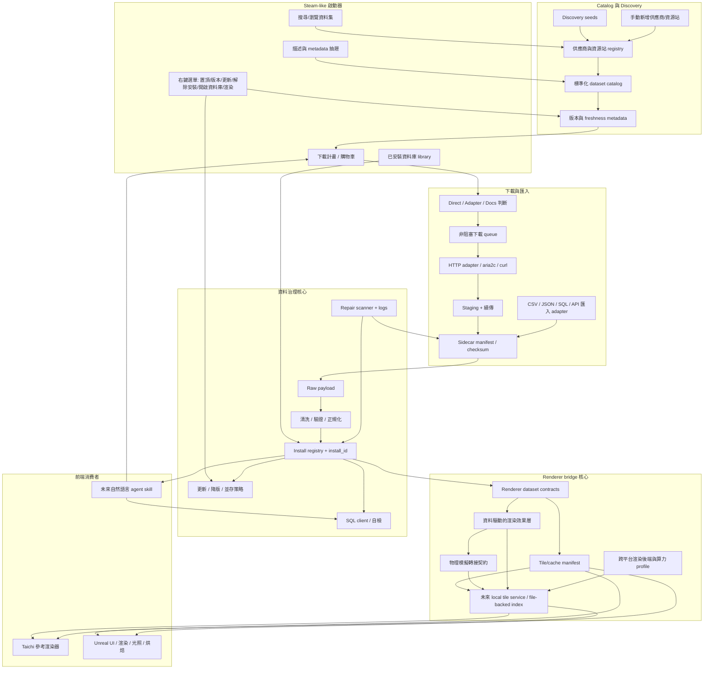

# APIkeys Collection 中文技術概要

最後更新：2026-05-17

APIkeys Collection 是一個類 Steam 的資料庫與資料源啟動器。它的目標不是只保存 API key，而是協助大數據專案管理「資料源、下載計畫、本機資料庫、安裝狀態、清洗流程、渲染器橋接」。

## 目前定位

這個專案目前是 MVP 階段，已經具備資料源清單、下載計畫、非阻塞下載器、資料庫工具設定、基本安裝 registry、Taichi renderer bridge 的骨架。

它尚未完成的部分包括：完整 provider-specific adapters、SQL 自檢、資料清洗流程、手動 CSV/JSON 匯入、完整 UI 右鍵選單、資料庫安全刪除流程。

## 主要流程

這份專案要同時保留兩件事：

- Steam-like 資料庫安裝器：搜尋資料集、加入下載計畫、下載、安裝、更新、解除安裝、開啟資料庫工具。
- 虛擬孿生資料管線：把已安裝資料轉成 Taichi/Unreal 可讀的 cache、tile manifest 或串流索引。



重要邊界：Unreal 是前端與渲染器，不是資料主權所在。原始資料、版本、checksum、清洗紀錄、install_id 仍由 launcher 管理；Unreal 只在需要時匯入、快取、串流或烘焙前端專用資產。

## 重要資料夾

| 路徑 | 用途 |
| --- | --- |
| `api_launcher/` | Python 核心套件。大多數產品邏輯都在這裡。 |
| `frontends/` | 前端程式碼。目前 Tk launcher 實作已放在 `frontends/tk/`，根目錄 UI 檔只保留相容入口。 |
| `catalog/` | 內建資料源清單、credential reference、範例 registry。 |
| `config/` | 可提交的範例設定，例如資料庫工具、AI、下載工具 profile。 |
| `docs/` | 技術文件、GTD、交接文件。 |
| `scripts/` | Windows/macOS/Linux 啟動與環境設定腳本。 |
| `state/` | 本機 runtime 狀態，預期忽略於 Git。 |
| `downloads/` | 實際下載資料，預期忽略於 Git。 |
| `renderers/` | 可選的渲染引擎，目前有 `taichi_global_bathymetry.py`。 |
| `tests/` | 單元測試。 |

## 路徑管理規則

跨平台開發時不要在各檔案自行硬寫路徑。請使用：

```python
from api_launcher.paths import catalog_file, config_file, local_config_file, state_file
```

常見用途：

```python
catalog_file("APIkeys_collection_catalog.json")
config_file("launcher_integrations.example.json")
local_config_file("launcher_integrations.local.json")
state_file("APIkeys_collection.sqlite")
```

`api_launcher/paths.py` 會優先使用新資料夾，也會在相容期回頭尋找舊 root 檔案，降低 Windows/Mac 接力時的路徑錯誤。

## 前後端資料夾邊界

後端核心放在 `api_launcher/`。Tk UI 實作放在 `frontends/tk/`。根目錄的 `APIkeys_collection.py` 和 `APIkeys_collection_ui.py` 是相容入口，讓舊指令仍可使用。

未來 Unreal 相關工具會優先放在 `frontends/unreal/` 或 `scripts/` 中，不應直接混進後端資料管理邏輯。目前 `frontends/unreal/README.zh-TW.md` 先定義 Unreal 前端邊界與後續腳本位置。

## 下載器設計

下載器分成兩層：

| 層 | 檔案 | 用途 |
| --- | --- | --- |
| Job queue | `api_launcher/download_jobs.py` | 管理 queued/running/paused/completed/failed/cancelled 狀態。 |
| HTTP adapter | `api_launcher/http_downloader.py` | 真正下載 direct HTTP(S) 檔案，支援 `.part` 與 Range 續傳。 |
| 外部工具 profile | `api_launcher/transfer_tools.py` | 建立 aria2c/curl 等外部工具命令，但不用 shell 字串拼接。 |
| 可下載性判斷 | `api_launcher/download_eligibility.py` | 判斷資料源是 Direct、Adapter、Docs 或 Unavailable。 |
| 禮貌下載政策 | `api_launcher/download_policy.py` | 控制每 host 延遲、重試退避、429/503 冷卻、User-Agent。 |

目前 UI 只會直接下載 Direct 類型資料源。API endpoint 或 docs page 會被標為需要 adapter，避免把文件頁誤當資料集下載。

大量下載時必須注意來源站的限制。預設下載器會限制同一 host 的請求節奏，遇到 429 或 503 會冷卻後重試。未來 provider-specific adapter 應該讀取官方 rate limit，並且讓使用者能在 UI 中調整並行數與延遲。

下載政策可以在 `launcher_integrations.local.json` 覆寫，範例來源在 `config/launcher_integrations.example.json`：

```json
{
  "download_policy": {
    "max_parallel_jobs": 3,
    "max_parallel_per_host": 1,
    "min_delay_per_host_seconds": 1.0,
    "max_retries": 5,
    "retry_base_delay_seconds": 2.0,
    "retry_max_delay_seconds": 120.0,
    "cooldown_status_codes": [429, 503]
  }
}
```

如果來源站有限制，請優先降低 `max_parallel_jobs`，提高 `min_delay_per_host_seconds`，而不是硬開多執行緒。

## Steam-like library actions

目前新增 `api_launcher/library_actions.py` 作為 UI/agent 共用的動作判斷骨架。它會根據 local status、update status、manifest health、install_id、是否可下載、是否有 renderer asset，判斷以下動作是否可用：

| Action | 用途 |
| --- | --- |
| `add_to_plan` | 加入下載計畫。 |
| `install` | 下載/匯入並納管。 |
| `update` | 有新版或 stale 狀態時更新。 |
| `repair` | manifest 顯示缺檔、checksum 錯誤或 size 錯誤時修復。 |
| `open_database` | 透過設定的資料庫工具開啟。 |
| `render_preview` | 有 renderer bridge asset 時交給 Taichi/Unreal 預覽。 |
| `uninstall` | 解除納管或未來 guarded destructive uninstall。 |

這層先不直接綁死 Tk UI，避免 UI 越來越複雜。之後右鍵選單、agent skill、Unreal frontend 都可以共用同一套 action rules。

可用 CLI 模擬目前某個資料源可做的動作：

```powershell
py APIkeys_collection.py --show-library-actions gebco --library-local-status managed --library-install-id inst_demo --library-render-assets
```

## 可下載性狀態

| 狀態 | 意義 |
| --- | --- |
| `direct_download` | URL 看起來是直接檔案，例如 `.zip`、`.nc`、`.csv`、`.json`。 |
| `adapter_required` | 有 API endpoint，但需要 provider-specific adapter 轉成資料檔。 |
| `metadata_only` | 目前只有 docs/signup 頁面，不能直接下載。 |
| `unavailable` | 沒有可用 URL。 |

## 資料庫工具接口

資料庫工具設定在：

- 範例：`config/launcher_integrations.example.json`
- 本機：`launcher_integrations.local.json`

本機檔案不要提交 Git。使用者可以設定 MySQL Workbench、DBeaver 或其他資料庫工具。UI 中有「資料庫工具設定」視窗可切換預設工具。

## 安裝 registry 與解除安裝

資料下載或手動納管後，launcher 會以 `install_id` 追蹤本機資產。這是為了避免使用者手動刪除、重複匯入、或資料庫漂移時造成誤判。

目前解除安裝仍是安全骨架：會標記 registry 狀態，不會直接執行破壞性 SQL。未來若要刪除 SQL database，必須確認 install_id 與 fingerprint 都符合。

## Taichi renderer bridge

`renderers/taichi_global_bathymetry.py` 被視為渲染引擎，不應該負責資料 discovery、下載、清洗或卸載。

Launcher 透過 `api_launcher/renderer_contracts.py` 管理 renderer 需要的資料集 ID 與快取路徑，例如：

- GEBCO 地形資料
- HYG 星表資料

未來的目標是：資料被 launcher 下載與註冊後，可以被 renderer bridge 穩定讀取。

## Unreal / Taichi 共同 tile manifest

目前新增了 `api_launcher/tile_manifests.py` 作為骨架。它定義：

| 概念 | 用途 |
| --- | --- |
| `TileManifest` | 一份資料集某版本的 tile/cache 索引。 |
| `TileAsset` | 單一 tile 的 ID、經緯度範圍、LOD、URI、checksum、format。 |
| `GeoBounds` | tile 或資料集的 EPSG:4326 邊界。 |
| `build_global_grid_manifest` | 先建立全球格網 manifest，未來可給 GEBCO/HYG/天氣等 adapter 使用。 |

這個 schema 會是下載器/安裝器與 Taichi/Unreal 之間的共同語言。

可用 CLI 先產生骨架 manifest：

```powershell
py APIkeys_collection.py --write-tile-manifest state\sample_tile_manifest.json --tile-dataset-uid gebco:2025 --tile-version 2025 --tile-degrees 60 --tile-role topography_tile --tile-uri-template "tiles/{tile_id}.npy"
```

## 資料驅動的物理/渲染效果層

有些地球細節不是單靠資料集就能完成。例如海洋、水體、空品、雲、霧、煙霾等，它們需要資料作為邊界條件或參數，再由渲染器用 shader、粒子、體積霧、流場或簡化物理去呈現。

以水體為例，資料集可以告訴我們海岸線、水深、河道、潮汐、風場或洋流，但不會直接告訴我們浪如何破碎、泡沫如何生成、近岸水流如何互動。因此未來需要一層水物理/視覺模擬：遠距離可以用 shader-only 波浪，近距離可以加入 Gerstner/FFT 類波浪、shallow-water/flow-map 近岸近似，以及粒子泡沫或飛沫。

目前新增了 `api_launcher/render_effects.py` 作為骨架：

| Layer | 資料來源 | 模擬/渲染策略 |
| --- | --- | --- |
| `water_surface` | bathymetry、coastline、tides、currents、wind | 資料提供邊界條件；Unreal 用水材質、Gerstner/FFT 類波浪、flow-map、foam、Niagara 粒子；Taichi 用簡化 height/normal field 或粒子預覽 |
| `air_quality_volume` | air quality、weather、wind、humidity、terrain | 資料提供濃度與氣象場；Unreal 用 volumetric fog、3D texture、Niagara sprites、sparse volume；Taichi 用粗 voxel grid 或 screen-space overlay |
| `cloud_weather` | satellite、weather、radar、humidity | 資料提供雲遮罩與時間切片；Unreal 用 sky atmosphere、volumetric clouds、time-sliced textures；Taichi 用低解析 cloud mask 或 billboard |

這代表資料管線不只輸出「資料表」，也要能輸出渲染效果所需的參數、遮罩、時間序列與 LOD 建議。

目前沒有實作水物理或空氣物理模擬。新增的 `api_launcher/simulation_bridge.py` 只先定義轉接契約：

| Contract | 目前狀態 | 目的 |
| --- | --- | --- |
| `water_boundary_conditions` | contract only | 定義水模擬需要的 coast mask、bathymetry、wind、tide、current 等輸入角色。 |
| `water_visual_physics_bridge` | planned / contract only | 預留 Gerstner/FFT、shallow-water、flow-map、Unreal native water 或 Taichi preview 的接點。 |
| `air_quality_boundary_conditions` | contract only | 定義空品/霧體積需要的濃度、時間、風場、濕度、地形等輸入角色。 |
| `air_quality_volume_bridge` | planned / contract only | 預留簡化 advection/dispersion 或 visualization-only 的接點。 |

也就是說，資料集與未來物理模擬之間會有明確接口，不會把「有資料」誤認為「已經完成物理模擬」。

## 驗證指令

Windows PowerShell：

```powershell
py -m unittest discover -s tests
$env:PYTHONDONTWRITEBYTECODE='1'; py -m py_compile APIkeys_collection.py APIkeys_collection_ui.py api_launcher\core.py
docker compose run --rm --build launcher
```

macOS/Linux：

```bash
python3 -m unittest discover -s tests
PYTHONDONTWRITEBYTECODE=1 python3 -m py_compile APIkeys_collection.py APIkeys_collection_ui.py api_launcher/core.py
docker compose run --rm --build launcher
```

## 開發原則

- 不要收集、爬取、提交真實 API key 或 token。
- 不要把本機絕對路徑寫進程式碼。
- 不要把下載資料、SQLite runtime state、private config 提交 Git。
- 任何會刪除資料庫或檔案的功能，都必須依賴 install_id 與明確確認流程。
- 新功能完成後要更新 `docs/PROJECT_GTD.md`。
