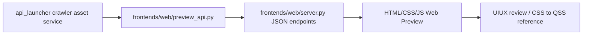

# Web Preview UI/UX 對照層
最後更新：2026-05-26

這份文件記錄 RRKAL 新增的 HTML/CSS Web Preview 開發路線。它不是取代 Tk，也不是另開一套 Web 版業務系統；它是用瀏覽器快速驗證 UIUX、資訊架構與未來 Qt/QSS 視覺語言的薄層。

## 定位

Tk 與 Web Preview 的分工如下：

- Tk：穩定、樸素、可操作的 MVP 控制台。它應該優先保守、清楚、低風險。
- Web Preview：更自由的 UIUX 設計實驗場。它可以比 Tk 華麗，也可以快速嘗試資訊架構、卡片、狀態、表單、Inspector、響應式版面與未來 QSS token。
- Qt/QSS：未來正式桌面升級方向。當 Web Preview 的視覺語言被討論穩定後，再翻譯成 Qt widget 與 QSS。

共同規則：後端功能先成為 `api_launcher` 的 service / JSON contract；Tk 與 Web Preview 分別接同一個 contract。兩個 UI 可以有不同設計語言，但不能各自重寫 crawler、resolver、downloader、importer 或資料庫規則。

## Web Preview 責任

Web Preview 的責任：

- 讀取 `api_launcher` 既有 service / JSON contract。
- 以 HTML/CSS/JS 呈現 crawler asset、資產護照、動態界域表單與後端 JSON 結果。
- 讓使用者與 agent 可以即時討論介面心流，而不必每次啟動 Tk。
- 沉澱 CSS token、元件節奏與資訊層級，作為未來 Qt/QSS 的參照。

Web Preview 不做的事：

- 不複製 crawler、resolver、downloader、importer。
- 不取代 adapter review 或正式下載匯入流程。
- 不把 HTML 當成新的正式資料入口。
- 不要求 Tk 和 Web 長得一樣；Tk 可以樸素，Web 可以更前導。

## 檔案結構

目前檔案：

- `frontends/web/server.py`：stdlib HTTP server，只負責 API routing 與 static file serving。
- `frontends/web/preview_api.py`：把 backend service 輸出整理成 Web Preview 用 JSON。
- `frontends/web/static/index.html`：預覽頁結構。
- `frontends/web/static/styles.css`：CSS 版視覺語言。
- `frontends/web/static/app.js`：呼叫 JSON endpoint 並渲染互動。
- `frontends/shared/ui_tokens.json`：Tk / Web / 未來 Qt 可共用的設計 token 種子。
- `scripts/run_web_preview.cmd`：本機啟動入口。
- `api_launcher/crawler_asset_display.py`：Web/Tk/Qt 共用的顯示 schema。它把 `field_id`、`capability_id`、`outcome_bucket`、Adapter review `by_outcome` 轉成 `display_label`、`display_help`、`display_tone`、`summary` 與 `next_action_label`，避免每個 UI 外殼自行推理後端狀態。

資料流：



## 啟動方式

```powershell
scripts\run_web_preview.cmd
```

或：

```powershell
py -B -m frontends.web.server --host 127.0.0.1 --port 8765 --open
```

網址：

```text
http://127.0.0.1:8765/
```

如果只用 IDE Live Preview 直接開 `frontends/web/static/index.html`，可以檢查靜態版面與 CSS，但 `/api/...` endpoints 不會存在，因此看不到真實 crawler asset 清單與動態界域表單。要看完整互動，需要啟動上面的 Web Preview server。

## 開發規則

1. Web Preview 只能呼叫 backend service，不複製後端規則。
2. 每個 Web 動作要能對應既有 JSON contract。
3. UI 顯示可以有設計感，但狀態文字不能亂猜 `source_type`、`outcome_bucket` 或下載能力。
4. 後端新增重要功能時，應同步評估 Tk 與 Web Preview 是否都需要入口；Tk 走穩定控制台語言，Web 走前導設計語言。
5. 若 Web Preview 發現 UIUX 問題，先回推 service contract 或 UX 文件，再決定是否改 Tk。
6. CSS token 若被反覆使用，應整理進 `frontends/shared/ui_tokens.json`，避免未來 Qt/QSS 重新猜顏色與間距。

## 目前狀態

- 已接 crawler asset 清單、資產護照、動態界域表單、payload preview、下載計畫 preview endpoint。
- `execute=false` 只做界域 payload 與 plan preview，不觸發 live crawler。
- `execute=true` 會呼叫現有 crawler asset download plan service，仍會進入 adapter review / direct plan 規則，不繞過後端。
- Web Preview 第一版已改成較完整的 console 佈局，作為未來 QSS 參照。
- `/api/health` 會回報實際綁定的 `host`、`port`、`url`、原請求 port 與是否經過 port scan；前端總覽與本機互動紀錄會顯示實際 `host:port`，避免多個 agent / clone 同時開 Web Preview 時混淆。
- Web session 內建立下載計畫後，卡片牆會用後端 `plan_outcome.short_label` / `display_tone` / `content_review` 顯示即時徽章，並同步寫入 compact `crawler_asset_plan_outcome_recorded` structured event；重新載入頁面時，也會從近期 event 讀取同一份 badge payload 作為後端狀態提示。這不是 JS localStorage 持久化；長期資產狀態仍應由 event log / asset profile / service contract 接手。
- 選中爬蟲資產後，hero 與右側資產護照會顯示最近計畫結果摘要；這仍只呈現 `latest_plan_outcome` / session payload，不在前端判斷 direct/review/blocked 的業務規則。
- `execute=true` 建立下載計畫時，Web API 會另外回傳 compact `plan_passport`：包含 asset id、是否已有 resolved plan、candidate/direct/review/content-review counts、credential/missing-provider counts、bounds 與 next action，但不複製完整 `providers` / resolved plan body。這是 Tk/Web/Qt 共用「計畫護照」契約的第一步，避免 UI 為了顯示狀態而持有大包 plan。
- 中寬度響應式版面必須保留中文標籤。不要再用 `font-size: 0` 把側欄壓成只有圖示的空按鈕；若 viewport 不夠寬，側欄應變成頁首控制區，來源篩選以多欄與高度限制處理，讓主工作區在第一屏可見。
- 右側資產護照已可在本頁 session 內顯示 `plan_passport` 面板：顯示 resolved-plan presence、candidate/direct/review/adapter counts、內容格式待辦與 credential/provider gate 摘要。這個面板只吃後端 compact payload；完整 plan 仍留在 JSON inspector 與 review/download path。
- Web Preview 側欄四個工作區已啟用：`爬蟲資產` 保留主要界域與資產護照心流；`下載器` 顯示已建立的 `plan_outcome` / `plan_passport` 摘要；`匯入審核` 顯示最近一次 plan build 回傳的 Adapter review 與 content parser 待辦；`事件紀錄` 讀取 `/api/events/recent` 的 structured event 摘要。這些分頁都只視覺化後端契約，不在 JS 裡重寫下載、匯入或審核規則。

## 下一步

- 將 Web `下載器` / `匯入審核` 從狀態預覽逐步接到正式 library action，但仍共用後端 JSON contract，不在 JS 內直接執行下載或匯入。
- 讓狀態與錯誤提示更接近使用者語言，而不是只顯示原始 JSON。
- 將穩定的 CSS token 映射成 Qt/QSS 草稿。
- 在 Tk 新增後端功能時，建立簡短 checklist：是否需要同步 Web Preview、是否需要同步文件。

## 2026-05-25 爬蟲資產庫視覺方向

這一輪 Web Preview 已把 `tem/ui-aseat-ui` 的核心精神收進正式預覽層，但沒有搬入 React/Vite 依賴：

- `tem` 只提供構圖、密度、互動節奏與卡片牆精神；可見語彙必須改回 RRKAL 本專案語言，不直接搬用 Aseat、Season Pass、Workshop、Mission 等外部概念。
- 一個 crawler asset 視為一個「爬蟲資產」，畫面用資產卡片牆強化掃描與比較。
- 左側維持來源範式分流，避免使用者先面對 provider 細節。
- 中央卡片只呈現可掃描資訊：入口名稱、provider、來源表面、狀態、信任分數與來源範式。
- 右側「資產護照」呈現能力槽、風險、成熟度、endpoint、下一步與動態界域表單。
- 上方「目前選取的爬蟲資產」主視覺區承接 `tem` 的 hero/operation rail 精神，但只顯示真實後端欄位與真實操作入口。
- 選取資產後的流程條由 `api_launcher/crawler_asset_display.py` 產生 `flow_steps`，Web/Tk/Qt 只負責視覺化 `seed -> source_pattern -> bounds -> download_plan -> review_gate`，避免各 UI 自己推測 crawler readiness。
- 表單欄位與能力列表的顯示文字由同一個 display schema 依 `field_id` / `capability_id` 產生 `display_label` / `display_help`，避免舊後端 label 的亂碼或平台差異直接進入 UI；後端契約仍保留原始欄位。
- 界域表單會依後端 `group_display` 分組渲染，例如「版本控制、資料集選擇、時間界域、空間界域、擷取上限」。Web 只呈現這份 schema；分組語彙由 `api_launcher/crawler_asset_display.py` 統一提供，未來 Tk/Qt 可沿用同一份 contract。
- 下載計畫結果與 Adapter 待辦摘要也由同一個 display schema 產生：`plan_outcome` 會帶 `outcome_bucket`、`display_label`、`display_tone`、`short_label`、`summary`、`next_action_label`；`adapter_review` 會帶 `item_count`、`by_outcome` 與可顯示的 outcome 分組。Web 只呈現這份 payload，不在 `app.js` 裡重寫業務分支；Tk 表格短狀態也沿用 `short_label`。
- 卡片牆的 plan badge 先呈現目前 Web session 剛建立的 plan outcome；若頁面重載或剛開啟，則讀取 Web API 從 structured event log 彙整出的 `latest_plan_outcome`。Web Preview 自己建立下載計畫時也會寫同一種 event，但只保存 compact context，不把完整 resolved plan 塞進 JSONL。文字使用 `short_label`，色調使用 `display_tone`，若有 `content_review.has_review`，會再顯示內容格式待辦徽章。不要在 CSS/JS 裡新增 outcome bucket 分支。
- 資產護照的 plan outcome panel 與上方 selected hero 都只視覺化同一份 `latest_plan_outcome`：顯示最近計畫短標、summary、direct/review counts 與 content-review badge，讓使用者點進資產後仍能看到後端狀態，而不是只靠卡片牆小徽章。
- `plan_passport` 是比 `plan_outcome` 更完整、但仍然 compact 的 service payload；它要給卡片護照、Tk panel、未來 Qt sidebar 使用，不能把 full resolved plan 當 UI state。若需要完整 plan，仍應走既有 review/download path。
- Web Preview 已將 `plan_passport` 顯示在資產護照內，作為 Qt sidebar / Tk panel 的前導樣式。此狀態目前仍是 session-local，下一步才是判斷哪些欄位需要進入 asset profile 或 event-backed persisted passport。
- 下方「本機互動紀錄」只記錄本機互動與後端回應，不偽造下載進度。
- 「後端 JSON」保留完整 payload，讓 agent 與人類都能追查 service contract。

限制仍不變：Web Preview 可以更華麗，但不能分叉後端規則。雙擊開 IDE 與 AI 診斷任務目前只展示 intent / preview-only 流程，真正本機執行要由 Tk/Qt 或本機 agent bridge 接手。

## Port 使用規則

Web Preview 預設使用 `127.0.0.1:8765`。啟動時會先嘗試 8765；如果該 port 已被其他前端 agent、IDE Live Preview 或另一份本地 clone 使用，server 會自動掃描後續 port，例如 8766、8767，一直到 `--port-scan` 指定的範圍。

```powershell
py -B -m frontends.web.server --host 127.0.0.1 --port 8765 --port-scan 20 --open
```

如果你想固定到某個 port，也可以手動指定：

```powershell
py -B -m frontends.web.server --host 127.0.0.1 --port 8766 --port-scan 0 --open
```

不要為了預覽 UI 去終止不明程序。不同 agent 可以在不同專案資料夾各自開 Web Preview，只要 port 不同即可。需要穩定展示時，請在本地 clone 執行 Web Preview，不要在雲端碟 K 槽直接跑長時間 GUI / server。

前端若成功連到 server，總覽卡會顯示實際 `host:port`；若原 port 被占用而改用後續 port，該欄位會有 tooltip 說明原定 port 與實際 port。這個資訊來自 `/api/health`，不是前端硬猜。
