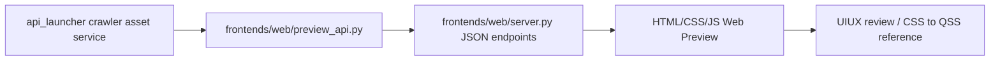

# Web Preview UI/UX 對照層
最後更新：2026-05-31

這份文件記錄 RRKAL 新增的 HTML/CSS Web Preview 開發路線。它不是取代 Tk，也不是另開一套 Web 版業務系統；它是用瀏覽器快速驗證 UIUX、資訊架構與未來 Qt/QSS 視覺語言的薄層。

## 2026-05-27 文件審計校準

- 實際 Web API smoke 已用同一進程 HTTP server 驗證：`/api/health`、`/api/crawler-assets`、`/api/diagnostics/crawler-handler-smoke`、`/api/events/recent` 均能回應。
- 目前驗證值：crawler asset card 數為 23；developer diagnostics 的 `supported_source_type_count=14`，`candidate_case_status=pass`。
- GUI-level audit 已用 in-app browser 驗證：四個工作區「爬蟲資產 / 下載器 / 匯入審核 / 事件紀錄」可見；下載器分頁主 CTA 已改為「下載 / 匯入目前資產」，會呼叫 formal crawler asset download/import endpoint；選取 NASA Earthdata CMR 後，畫面會顯示「需要登入 / API Key」、官方登入入口與「記住我的帳號」設定流程。
- API-level audit 也驗證 `/api/crawler-assets/noaa_ncei_dataset_search/seeds?page=1&page_size=50` 會回傳本機 seed 視窗與 `page_summary`；`/api/crawler-assets/nasa_earthdata_cmr_collections` 會回傳 `missing_credentials` guard 與 3 個 credential 欄位。
- 一般路由 `/api/demo/real-download` 已退場；公開 CSV proof helper 只保留在 `POST /api/diagnostics/real-download-demo`，並以 `developer_only=true` 標示。主要下載 / 匯入操作由 `POST /api/crawler-assets/{asset_id}/download-import`、`POST /api/crawler-assets/{asset_id}/seed-download-import` 與 `POST /api/crawler-assets/{asset_id}/recommended-seed-closure` 接管。
- Formal crawler asset download/import 的預設輸出在本機下載資料夾下的 `RuRuKa Asset Launcher Web Preview\<asset_id>`；resolved plan 也寫在同一個本機下載資料夾內。不要把 live import 預設壓在 K 槽雲端同步路徑，避免 SQLite lock / sync latency 影響展示與驗收。
- 若用 PowerShell 讀 zh-TW 文件時出現亂碼，先用 `Get-Content -Encoding UTF8` 或 Python `encoding="utf-8"` 複核；不要把 console 顯示問題誤判成檔案損壞。


## Plan Passport freshness guard
- Web Preview 讀取的 `latest_plan_passport` 是後端判斷過的 display-safe payload，不是單純的上次結果快照。
- `api_launcher/crawler_asset_profiles.py` 會比較 profile state、source signature 與 bounds signature；當 crawler asset 被停用、封存、來源 endpoint/source type 變更，或界域表單範式改變時，後端輸出 `stale=true` / `stale_reason`。
- Web/Tk/未來 Qt 只顯示後端給的 `stale_label` / `stale_next_action_label`，例如「資產已停用，啟用後重新建立下載計畫」或「來源設定已改變，請重新建立下載計畫」。`stale_next_action` / `stale_reason` 這類 raw token 只保留給 agent/debug，不應直接出現在使用者可見文字。若 label 缺失，UI 必須落到中性安全提示，不在 UI 端翻譯 raw reason 或重做業務判斷。若要擴充過期規則，優先改 backend profile/service 與測試。
- `plan_passport` 會保存 `candidate_snapshot_signature` 與 `candidate_snapshot_count`，表示本次下載計畫由哪一批 crawler candidate 形成。這是追溯資訊，不是 live freshness check；Web/Tk/Qt 不應在沒有 fresh crawl 的情況下自行宣稱遠端候選清單已改變。
- `candidate_snapshot_changed` 只代表這次使用者明確重跑 crawl / rebuild plan 後，後端把上一版 profile 護照 digest 與本次 digest 比較出不同；前端可以顯示這個旗標，但不能在單純讀取卡片或 profile 時自行推測遠端更新。

## 2026-05-27 操作 guard

- Crawler Asset 的入口表面與存取邊界文案也屬於後端 display contract：`CrawlerAsset.to_dict()` 會輸出 `source_surface_label` 與 `access_requirement_label`。Web Preview 應顯示這些 label，例如「API 入口」「檔案目錄」「需登入 / API key」；raw `source_surface` / `access_requirement` 只保留給 JSON/debug、搜尋 haystack 或 developer diagnostics。Web 不應維護 `file_index` / `map_service` 這類本地翻譯表。
- 沒有動態界域欄位的資產仍應允許使用者按「建立下載計畫」或「先設定登入 / API Key」。不要用 credential guard 的反值去 disable build-plan 按鈕；按鈕是否進入登入設定或建立計畫，交給 `configureBuildPlanButton()` / `handleBuildPlanClick()` 判斷。
- 選取一個爬蟲入口後，預設動作是枚舉該入口的 seed。不要把「更新清單」設計成使用者理解入口內容的必要前置動作；「重新枚舉 seed」只能是次要刷新。
- Seed 清單要用分頁視窗呈現：第一屏顯示前 50 筆，按「顯示更多 seed」再展開下一批 50 筆。這是從本機已枚舉 catalog 讀取，不是每按一次就重新打遠端 crawler。
- 收藏功能的對象是 seed，不是 crawler asset / 入口。Web 目前透過 `/api/crawler-assets/{asset_id}/seed-favorites` 寫入 crawler asset profile 的 `favorite_seed_uids`；後續正式化時再提升成 seed registry / 跨 UI 查詢入口。
- Seed 枚舉狀態要吃後端 `seed_enumeration` payload：`label` / `help` / `display_tone` / `limited_by_max_results` 由 service 判斷。Web 只能呈現，不要用候選數自行猜「完整」或「被截斷」。若 `limited_by_max_results=true`，UI 應明確提示「已達本機安全上限，遠端可能還有更多」。
- 若 seed page payload 帶有 `recommended_seed_uid`，Web 應顯示一個明確的推薦 seed 操作入口，並直接呼叫正式 seed-level download/import endpoint。推薦邏輯屬於後端 `crawler_seed_page()` contract，Web 不自行挑選第一筆、收藏 seed 或依 source type 推斷可下載性。若 UI 需要一鍵驗證入口小閉環，應呼叫 recommended-seed closure endpoint，讓後端重新跑 listing、讀 seed page 並觸發 formal seed download/import。
- Seed row 可提供「探測欄位」動作，將該 row 的 `api_url` / `download_url` / `landing_url` 交給後端 schema probe endpoint；Web 只能挑選可見 seed URL，不自行推論欄位型別或替 source type 寫特殊規則。探測成功後，Web 重新渲染後端回傳的 bounds form。
- Crawler asset 的 capability address 與能力膠囊摘要要吃後端 `capability_profile` payload：卡片可以顯示「能力 0000」徽章，Passport 可以顯示「能力位址」、「能力膠囊」與 `Seed 範式` 摘要，但 Web/Tk 不應以 `source_type` 重新計算分組、seed 枚舉語義或翻譯文案。能力膠囊摘要應消費 `source_family_label`、`transport_label`、`auth_mode_label`、`result_shape_label`、`seed_scope_label`；若後端缺 label，UI 應顯示「待確認」或「Seed 範式待確認」這類中性文案，不要假裝已歸類，也不要把 `catalog_search`、`json`、`public_or_review`、`dataset_list`、`entry_listing` 等 raw backend token 當人類文案。
- Crawler source type 的顯示文字也應來自後端 payload：`CrawlerCapabilityProfile` / `CrawlerAsset.to_dict()` 會提供 `source_type_label`；Web filter、Passport、Downloader row、selected hero 與 Tk Crawler Asset 表格 / Passport / profile dialog / credential dialog 都顯示 label 或「來源範式待確認」。raw `source_type` id 只保留給 JSON/debug、filter key、search haystack、路由與 developer diagnostics，不作為使用者主要文案。
- Web 不應用 `shortPattern(source_type)` 或類似函數把 raw source id 改成看似人類文案；這會讓未註冊 label 的新來源看起來像已完成翻譯。缺 label 時顯示「來源範式待確認」，讓問題回到後端 display contract。
- Crawler asset 的 maturity / risk tier 也要吃後端 display payload：Web/Tk/Qt 應顯示 `maturity_label` / `risk_tier_label`，例如「已套安全界域」「待審核」「待補 handler」。raw `maturity` / `risk_tier` id 只保留給 JSON/debug panel，不應作為主要使用者文案。
- 「成熟度」工作區只讀 `/api/project-maturity` 的後端 payload，顯示 canonical delivery scope、成熟度 row、`🚧` 施工中圖示、display tone、限制與下一步。Web 不得用 JS 重新計算專案完成率，也不得把 `contract_only` / `planned_not_started` 寫成穩定功能。Delivery Scope 摘要與 maturity row label 也必須走 display-safe helper；若後端缺 `status_zh_TW` / display label，UI 顯示「狀態待確認」或「成熟度待確認」，不把 raw `status`、`maturity_level` 或 `unknown` 當人類文案。
- 成熟度 row 的面向標題也必須走 display-safe helper；若缺 `area_label`，顯示「成熟度面向待確認」，不要把 `area_id` 或英文 `maturity area` 當主要使用者文案。
- Web 使用者可見文字不得 fallback 到 snake_case / raw backend token。若 `next_action_label`、`display_label`、`status_label` 等欄位缺失，Web 應顯示中性操作提示，例如「檢查界域或審核結果」「檢查下載計畫結果」，而不是把 `next_action`、`outcome_bucket`、`stale_next_action`、`status_code`、download/import `stage`、content review bucket、pipeline lane 或 seed scope 當成文案。raw token 可留在 JSON/debug panel，方便 agent 診斷。
- `next_action` / `stale_next_action` 是後端 stable id，不是 Web 文案候選。Downloader row、seed 枚舉 mission、Crawler Passport、credential badge、plan preview、selected hero、Plan Passport 與 stale passport 等使用者可見位置都只能消費 `next_action_label` / `stale_next_action_label` 或中性 fallback；若要新增 action 文案，先補後端 display contract 與測試，不在 `app.js` 用 raw id 即席翻譯。
- Flow step、event context、content review bucket、content pipeline lane 與 parser summary 也只能吃後端 label 類欄位或中性 fallback。`step_id`、`review_bucket`、`pipeline_lane`、`parser_id`、`source_format`、raw `stage/status` 是 trace/debug 資料，不是可見文案候選；若缺 label，先顯示「流程步驟待確認」「內容格式待辦」「匯入路徑待辦」「Parser 線索待確認」等中性提示。
- Event context chip 的 key 也屬於 display contract：`asset_id`、`run_record`、`next_action` 等 key 必須經 `eventContextKeyLabel()` 轉成人類欄位名；`next_action` / `user_next_action` 的 scalar value 若沒有 label，顯示「下一步待確認」，不要直接把 raw action id 放進事件列。
- 登入狀態、capability label 與 bounds field label helper 也遵守同一條線：`status.status`、`capability_id`、`field_id` 可做 route key、form key、debug trace 或本地已知 label map 的索引，但不能直接成為可見 fallback。未知時顯示「登入狀態待確認」「能力待確認」「欄位待確認」。
- Parser Registry、後端 flow step、capability row 與 bounds field label 也套用同一規則：缺 display label 時顯示「Parser 線索待確認」「流程步驟待確認」「能力待確認」「欄位待確認」，不要把 `parser_id`、`step_id`、`capability_id` 或 `field_id` 當主要使用者文案。
- Provider 顯示也不能退回英文開發者 fallback。若後端尚未提供 `provider_name` / `provider_label`，Web 可暫時顯示穩定的 `provider_id` 作為可追溯線索；若連 provider id 都缺失，顯示「Provider 待確認」，不要顯示 `provider unknown`。
- Asset card slot 也應走同一個 provider display helper：卡片副標使用 `providerDisplayText(asset)`，不要直接把 `asset.provider_id` 當作 provider 名稱。
- Credential editor title、bounds preset label 與 seed row 空 metadata 也遵守同一條 display-safe 規則：Web 應使用 `credentialProviderTitle()`、`boundPresetLabel()` 與「資料摘要待確認」這類中性文案，不要讓 `status.provider_id`、`assetId`、`preset_id` 或英文 `metadata pending` 成為主要使用者文字。raw id 可留在 debug JSON、route key、favorite key 或 provenance 線索，不應當作表面文案。
- Download/import 結果與 Web mission queue 都應優先顯示後端 `download_import.stage_label`。Web 端只保留中性 fallback；正式文案 ownership 在 `api_launcher.crawler_asset_display`，不要在 JS 端維護 stage 翻譯表，也不要把 raw `stage` id 當互動紀錄文案。
- Web mission queue 顯示資產與 seed 時，應使用 `display_name`、seed title 或中性 fallback。`asset_id`、`dataset_uid`、`recommended_seed_uid` 只留在 JSON/debug、route key 與 provenance，不應出現在互動紀錄的主要 detail 文案。
- 下載器結果列與推薦 seed 面板也遵守同一條線：標題應使用 `assetDisplayText()` / `seedDisplayText()`，缺後端 label 時顯示「爬蟲資產待確認」「seed 待確認」，不要把 `payload.asset_id`、`result.asset_id`、`recommended_seed_uid` 當標題 fallback。
- Seed row 的主要標題也應使用 seed title / display label；dataset id 可以保留在小字追溯欄，但要標明 `Dataset ID`，不要讓它看起來像人類命名的 seed 標題。
- 下載 / 匯入結果列的 context chip 也要使用人類文案，例如「爬蟲資產路徑」「下載 / 匯入管線」；`crawler_asset_path`、`download_import_pipeline` 這類 backend trace token 只屬於 JSON/debug 或事件追溯，不應直接成為 UI chip。

## 定位

Tk 與 Web Preview 的分工如下：

- Tk：穩定、樸素、可操作的 MVP 控制台。它應該優先保守、清楚、低風險。
- Web Preview：更自由的 UIUX 設計實驗場。它可以比 Tk 華麗，也可以快速嘗試資訊架構、卡片、狀態、表單、Inspector、響應式版面與未來 QSS token。
- Qt/QSS：未來正式桌面升級方向。當 Web Preview 的視覺語言被討論穩定後，再翻譯成 Qt widget 與 QSS。

共同規則：後端功能先成為 `api_launcher` 的 service / JSON contract；Tk 與 Web Preview 分別接同一個 contract。兩個 UI 可以有不同設計語言，但不能各自重寫 crawler、resolver、downloader、importer 或資料庫規則。

## Web Preview 責任

Web Preview 的責任：

- 讀取 `api_launcher` 既有 service / JSON contract。
- 以 HTML/CSS/JS 呈現 crawler asset、資產護照、動態界域表單與後端 JSON 結果。
- 讓使用者與 agent 可以即時討論介面心流，而不必每次啟動 Tk。
- 沉澱 CSS token、元件節奏與資訊層級，作為未來 Qt/QSS 的參照。

Web Preview 不做的事：

- 不複製 crawler、resolver、downloader、importer。
- 不取代 adapter review 或正式下載匯入流程。
- 不把 HTML 當成新的正式資料入口。
- 不要求 Tk 和 Web 長得一樣；Tk 可以樸素，Web 可以更前導。

## 檔案結構

目前檔案：

- `frontends/web/server.py`：stdlib HTTP server，只負責 API routing 與 static file serving。
- `frontends/web/preview_api.py`：把 backend service 輸出整理成 Web Preview 用 JSON。
- `frontends/web/static/index.html`：預覽頁結構。
- `frontends/web/static/styles.css`：CSS 版視覺語言。
- `frontends/web/static/app.js`：呼叫 JSON endpoint 並渲染互動。
- `frontends/shared/ui_tokens.json`：Tk / Web / 未來 Qt 可共用的設計 token 種子。
- POST API 只接受 bounded body：`frontends/web/server.py` 會用 `DEFAULT_WEB_PREVIEW_POST_BODY_MAX_BYTES=1024 * 1024` 檢查 `Content-Length`，超過上限會回 400 並停在 route handler 前。這是本機預覽的防禦性 budget，不是公開 HTTP 服務承諾。
- `scripts/run_web_preview.cmd`：本機啟動入口。
- `api_launcher/crawler_asset_display.py`：Web/Tk/Qt 共用的顯示 schema。它把 `field_id`、`capability_id`、`outcome_bucket`、Adapter review `by_outcome` 轉成 `display_label`、`display_help`、`display_tone`、`summary` 與 `next_action_label`，避免每個 UI 外殼自行推理後端狀態。
- `api_launcher/local_credentials.py`：Web/Tk/Qt 可共用的本機登入設定 service。它讀取 crawler asset/profile/provider catalog 需要的 env var，回傳遮蔽狀態，並可由 localhost API 保存到本機 ignored credential file。

資料流：



## 啟動方式

```powershell
scripts\run_web_preview.cmd
```

或：

```powershell
py -B -m frontends.web.server --host 127.0.0.1 --port 8765 --open
```

網址：

```text
http://127.0.0.1:8765/
```

如果只用 IDE Live Preview 直接開 `frontends/web/static/index.html`，可以檢查靜態版面與 CSS，但 `/api/...` endpoints 不會存在，因此看不到真實 crawler asset 清單與動態界域表單。要看完整互動，需要啟動上面的 Web Preview server。

## 開發規則

1. Web Preview 只能呼叫 backend service，不複製後端規則。
2. 每個 Web 動作要能對應既有 JSON contract。
3. UI 顯示可以有設計感，但狀態文字不能亂猜 `source_type`、`outcome_bucket` 或下載能力。
4. 後端新增重要功能時，應同步評估 Tk 與 Web Preview 是否都需要入口；Tk 走穩定控制台語言，Web 走前導設計語言。
5. 若 Web Preview 發現 UIUX 問題，先回推 service contract 或 UX 文件，再決定是否改 Tk。
6. CSS token 若被反覆使用，應整理進 `frontends/shared/ui_tokens.json`，避免未來 Qt/QSS 重新猜顏色與間距。

## 目前狀態

- 已接 crawler asset 清單、資產護照、動態界域表單、payload preview、下載計畫 preview endpoint。
- `execute=false` 只做界域 payload 與 plan preview，不觸發 live crawler。
- `execute=true` 會呼叫現有 crawler asset download plan service，仍會進入 adapter review / direct plan 規則，不繞過後端。
- Web Preview 第一版已改成較完整的 console 佈局，作為未來 QSS 參照。
- `/api/health` 會回報實際綁定的 `host`、`port`、`url`、原請求 port 與是否經過 port scan；前端總覽與本機互動紀錄會顯示實際 `host:port`，避免多個 agent / clone 同時開 Web Preview 時混淆。
- Web session 內建立下載計畫後，卡片牆會用後端 `plan_outcome.short_label` / `display_tone` / `content_review` 顯示即時徽章，並同步寫入 compact `crawler_asset_plan_outcome_recorded` structured event；重新載入頁面時，也會從近期 event 讀取同一份 badge payload 作為後端狀態提示。這不是 JS localStorage 持久化；長期資產狀態仍應由 event log / asset profile / service contract 接手。
- 選中爬蟲資產後，hero 與右側資產護照會顯示最近計畫結果摘要；這仍只呈現 `latest_plan_outcome` / session payload，不在前端判斷 direct/review/blocked 的業務規則。
- `execute=true` 建立下載計畫時，Web API 會另外回傳 compact `plan_passport`：包含 asset id、是否已有 resolved plan、candidate/direct/review/content-review counts、credential/missing-provider counts、bounds 與 next action，但不複製完整 `providers` / resolved plan body。這是 Tk/Web/Qt 共用「計畫護照」契約的第一步，避免 UI 為了顯示狀態而持有大包 plan。
- 中寬度響應式版面必須保留中文標籤。不要再用 `font-size: 0` 把側欄壓成只有圖示的空按鈕；若 viewport 不夠寬，側欄應變成頁首控制區，來源篩選以多欄與高度限制處理，讓主工作區在第一屏可見。
- 右側資產護照已可在本頁 session 內顯示 `plan_passport` 面板：顯示 resolved-plan presence、candidate/direct/review/adapter counts、內容格式待辦與 credential/provider gate 摘要。這個面板只吃後端 compact payload；完整 plan 仍留在 JSON inspector 與 review/download path。
- Web Preview 側欄四個工作區已啟用：`爬蟲資產` 保留主要界域與資產護照心流；`下載器` 顯示已建立的 `plan_outcome` / `plan_passport` 摘要；`匯入審核` 顯示最近一次 plan build 回傳的 Adapter review 與 content parser 待辦；`事件紀錄` 讀取 `/api/events/recent` 的 structured event 摘要。這些分頁都只視覺化後端契約，不在 JS 裡重寫下載、匯入或審核規則。
- `/api/events/recent` 會保留 crawler listing 的 bounded counts：candidate、upserted、skipped provider、duplicate、warning/error 與 compact `run_record` counts。事件分頁會優先顯示 `asset_id`、`run_record`、核心 counts 與 next action，讓 listing 與 plan build 都能被掃描；完整 payload 仍留在 `state/logs/launcher_events.jsonl`。
- 需要跨 agent 接手時，優先讀 `--handoff-report-json` 的 `crawler_run_summary`；Web 事件分頁是人類掃描與 UIUX 驗證層，不是唯一狀態來源。
- Web 事件摘要改由 `api_launcher.crawler_run_records.crawler_run_context_summary()` 產生；前端 JS 只渲染 summary，不維護自己的 event 白名單或 `run_record` 壓縮規則。
- Web Preview 的 crawler asset card/detail 會優先讀 asset profile 裡的 compact `latest_plan_passport`，再退回近期 `crawler_asset_plan_outcome_recorded` event。兩條路徑都只保留 asset id、resolved-plan presence、candidate/direct/review/content-review counts、credential/provider gate、簡化 bounds 與 next action 等白名單欄位；完整 `providers` / resolved plan body 不會進入 profile 或事件還原 payload。這讓頁面重載後的「下載器」分頁與資產護照仍能顯示真實後端狀態，而不是依賴 JS localStorage。
- 其中 `candidate_snapshot_signature` / `candidate_snapshot_count` 是後端 plan build 的候選快照摘要。前端可以顯示或保留它，但不能把它當成遠端自動更新通知；`candidate_snapshot_changed` 也必須由使用者明確重跑 crawl / rebuild plan 後，讓後端比較新舊 digest 才能更新。Web Preview 目前只在下載器列與 Plan Passport 面板顯示這個旗標，不在 JS 端重做比較。
- 本機登入設定已接到資產護照：Web 會顯示「免登入 / 需要登入 / 已設定登入」狀態、是否已記住帳號、官方文件與註冊連結；按「登入設定」會開啟欄位表單，儲存時透過 `/api/crawler-assets/{asset_id}/credentials` 交給後端處理。瀏覽器 JS 不直接碰檔案；檔案寫入由本機 localhost server 執行。回傳與 structured event 只包含遮蔽值、欄位名稱與狀態，不包含明文金鑰。
- 憑證 UI 的主語言改用「登入」心智：缺登入 / API Key 的來源會先阻擋建立下載計畫，提供「開啟官方登入 / 申請 API Key」、三步驟說明、貼上欄位與「記住我的帳號」勾選。勾選代表保存到本機設定檔，下次開啟仍可使用；取消勾選代表只在目前 Web Preview 進程有效。`.env` 是進階/技術說明，不應作為主按鈕文案。
- Seed 枚舉已成為入口選取的預設行為：Web 會呼叫後端 listing service 嘗試列出入口 seed，並透過 `/api/crawler-assets/{asset_id}/seeds` 從本機 catalog 分頁讀回顯示資料。右側清單只顯示目前視窗，不把大量 seed 一次塞進 DOM。
- Seed 收藏目前是 seed-level profile-backed prototype：星號會呼叫 localhost API，後端寫入 crawler asset profile 的 `favorite_seed_uids`。這不是正式跨裝置同步，也不是收藏入口；後續要收斂到正式 seed registry。
- Seed row 的「下載此 seed」是 Web Preview 目前最小的正式 seed-level download/import UX：它呼叫 `/api/crawler-assets/{asset_id}/seed-download-import`，後端用 catalog seed 建立 plan 並交給正式 pipeline。Web 只傳入 `dataset_uid` 與目前表單值，不自行判斷可下載性、憑證、adapter review 或 import policy。
- Seed 面板若收到 `recommended_seed_uid`，會在列表上方顯示「下載推薦 seed」。這只是把後端推薦的安全預設 seed 做成顯眼入口；按鈕仍走同一條正式 seed-level download/import service，不是 demo 或 fake shortcut。旁邊的「驗證閉環」按鈕則呼叫 `/api/crawler-assets/{asset_id}/recommended-seed-closure`，把目前 bounds form values 交給後端 closure service，固定驗證 listing -> recommended seed -> formal download/import，不讓 Web 自行猜 seed 或重寫 closure policy。
- Seed 面板現在會呈現 `seed_enumeration.label/help`，並在本機枚舉上限被打滿時顯示 `seed-limit-badge`。這是 UX 防呆：候選數達到 1000 不代表入口只有 1000 筆，而是這次枚舉到達本機安全上限。

## 下一步

- 將 Web `下載器` / `匯入審核` 從狀態預覽逐步接到正式 library action，但仍共用後端 JSON contract，不在 JS 內直接執行下載或匯入。
- 讓狀態與錯誤提示更接近使用者語言，而不是只顯示原始 JSON。
- 把本機登入設定的同一份 service 接回 Tk，讓需要帳號 / API Key 的 crawler 在建立下載計畫前提供「登入 / 貼金鑰 / 開官方申請頁」的明確修復路徑。
- 將穩定的 CSS token 映射成 Qt/QSS 草稿。
- 在 Tk 新增後端功能時，建立簡短 checklist：是否需要同步 Web Preview、是否需要同步文件。

## 2026-05-25 爬蟲資產庫視覺方向

這一輪 Web Preview 已把 `tem/ui-aseat-ui` 的核心精神收進正式預覽層，但沒有搬入 React/Vite 依賴：

- `tem` 只提供構圖、密度、互動節奏與卡片牆精神；可見語彙必須改回 RRKAL 本專案語言，不直接搬用 Aseat、Season Pass、Workshop、Mission 等外部概念。
- 一個 crawler asset 視為一個「爬蟲資產」，畫面用資產卡片牆強化掃描與比較。
- 左側維持來源範式分流，避免使用者先面對 provider 細節。
- 中央卡片只呈現可掃描資訊：入口名稱、provider、來源表面、狀態、信任分數與來源範式。
- 右側「資產護照」呈現能力槽、風險、成熟度、endpoint、下一步與動態界域表單。
- 上方「目前選取的爬蟲資產」主視覺區承接 `tem` 的 hero/operation rail 精神，但只顯示真實後端欄位與真實操作入口。
- 選取資產後的流程條由 `api_launcher/crawler_asset_display.py` 產生 `flow_steps`，Web/Tk/Qt 只負責視覺化 `seed -> source_pattern -> bounds -> download_plan -> review_gate`，避免各 UI 自己推測 crawler readiness。
- 表單欄位與能力列表的顯示文字由同一個 display schema 依 `field_id` / `capability_id` 產生 `display_label` / `display_help`，避免舊後端 label 的亂碼或平台差異直接進入 UI；後端契約仍保留原始欄位。
- 界域表單會依後端 `group_display` 分組渲染，例如「版本控制、資料集選擇、時間界域、空間界域、擷取上限」。Web 只呈現這份 schema；分組語彙由 `api_launcher/crawler_asset_display.py` 統一提供，未來 Tk/Qt 可沿用同一份 contract。
- 下載計畫結果與 Adapter 待辦摘要也由同一個 display schema 產生：`plan_outcome` 會帶 `outcome_bucket`、`display_label`、`display_tone`、`short_label`、`summary`、`next_action_label`；`adapter_review` 會帶 `item_count`、`by_outcome` 與可顯示的 outcome 分組。Web 只呈現這份 payload，不在 `app.js` 裡重寫業務分支；Tk 表格短狀態也沿用 `short_label`。
- 卡片牆的 plan badge 先呈現目前 Web session 剛建立的 plan outcome；若頁面重載或剛開啟，則讀取 Web API 從 structured event log 彙整出的 `latest_plan_outcome`。Web Preview 自己建立下載計畫時也會寫同一種 event，但只保存 compact context，不把完整 resolved plan 塞進 JSONL。文字使用 `short_label`，色調使用 `display_tone`，若有 `content_review.has_review`，會再顯示內容格式待辦徽章。不要在 CSS/JS 裡新增 outcome bucket 分支。
- 資產護照的 plan outcome panel 與上方 selected hero 都只視覺化同一份 `latest_plan_outcome`：顯示最近計畫短標、summary、direct/review counts 與 content-review badge，讓使用者點進資產後仍能看到後端狀態，而不是只靠卡片牆小徽章。
- `plan_passport` 是比 `plan_outcome` 更完整、但仍然 compact 的 service payload；它要給卡片護照、Tk panel、未來 Qt sidebar 使用，不能把 full resolved plan 當 UI state。若需要完整 plan，仍應走既有 review/download path。
- Web Preview 已將 `plan_passport` 顯示在資產護照內，作為 Qt sidebar / Tk panel 的前導樣式。此狀態現在會以 compact `latest_plan_passport` 回寫 asset profile，Web reload 後優先讀 profile，再以 structured event 作為舊資料 fallback。`candidate_snapshot_changed` 來自 explicit fresh crawl / rebuild plan 的後端比較，不靠前端輪詢或推測。
- 下方「本機互動紀錄」只記錄本機互動與後端回應，不偽造下載進度。
- 「後端 JSON」保留完整 payload，讓 agent 與人類都能追查 service contract。

限制仍不變：Web Preview 可以更華麗，但不能分叉後端規則。雙擊開 IDE 與 AI 診斷任務目前只展示 intent / preview-only 流程，真正本機執行要由 Tk/Qt 或本機 agent bridge 接手。

## Port 使用規則

Web Preview 預設使用 `127.0.0.1:8765`。啟動時會先嘗試 8765；如果該 port 已被其他前端 agent、IDE Live Preview 或另一份本地 clone 使用，server 會自動掃描後續 port，例如 8766、8767，一直到 `--port-scan` 指定的範圍。

```powershell
py -B -m frontends.web.server --host 127.0.0.1 --port 8765 --port-scan 20 --open
```

如果你想固定到某個 port，也可以手動指定：

```powershell
py -B -m frontends.web.server --host 127.0.0.1 --port 8766 --port-scan 0 --open
```

不要為了預覽 UI 去終止不明程序。不同 agent 可以在不同專案資料夾各自開 Web Preview，只要 port 不同即可。需要穩定展示時，請在本地 clone 執行 Web Preview，不要在雲端碟 K 槽直接跑長時間 GUI / server。

前端若成功連到 server，總覽卡會顯示實際 `host:port`；若原 port 被占用而改用後續 port，該欄位會有 tooltip 說明原定 port 與實際 port。這個資訊來自 `/api/health`，不是前端硬猜。
