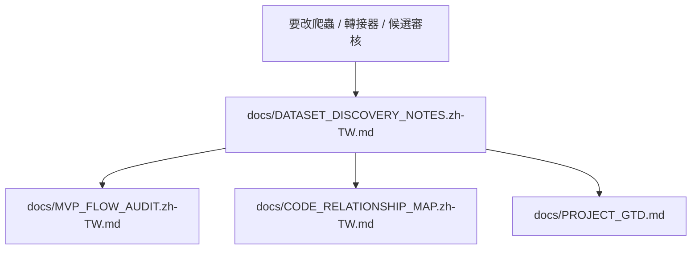

# Dataset Discovery 附錄 redirect

更新日期：2026-05-21

這個 appendix 路徑保留給舊 handoff、skill、prompt 與外部自動化引用。正式維護入口已收攏到：

- `docs/DATASET_DISCOVERY_NOTES.zh-TW.md`

## 為什麼收攏

原本這份 appendix 與 `DATASET_DISCOVERY_NOTES.zh-TW.md` 標題、章節與大部分內容重複；主文件已保留較新的 crawler-first、candidate review、adapter handoff、dataset-version plan、bounded resolver、download/import plan 與版本治理說明。為避免下一位維護者在兩份內容之間同步改動，這裡改成短 redirect。

## 現在該讀哪裡

| 需求 | 正式入口 |
| --- | --- |
| 新增 crawler source type | `docs/DATASET_DISCOVERY_NOTES.zh-TW.md` 的 `Dataset discovery sources` 與 `Dataset adapters` |
| 調整候選審核規則 | `docs/DATASET_DISCOVERY_NOTES.zh-TW.md` 的 crawler audit 段落 |
| 調整 adapter review / bounded resolver | `docs/DATASET_DISCOVERY_NOTES.zh-TW.md` 的 resolver 與 `import_plan` 段落 |
| 檢查 Demo 是否真的閉環 | `docs/MVP_FLOW_AUDIT.zh-TW.md` |
| 檢查程式調度位置 | `docs/CODE_RELATIONSHIP_MAP.zh-TW.md` |

## 維護規則

不要在這份 redirect 裡新增新的 discovery 規格。若未來需要再次拆分 discovery 文件，請先更新 `docs/DOCS_INDEX.zh-TW.md` 的文件地圖，再回頭更新 `.codex/skills/`、`.github/prompts/`、`openspec/` 或其他引用路徑。
