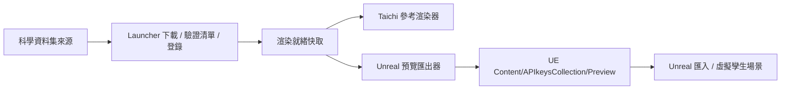

# Unreal Engine Bridge 設計筆記

最後更新：2026-05-17

## 定位

`APIkeys_collection` 的最終前端目標是 Unreal Engine 5。Launcher 負責資料集 discovery、下載、版本管理、清洗、manifest、安裝登錄與資料轉接；Unreal 則負責互動式虛擬孿生呈現。

Unreal 不應持有資料主權。它是渲染器與最終 UI，負責材質、光照、烘焙、後處理、互動與場景組成。資料可以由外部 manifest、tile cache、local service、SQL、檔案或 API 即時餵入 Unreal；只有在效能或工作流程需要時，才把資料轉成 `.uasset` 或預生成資產。

`renderers/taichi_global_bathymetry.py` 的定位不是取代 Unreal，而是跨平台參考渲染器。當某台機器沒有安裝 Unreal，或需要快速驗證地形/星圖資料是否能被渲染時，Taichi 可以作為 smoke test 與演算法原型。

## 目前本機環境

- Unreal Engine: `C:\Program Files\Epic Games\UE_5.7`
- Local Unreal project: `K:\UnrealProjects\APIkeysVirtualTwin\APIkeysVirtualTwin.uproject`
- Preview output:
  `K:\UnrealProjects\APIkeysVirtualTwin\Content\APIkeysCollection\Preview`
- 目前產出：
  - `EarthPreview.obj`
  - `EarthPreview.mtl`
  - `StarsPreview.csv`
  - `TileManifest.json`
  - `APIkeysBridgeManifest.json`

本機 Unreal 專案放在 repo 外，不進 Git。repo 只保留可重跑的匯出工具與橋接文件。

## 現階段管線



目前 `scripts/export_unreal_preview.py` 會從 Taichi cache 讀取低解析 GEBCO 地形與 HYG 星圖 cache，匯出 Unreal 可匯入的 OBJ/MTL/CSV。這只是 MVP 預覽，不是最終高效能資料串流方案。

同時它會產生 `TileManifest.json`。目前這份 manifest 是 preview index only，tile 檔案還沒有真正 materialize；它先定義未來 Unreal/Taichi 共同讀取 tile 的 ID、bounds、LOD、URI 與格式。

執行範例：

```powershell
py scripts\export_unreal_preview.py --project K:\UnrealProjects\APIkeysVirtualTwin\APIkeysVirtualTwin.uproject --sample-step 2
```

## 未來串流架構

完整地球資料不應一次載入 Unreal。資料集可以相同，但取樣策略要由相機視角決定：

| Camera mode | 需求 | 策略 |
| --- | --- | --- |
| First person | 近場地形、坡度、地表細節 | 近距離高 LOD tile，遠距離快速裁切 |
| Second person | 跟隨目標或運鏡 | 目標附近高 LOD，相機路徑附近中 LOD |
| Third person / orbit | 全球尺度瀏覽 | 粗略全球 tile，焦點區域再細化 |

未來管線會朝這個方向演進：


重點是讓 Unreal 依照 camera mode、位置、frustum、距離與算力預算請求資料，而不是暴力載入完整全球模型。

## Unreal 邊界

Unreal bridge 應該遵守幾個邊界：

1. Raw data 不直接散落在 UE Content 裡。
2. UE Content 只放 preview/imported/render-cache 需要的資產。
3. 原始資料、版本、授權、checksum、清洗紀錄留在 launcher registry。
4. 如果可以用外部 streaming 提供資料，就不強迫預生成 `.uasset`。
5. 如果需要 bake，例如光照、材質、Nanite mesh、HLOD，才由 Unreal 工具鏈產生前端專用結果。

## Bridge Manifest

`APIkeysBridgeManifest.json` 目前包含：

- source cache path
- preview asset path
- Unreal mount root
- topography shape / exported shape
- star count
- `camera_driven_streaming` 建議值
- future pipeline notes

這份 manifest 是給未來 Unreal importer、agent、自動測試與人類開發者共同讀的交接文件。

## 下一步

1. 在 Unreal 專案內建立可自動匯入 `EarthPreview.obj` 的 Editor utility 或 Python import script。
2. 建立 tile manifest schema，將 dataset id、版本、解析度、經緯度範圍、checksum、LOD 關係納入。
3. 讓 launcher 的安裝登錄能把 GEBCO/HYG 等資料集標記為 renderer/Unreal 可用資產。
4. 設計 Unreal runtime streamer：依 camera mode 與距離載入/釋放 tile。
5. 保留 Taichi renderer 作為無 Unreal 環境的跨平台參考測試。
